# Computer vision stages, 2026-08-30T06:51:46

Written by `scripts/cv_pickpose_visuals.py`. The arms were NOT commanded; this program has no publisher, no service client and no Kortex session.

## The arms

Read from `/real/joint_states` (700 distinct source stamps), compared with the saved ideal pick pose.

| arm | reference | joints read | worst deviation | at the pick pose |
| --- | --- | --- | --- | --- |
| left | `config/pick_pose_ideal_left.txt` | 7 of 7 | 82.27 deg | **NO** |
| right | `config/pick_pose_ideal_right.txt` | 7 of 7 | 66.10 deg | **NO** |

left, joint by joint

| joint | measured (deg) | pick pose (deg) | delta (deg) |
| --- | --- | --- | --- |
| joint_1 | 73.324 | 97.743 | -24.419 |
| joint_2 | 35.074 | 37.529 | -2.455 |
| joint_3 | 140.198 | 134.368 | +5.830 |
| joint_4 | -96.048 | -87.339 | -8.709 |
| joint_5 | -101.087 | -18.818 | -82.269 |
| joint_6 | -54.734 | -28.989 | -25.744 |
| joint_7 | -49.852 | -128.712 | +78.859 |

right, joint by joint

| joint | measured (deg) | pick pose (deg) | delta (deg) |
| --- | --- | --- | --- |
| joint_1 | 112.602 | 134.916 | -22.313 |
| joint_2 | -72.381 | -66.576 | -5.806 |
| joint_3 | 91.965 | 25.867 | +66.098 |
| joint_4 | -82.473 | -31.455 | -51.018 |
| joint_5 | 153.607 | 161.696 | -8.089 |
| joint_6 | 8.033 | 71.186 | -63.153 |
| joint_7 | 142.439 | 153.932 | -11.493 |

## left_gripper

**No frame.** after attempting the arm pings and port 554 is NOT LISTENING, so the vision MODULE is wedged -- not the driver, not the network. The camera node would retry for ever and never connect. Recover it deliberately, with the bridge stopped: .kortex_venv/bin/python scripts/reboot_vision_module.py left; ping ok, port 554 SHUT, port 10000 open, driver running -- it still refuses: only 0 of 4 topics answered on /left_camera within 12 s (missing: c, ck, d, dk), on ROS_DOMAIN_ID=42. Either the camera driver is not up -- `bash scripts/bringup_arm.sh left` -- or this terminal is on a different domain from the one it was started on.  --- then the direct RTSP fallback also failed: no colour frame from rtsp://192.168.1.10/color. The arm must be powered and on the network, and Kinova allows only two simultaneous connections per stream.

## right_gripper

Kinova vision module on the right arm, over ROS topics /right_camera/{color,depth} (driver: kinova_vision_node, started by bringup_arm.sh), ROS_DOMAIN_ID=42

- intrinsics read from the published camera_info, not assumed: colour cx=620.9 cy=238.3 on a 1280x720 image -- the principal point is not the image centre and assuming it is throws every ray

Contact sheet: `sheet_right_gripper.png`

### 01  The frame, as the camera delivered it  [ok]

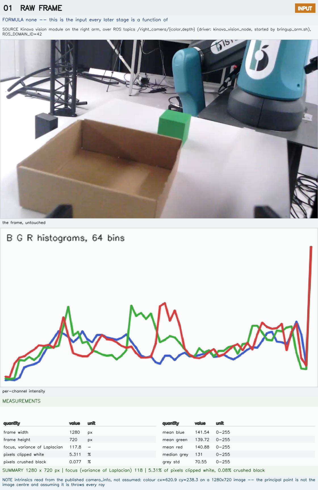

- **formula** `none -- this is the input every later stage is a function of`
- **source** Kinova vision module on the right arm, over ROS topics /right_camera/{color,depth} (driver: kinova_vision_node, started by bringup_arm.sh), ROS_DOMAIN_ID=42
- **summary** 1280 x 720 px | focus (variance of Laplacian) 118 | 5.31% of pixels clipped white, 0.08% crushed black

| quantity | value | unit |
| --- | ---: | --- |
| frame width | 1280 | px |
| frame height | 720 | px |
| focus, variance of Laplacian | 117.8 | - |
| pixels clipped white | 5.311 | % |
| pixels crushed black | 0.077 | % |
| mean blue | 141.54 | 0-255 |
| mean green | 139.72 | 0-255 |
| mean red | 140.88 | 0-255 |
| median grey | 131 | 0-255 |
| grey std | 70.55 | 0-255 |

- **note** intrinsics read from the published camera_info, not assumed: colour cx=620.9 cy=238.3 on a 1280x720 image -- the principal point is not the image centre and assuming it is throws every ray

### 02  Intrinsics and the ray each pixel stands for  [ok]

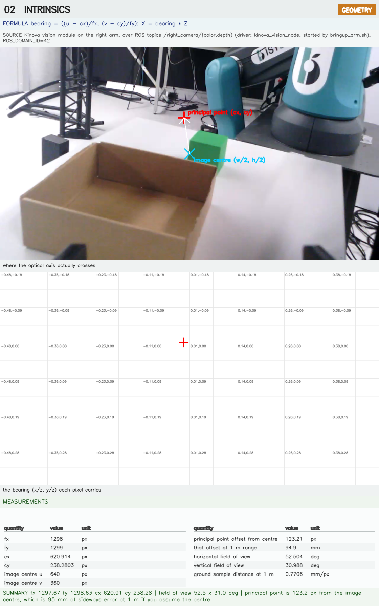

- **formula** `bearing = ((u - cx)/fx, (v - cy)/fy);  X = bearing * Z`
- **source** Kinova vision module on the right arm, over ROS topics /right_camera/{color,depth} (driver: kinova_vision_node, started by bringup_arm.sh), ROS_DOMAIN_ID=42
- **summary** fx 1297.67  fy 1298.63  cx 620.91  cy 238.28 | field of view 52.5 x 31.0 deg | principal point is 123.2 px from the image centre, which is 95 mm of sideways error at 1 m if you assume the centre

| quantity | value | unit |
| --- | ---: | --- |
| fx | 1298 | px |
| fy | 1299 | px |
| cx | 620.914 | px |
| cy | 238.2803 | px |
| image centre u | 640 | px |
| image centre v | 360 | px |
| principal point offset from centre | 123.21 | px |
| that offset at 1 m range | 94.9 | mm |
| horizontal field of view | 52.504 | deg |
| vertical field of view | 30.988 | deg |
| ground sample distance at 1 m | 0.7706 | mm/px |

### 03  BGR to HSV, the space the colour tests live in  [ok]

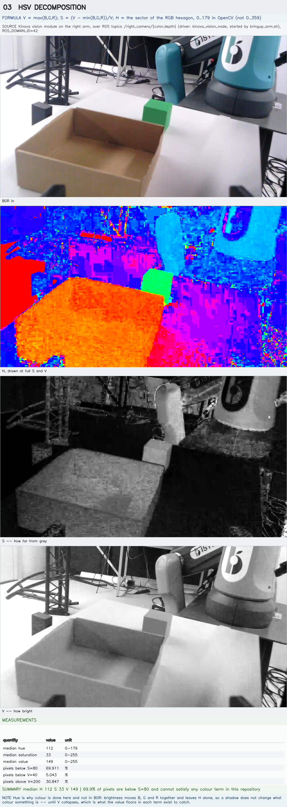

- **formula** `V = max(B,G,R);  S = (V - min(B,G,R))/V;  H = the sector of the RGB hexagon, 0..179 in OpenCV (not 0..359)`
- **source** Kinova vision module on the right arm, over ROS topics /right_camera/{color,depth} (driver: kinova_vision_node, started by bringup_arm.sh), ROS_DOMAIN_ID=42
- **summary** median H 112  S 33  V 149 | 69.9% of pixels are below S=80 and cannot satisfy any colour term in this repository

| quantity | value | unit |
| --- | ---: | --- |
| median hue | 112 | 0-179 |
| median saturation | 33 | 0-255 |
| median value | 149 | 0-255 |
| pixels below S=80 | 69.911 | % |
| pixels below V=40 | 5.043 | % |
| pixels above V=200 | 30.847 | % |

- **note** Hue is why colour is done here and not in BGR: brightness moves B, G and R together and leaves H alone, so a shadow does not change what colour something is -- until V collapses, which is what the value floors in each term exist to catch.

### 04  The pick path's own green threshold  [ok]

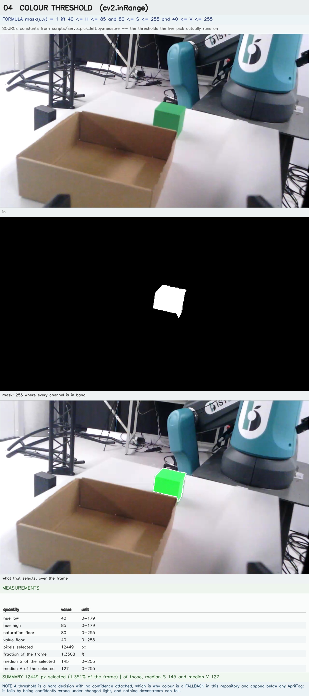

- **formula** `mask(u,v) = 1 iff  40 <= H <= 85  and  80 <= S <= 255  and  40 <= V <= 255`
- **source** constants from scripts/servo_pick_left.py:measure -- the thresholds the live pick actually runs on
- **summary** 12449 px selected (1.351% of the frame) | of those, median S 145 and median V 127

| quantity | value | unit |
| --- | ---: | --- |
| hue low | 40 | 0-179 |
| hue high | 85 | 0-179 |
| saturation floor | 80 | 0-255 |
| value floor | 40 | 0-255 |
| pixels selected | 12449 | px |
| fraction of the frame | 1.3508 | % |
| median S of the selected | 145 | 0-255 |
| median V of the selected | 127 | 0-255 |

- **note** A threshold is a hard decision with no confidence attached, which is why colour is a FALLBACK in this repository and capped below any AprilTag: it fails by being confidently wrong under changed light, and nothing downstream can tell.

### 05  What the 9x9 opening removes  [ok]

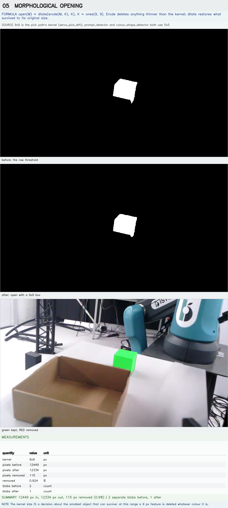

- **formula** `open(M) = dilate(erode(M, K), K),  K = ones(9, 9).  Erode deletes anything thinner than the kernel; dilate restores what survived to its original size.`
- **source** 9x9 is the pick path's kernel (servo_pick_left); prompt_detector and colour_shape_detector both use 5x5
- **summary** 12449 px in, 12334 px out, 115 px removed (0.9%) | 2 separate blobs before, 1 after

| quantity | value | unit |
| --- | ---: | --- |
| kernel | 9x9 | px |
| pixels before | 12449 | px |
| pixels after | 12334 | px |
| pixels removed | 115 | px |
| removed | 0.924 | % |
| blobs before | 2 | count |
| blobs after | 1 | count |

- **note** The kernel size IS a decision about the smallest object that can survive: at this range a 9 px feature is deleted whatever colour it is.

### 06  Connected components, and their statistics  [ok]

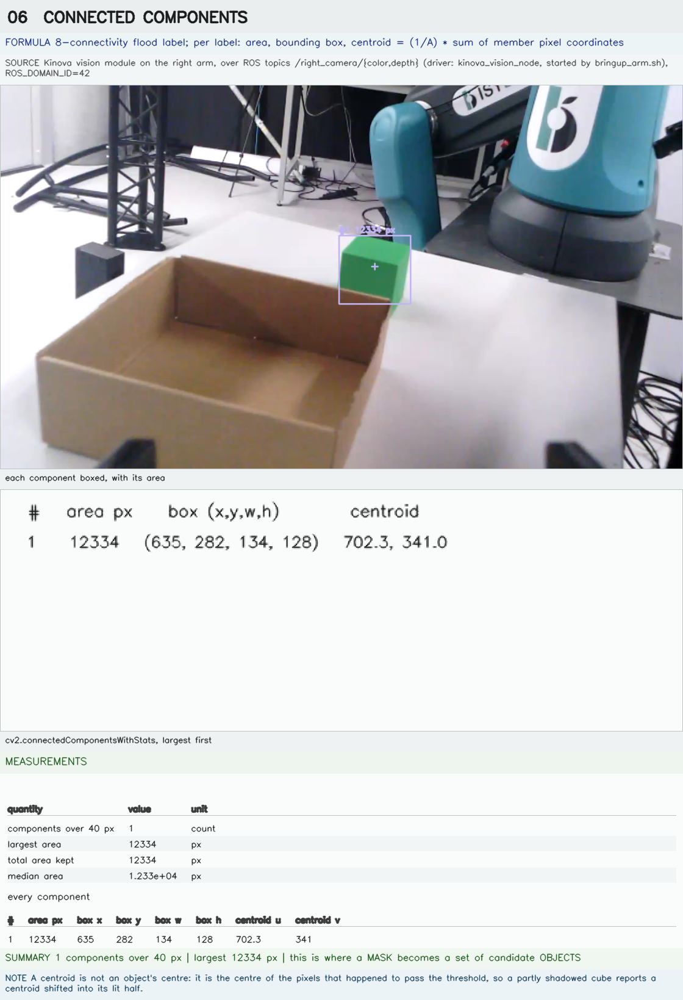

- **formula** `8-connectivity flood label; per label: area, bounding box, centroid = (1/A) * sum of member pixel coordinates`
- **source** Kinova vision module on the right arm, over ROS topics /right_camera/{color,depth} (driver: kinova_vision_node, started by bringup_arm.sh), ROS_DOMAIN_ID=42
- **summary** 1 components over 40 px | largest 12334 px | this is where a MASK becomes a set of candidate OBJECTS

| quantity | value | unit |
| --- | ---: | --- |
| components over 40 px | 1 | count |
| largest area | 12334 | px |
| total area kept | 12334 | px |
| median area | 1.233e+04 | px |

*every component* -- 1 rows, full data in `data/right_gripper/06_components__every_component.csv`

- **note** A centroid is not an object's centre: it is the centre of the pixels that happened to pass the threshold, so a partly shadowed cube reports a centroid shifted into its lit half.

### 07  The whole colour vocabulary, swept  [ok]

- **formula** `one inRange per band, OR-ed across bands (red needs two: it wraps the hue circle at 0/179), then a 5x5 opening`
- **source** srl_perception/prompt_detector.py:COLOUR_TERMS -- the colour backend's entire vocabulary, stated so its limit is visible rather than discovered
- **summary** white 281510 | orange 54622 | black 54571 | blue 44494 | cyan 36292 | red 16942

| quantity | value | unit |
| --- | ---: | --- |
| colour terms tested | 11 | count |
| terms with any pixels | 8 | count |
| largest term | white | - |
| its pixel count | 281510 | px |

*pixels per colour term* -- 11 rows, full data in `data/right_gripper/07_vocabulary__pixels_per_colour_term.csv`

*the three definitions of green* -- 3 rows, full data in `data/right_gripper/07_vocabulary__the_three_definitions_of_green.csv`

- **note** THE THREE GREENS ARE NOT THE SAME: servo_pick_left (the live pick) H40-85 S>=80 V>=40 open 9: 12334 px; prompt_detector.COLOUR_TERMS H36-85 S>=80 V>=25 open 5: 12415 px; colour_shape_detector.DEFAULT H40-85 S>=80 V>=60 open 5: 12393 px. They differ in the value floor (25 / 40 / 60) and in the opening kernel, so the same cube in the same frame gives three different pixel counts depending on which module is asking.

### 08  The region-MEAN ratio test, and its near-black guard  [ok]

- **formula** `green  <=>  mean_G > 1.25 * mean_B  and  mean_G > 1.8 * mean_R,  refused outright when max(B,G,R) < 25`
- **source** srl_perception/prompt_detector.py:_colour_matches
- **summary** 1 of 1 regions pass

| quantity | value | unit |
| --- | ---: | --- |
| regions tested | 1 | count |
| regions passing | 1 | count |
| regions rejected as near-black | 0 | count |
| blue ratio threshold | 1.25 | - |
| red ratio threshold | 1.8 | - |
| near-black floor | 25 | 0-255 |

*region means and verdicts* -- 1 rows, full data in `data/right_gripper/08_region_mean__region_means_and_verdicts.csv`

- **note** Per-pixel hue picked the room's teal robots three times: their shadowed hue is 76 against the target cube's 74, two apart and inside noise. Region MEANS separate them, because teal carries far more blue. The near-black guard exists because a region measuring (4.1, 8.8, 3.9) -- visually black -- satisfies the ratios on sensor noise alone and was reported as the cube.

### 09  Rotated box, in-image yaw, and the degeneracy gate  [ok]

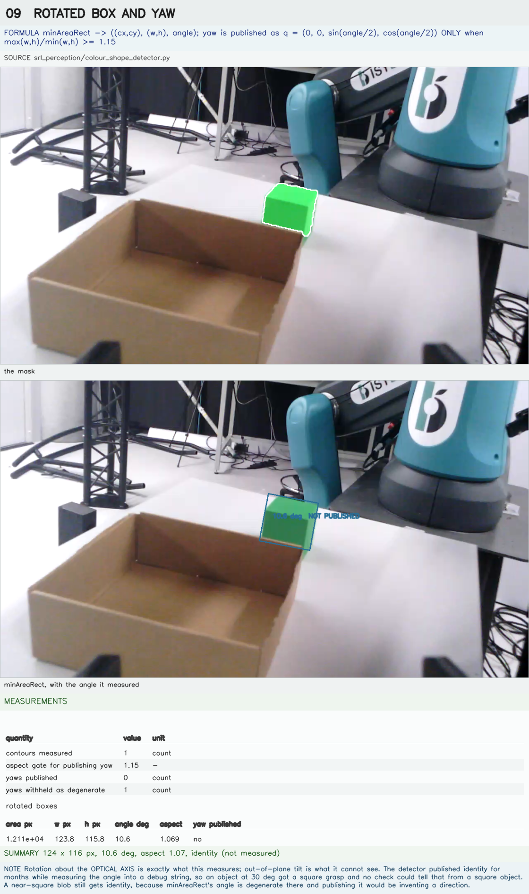

- **formula** `minAreaRect -> ((cx,cy), (w,h), angle);  yaw is published as q = (0, 0, sin(angle/2), cos(angle/2)) ONLY when max(w,h)/min(w,h) >= 1.15`
- **source** srl_perception/colour_shape_detector.py
- **summary** 124 x 116 px, 10.6 deg, aspect 1.07, identity (not measured)

| quantity | value | unit |
| --- | ---: | --- |
| contours measured | 1 | count |
| aspect gate for publishing yaw | 1.15 | - |
| yaws published | 0 | count |
| yaws withheld as degenerate | 1 | count |

*rotated boxes* -- 1 rows, full data in `data/right_gripper/09_minarearect__rotated_boxes.csv`

- **note** Rotation about the OPTICAL AXIS is exactly what this measures; out-of-plane tilt is what it cannot see. The detector published identity for months while measuring the angle into a debug string, so an object at 30 deg got a square grasp and no check could tell that from a square object. A near-square blob still gets identity, because minAreaRect's angle is degenerate there and publishing it would be inventing a direction.

### 10  The size-at-range gate  [ok]

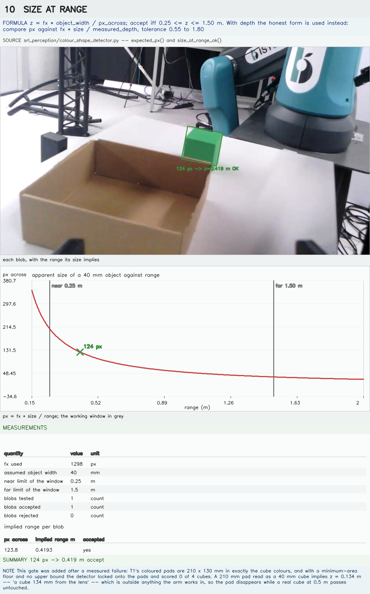

- **formula** `z = fx * object_width / px_across;  accept iff 0.25 <= z <= 1.50 m.  With depth the honest form is used instead: compare px against fx * size / measured_depth, tolerance 0.55 to 1.80`
- **source** srl_perception/colour_shape_detector.py -- expected_px() and size_at_range_ok()
- **summary** 124 px -> 0.419 m accept

| quantity | value | unit |
| --- | ---: | --- |
| fx used | 1298 | px |
| assumed object width | 40 | mm |
| near limit of the window | 0.25 | m |
| far limit of the window | 1.5 | m |
| blobs tested | 1 | count |
| blobs accepted | 1 | count |
| blobs rejected | 0 | count |

*implied range per blob* -- 1 rows, full data in `data/right_gripper/10_size_at_range__implied_range_per_blob.csv`

- **note** This gate was added after a measured failure: T1's coloured pads are 210 x 130 mm in exactly the cube colours, and with a minimum-area floor and no upper bound the detector locked onto the pads and scored 0 of 4 cubes. A 210 mm pad read as a 40 mm cube implies z = 0.134 m -- 'a cube 134 mm from the lens' -- which is outside anything the arm works in, so the pad disappears while a real cube at 0.5 m passes untouched.

### 11  FastSAM: every region in the picture, no prompt  [ok]

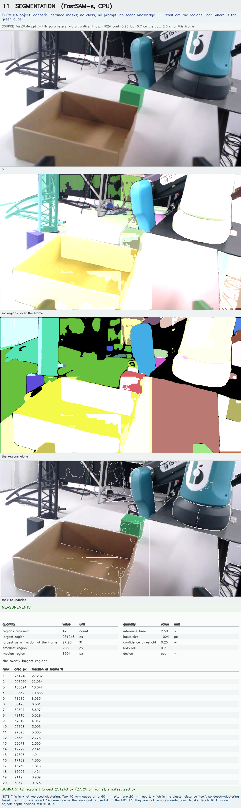

- **formula** `object-agnostic instance masks; no class, no prompt, no scene knowledge -- 'what are the regions', not 'where is the green cube'`
- **source** FastSAM-s.pt (~11M parameters) via ultralytics, imgsz=1024 conf=0.25 iou=0.7 on the cpu, 2.6 s for this frame
- **summary** 42 regions | largest 251248 px (27.3% of frame), smallest 298 px

| quantity | value | unit |
| --- | ---: | --- |
| regions returned | 42 | count |
| largest region | 251248 | px |
| largest as a fraction of the frame | 27.26 | % |
| smallest region | 298 | px |
| median region | 8304 | px |
| inference time | 2.59 | s |
| input size | 1024 | px |
| confidence threshold | 0.25 | - |
| NMS IoU | 0.7 | - |
| device | cpu | - |

*the twenty largest regions* -- 20 rows, full data in `data/right_gripper/11_fastsam__the_twenty_largest_regions.csv`

- **note** This is what replaced clustering. Two 40 mm cubes on a 60 mm pitch are 20 mm apart, which is the cluster distance itself, so depth-clustering fused them into one object 140 mm across the jaws and refused it. In the PICTURE they are not remotely ambiguous. Masks decide WHAT is an object; depth decides WHERE it is.

### 12  The area filter: noise below, the table above  [ok]

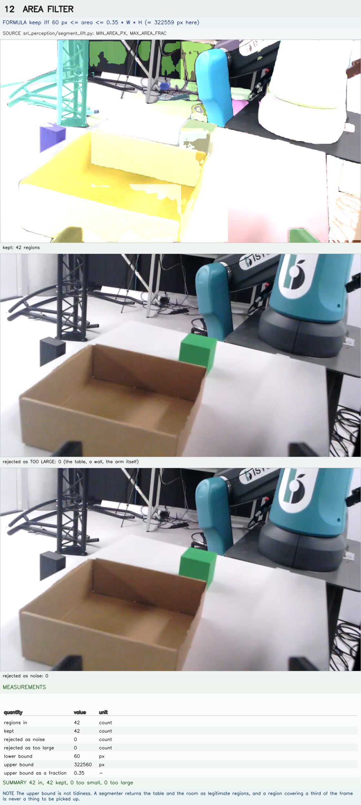

- **formula** `keep iff  60 px <= area <= 0.35 * W * H  (= 322559 px here)`
- **source** srl_perception/segment_lift.py: MIN_AREA_PX, MAX_AREA_FRAC
- **summary** 42 in, 42 kept, 0 too small, 0 too large

| quantity | value | unit |
| --- | ---: | --- |
| regions in | 42 | count |
| kept | 42 | count |
| rejected as noise | 0 | count |
| rejected as too large | 0 | count |
| lower bound | 60 | px |
| upper bound | 322560 | px |
| upper bound as a fraction | 0.35 | - |

- **note** The upper bound is not tidiness. A segmenter returns the table and the room as legitimate regions, and a region covering a third of the frame is never a thing to be picked up.

### 13  Segment everything, then pick the one that matches  [ok]

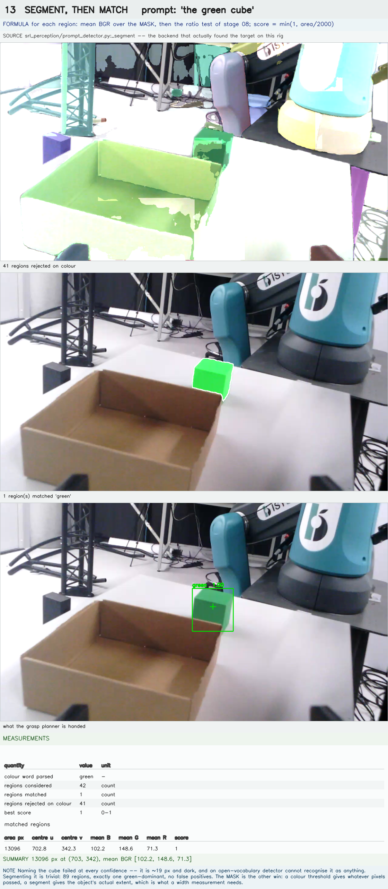

- **formula** `for each region: mean BGR over the MASK, then the ratio test of stage 08; score = min(1, area/2000)`
- **source** srl_perception/prompt_detector.py:_segment -- the backend that actually found the target on this rig
- **summary** 13096 px at (703, 342), mean BGR [102.2, 148.6, 71.3]

| quantity | value | unit |
| --- | ---: | --- |
| colour word parsed | green | - |
| regions considered | 42 | count |
| regions matched | 1 | count |
| regions rejected on colour | 41 | count |
| best score | 1 | 0-1 |

*matched regions* -- 1 rows, full data in `data/right_gripper/13_segment_match__matched_regions.csv`

- **note** Naming the cube failed at every confidence -- it is ~19 px and dark, and an open-vocabulary detector cannot recognise it as anything. Segmenting it is trivial: 89 regions, exactly one green-dominant, no false positives. The MASK is the other win: a colour threshold gives whatever pixels passed, a segment gives the object's actual extent, which is what a width measurement needs.

### 14  YOLO-World: open-vocabulary naming  [refused]

- **refused** YOLO-World ran in 4.4 s over classes ['green cube'] at conf 0.05 and found NOTHING. This is the measured behaviour on this rig, not a misconfiguration: it finds a person at 0.725 and a laptop at 0.739 in the same room and cannot see the small dark cube at any confidence. It is why the backend order is segment first, naming second, colour as the floor.

### 15  The depth frame, and where it has no answer  [ok]

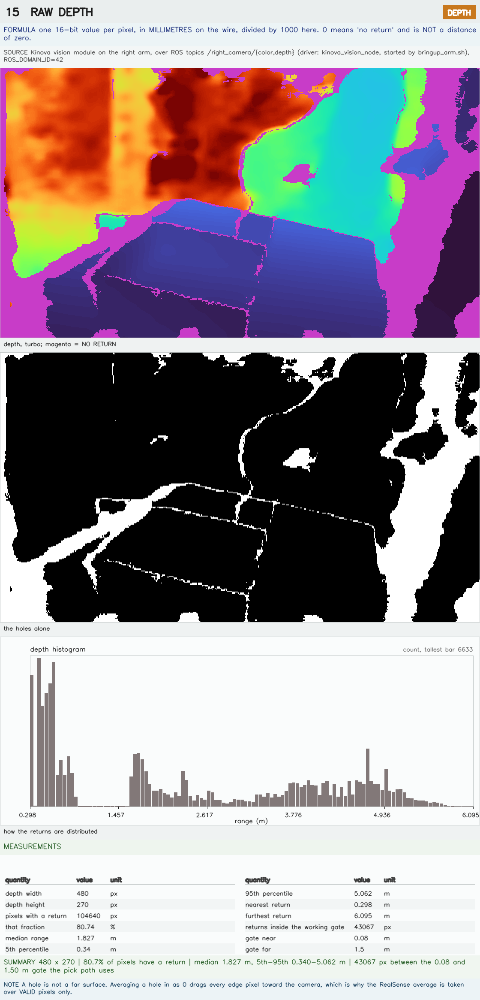

- **formula** `one 16-bit value per pixel, in MILLIMETRES on the wire, divided by 1000 here. 0 means 'no return' and is NOT a distance of zero.`
- **source** Kinova vision module on the right arm, over ROS topics /right_camera/{color,depth} (driver: kinova_vision_node, started by bringup_arm.sh), ROS_DOMAIN_ID=42
- **summary** 480 x 270 | 80.7% of pixels have a return | median 1.827 m, 5th-95th 0.340-5.062 m | 43067 px between the 0.08 and 1.50 m gate the pick path uses

| quantity | value | unit |
| --- | ---: | --- |
| depth width | 480 | px |
| depth height | 270 | px |
| pixels with a return | 104640 | px |
| that fraction | 80.74 | % |
| median range | 1.827 | m |
| 5th percentile | 0.34 | m |
| 95th percentile | 5.062 | m |
| nearest return | 0.298 | m |
| furthest return | 6.095 | m |
| returns inside the working gate | 43067 | px |
| gate near | 0.08 | m |
| gate far | 1.5 | m |

- **note** A hole is not a far surface. Averaging a hole in as 0 drags every edge pixel toward the camera, which is why the RealSense average is taken over VALID pixels only.

### 16  Depth put into the colour frame  [ok]

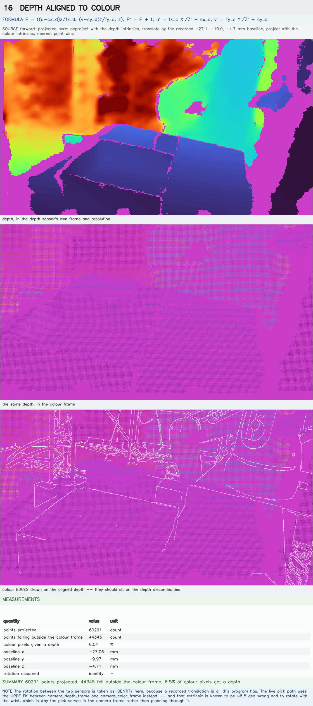

- **formula** `P = ((u-cx_d)z/fx_d, (v-cy_d)z/fy_d, z);  P' = P + t;  u' = fx_c X'/Z' + cx_c,  v' = fy_c Y'/Z' + cy_c`
- **source** forward-projected here: deproject with the depth intrinsics, translate by the recorded -27.1, -10.0, -4.7 mm baseline, project with the colour intrinsics, nearest point wins
- **summary** 60291 points projected, 44345 fell outside the colour frame, 6.5% of colour pixels got a depth

| quantity | value | unit |
| --- | ---: | --- |
| points projected | 60291 | count |
| points falling outside the colour frame | 44345 | count |
| colour pixels given a depth | 6.54 | % |
| baseline x | -27.06 | mm |
| baseline y | -9.97 | mm |
| baseline z | -4.71 | mm |
| rotation assumed | identity | - |

- **note** The rotation between the two sensors is taken as IDENTITY here, because a recorded translation is all this program has. The live pick path uses the URDF FK between camera_depth_frame and camera_color_frame instead -- and that extrinsic is known to be ~8.5 deg wrong and to rotate with the wrist, which is why the pick servos in the camera frame rather than planning through it.

### 17  Pixels and depth become a cloud  [ok]

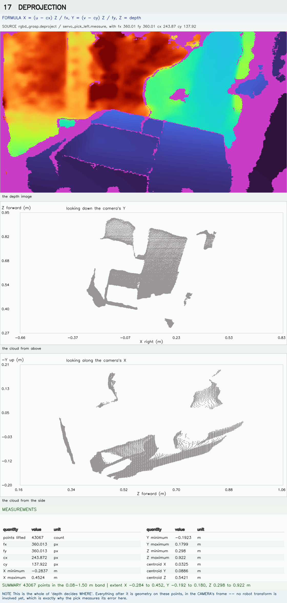

- **formula** `X = (u - cx) Z / fx,   Y = (v - cy) Z / fy,   Z = depth`
- **source** rgbd_grasp.deproject / servo_pick_left.measure, with fx 360.01 fy 360.01 cx 243.87 cy 137.92
- **summary** 43067 points in the 0.08-1.50 m band | extent X -0.284 to 0.452, Y -0.192 to 0.180, Z 0.298 to 0.922 m

| quantity | value | unit |
| --- | ---: | --- |
| points lifted | 43067 | count |
| fx | 360.013 | px |
| fy | 360.013 | px |
| cx | 243.872 | px |
| cy | 137.922 | px |
| X minimum | -0.2837 | m |
| X maximum | 0.4524 | m |
| Y minimum | -0.1923 | m |
| Y maximum | 0.1799 | m |
| Z minimum | 0.298 | m |
| Z maximum | 0.922 | m |
| centroid X | 0.0325 | m |
| centroid Y | 0.0886 | m |
| centroid Z | 0.5421 | m |

- **note** This is the whole of 'depth decides WHERE'. Everything after it is geometry on these points, in the CAMERA's frame -- no robot transform is involved yet, which is exactly why the pick measures its error here.

### 18  RANSAC: the support plane  [ok]

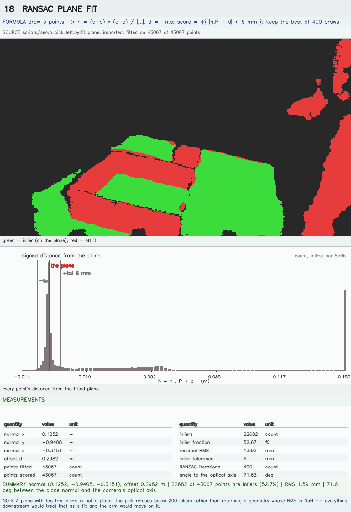

- **formula** `draw 3 points -> n = (b-a) x (c-a) / |...|,  d = -n.a;  score = #{ |n.P + d| < 6 mm };  keep the best of 400 draws`
- **source** scripts/servo_pick_left.py:fit_plane, imported; fitted on 43067 of 43067 points
- **summary** normal (0.1252, -0.9408, -0.3151), offset 0.2982 m | 22682 of 43067 points are inliers (52.7%) | RMS 1.59 mm | 71.6 deg between the plane normal and the camera's optical axis

| quantity | value | unit |
| --- | ---: | --- |
| normal x | 0.1252 | - |
| normal y | -0.9408 | - |
| normal z | -0.3151 | - |
| offset d | 0.2982 | m |
| points fitted | 43067 | count |
| points scored | 43067 | count |
| inliers | 22682 | count |
| inlier fraction | 52.67 | % |
| residual RMS | 1.592 | mm |
| inlier tolerance | 6 | mm |
| RANSAC iterations | 400 | count |
| angle to the optical axis | 71.63 | deg |

- **note** A plane with too few inliers is not a plane. The pick refuses below 200 inliers rather than returning a geometry whose RMS is NaN -- everything downstream would treat that as a fix and the arm would move on it.

### 19  The PCA refinement, and the NaN it once produced  [ok]

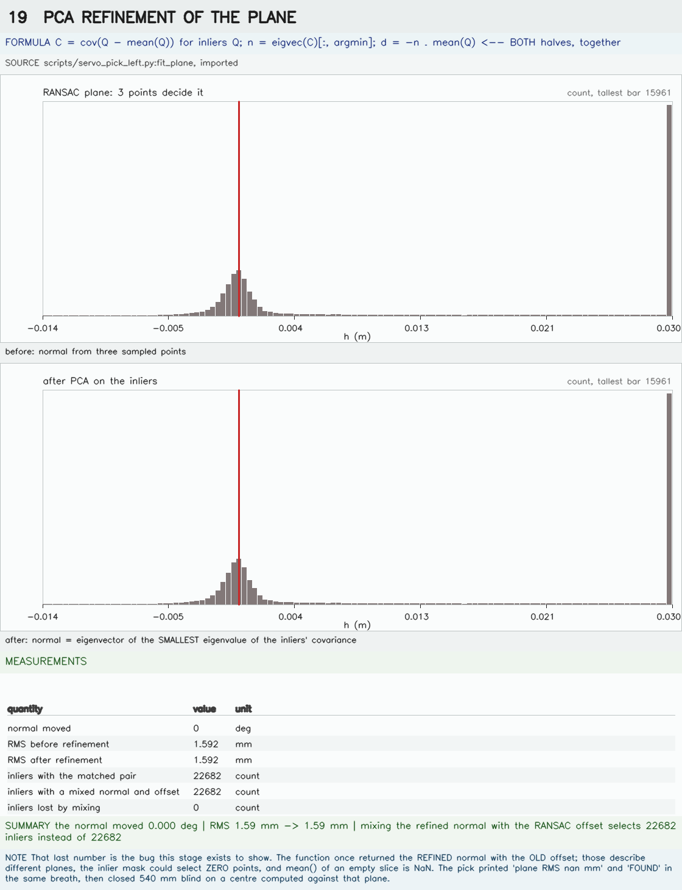

- **formula** `C = cov(Q - mean(Q)) for inliers Q;  n = eigvec(C)[:, argmin];  d = -n . mean(Q)   <-- BOTH halves, together`
- **source** scripts/servo_pick_left.py:fit_plane, imported
- **summary** the normal moved 0.000 deg | RMS 1.59 mm -> 1.59 mm | mixing the refined normal with the RANSAC offset selects 22682 inliers instead of 22682

| quantity | value | unit |
| --- | ---: | --- |
| normal moved | 0 | deg |
| RMS before refinement | 1.592 | mm |
| RMS after refinement | 1.592 | mm |
| inliers with the matched pair | 22682 | count |
| inliers with a mixed normal and offset | 22682 | count |
| inliers lost by mixing | 0 | count |

- **note** That last number is the bug this stage exists to show. The function once returned the REFINED normal with the OLD offset; those describe different planes, the inlier mask could select ZERO points, and mean() of an empty slice is NaN. The pick printed 'plane RMS nan mm' and 'FOUND' in the same breath, then closed 540 mm blind on a centre computed against that plane.

### 20  Height above the plane  [ok]

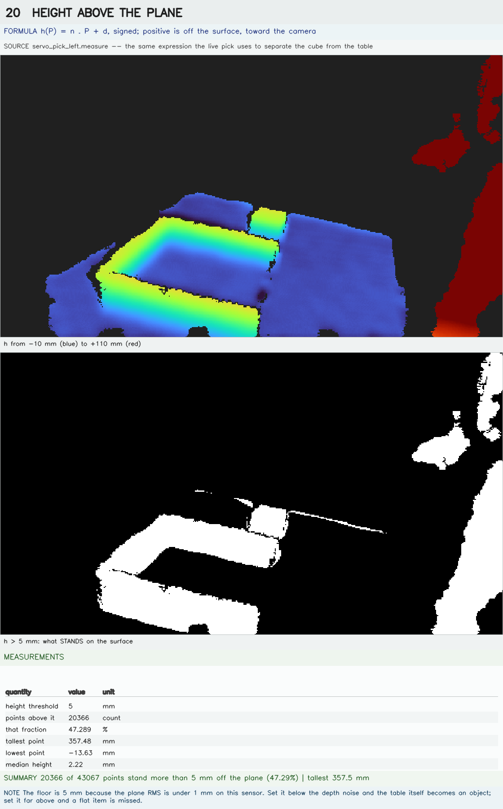

- **formula** `h(P) = n . P + d,  signed;  positive is off the surface, toward the camera`
- **source** servo_pick_left.measure -- the same expression the live pick uses to separate the cube from the table
- **summary** 20366 of 43067 points stand more than 5 mm off the plane (47.29%) | tallest 357.5 mm

| quantity | value | unit |
| --- | ---: | --- |
| height threshold | 5 | mm |
| points above it | 20366 | count |
| that fraction | 47.289 | % |
| tallest point | 357.48 | mm |
| lowest point | -13.63 | mm |
| median height | 2.22 | mm |

- **note** The floor is 5 mm because the plane RMS is under 1 mm on this sensor. Set it below the depth noise and the table itself becomes an object; set it far above and a flat item is missed.

### 21  The surface height as a MODE, not a mean  [ok]

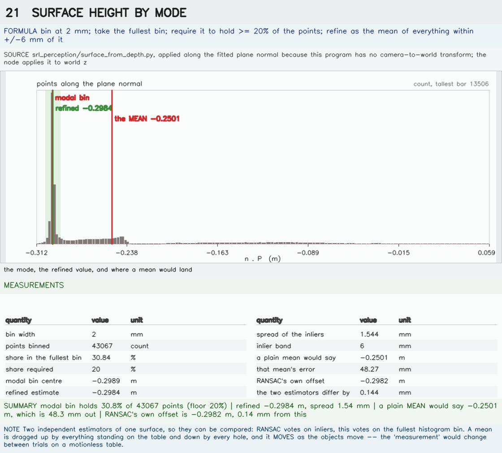

- **formula** `bin at 2 mm; take the fullest bin; require it to hold >= 20% of the points; refine as the mean of everything within +/-6 mm of it`
- **source** srl_perception/surface_from_depth.py, applied along the fitted plane normal because this program has no camera-to-world transform; the node applies it to world z
- **summary** modal bin holds 30.8% of 43067 points (floor 20%) | refined -0.2984 m, spread 1.54 mm | a plain MEAN would say -0.2501 m, which is 48.3 mm out | RANSAC's own offset is -0.2982 m, 0.14 mm from this

| quantity | value | unit |
| --- | ---: | --- |
| bin width | 2 | mm |
| points binned | 43067 | count |
| share in the fullest bin | 30.84 | % |
| share required | 20 | % |
| modal bin centre | -0.2989 | m |
| refined estimate | -0.2984 | m |
| spread of the inliers | 1.544 | mm |
| inlier band | 6 | mm |
| a plain mean would say | -0.2501 | m |
| that mean's error | 48.27 | mm |
| RANSAC's own offset | -0.2982 | m |
| the two estimators differ by | 0.144 | mm |

- **note** Two independent estimators of one surface, so they can be compared: RANSAC votes on inliers, this votes on the fullest histogram bin. A mean is dragged up by everything standing on the table and down by every hole, and it MOVES as the objects move -- the 'measurement' would change between trials on a motionless table.

### 22  What is standing on the surface  [refused]

- **refused** nothing stands more than 5 mm above the fitted plane in this view

### 23  The measurement the pick actually acts on  [ok]

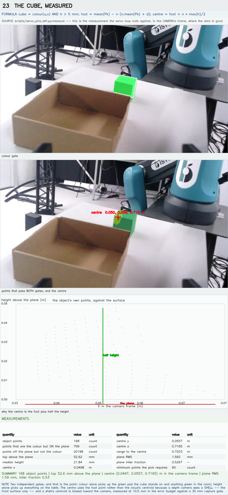

- **formula** `cube = colour(u,v) AND h > 5 mm;  foot = mean(Pk) - n (n.mean(Pk) + d);  centre = foot + n * max(h)/2`
- **source** scripts/servo_pick_left.py:measure -- this is the measurement the servo loop nulls against, in the CAMERA's frame, where the data is good
- **summary** 168 object points | top 52.6 mm above the plane | centre (0.0497, 0.0557, 0.7165) m in the camera frame | plane RMS 1.59 mm, inlier fraction 0.53

| quantity | value | unit |
| --- | ---: | --- |
| object points | 168 | count |
| points that are the colour but ON the plane | 709 | count |
| points off the plane but not the colour | 20198 | count |
| top above the plane | 52.62 | mm |
| median height | 21.84 | mm |
| centre x | 0.0498 | m |
| centre y | 0.0557 | m |
| centre z | 0.7165 | m |
| range to the centre | 0.7203 | m |
| plane RMS | 1.592 | mm |
| plane inlier fraction | 0.5267 | - |
| minimum points the pick requires | 60 | count |

- **note** Two independent gates, and that is the point: colour alone picks up the green pad the cube stands on and anything green in the room; height alone picks up everything on the table. The centre uses the foot point rather than the cloud's centroid because a depth camera sees a SHELL -- the front surface only -- and a shell's centroid is biased toward the camera, measured at 10.5 mm in the error budget against a 30 mm capture gate.

### 24  Splitting a cube from the pad it stands on  [ok]

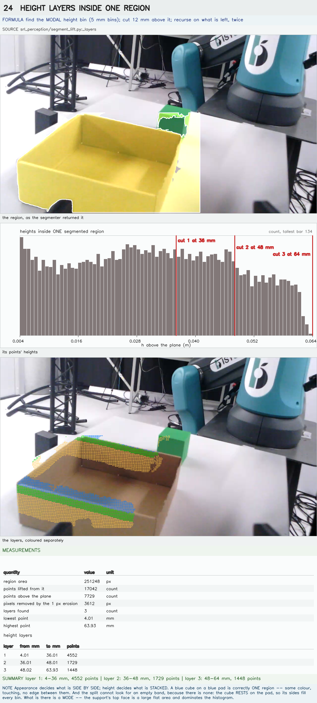

- **formula** `find the MODAL height bin (5 mm bins); cut 12 mm above it; recurse on what is left, twice`
- **source** srl_perception/segment_lift.py:_layers
- **summary** layer 1: 4-36 mm, 4552 points | layer 2: 36-48 mm, 1729 points | layer 3: 48-64 mm, 1448 points

| quantity | value | unit |
| --- | ---: | --- |
| region area | 251248 | px |
| points lifted from it | 17042 | count |
| points above the plane | 7729 | count |
| pixels removed by the 1 px erosion | 3612 | px |
| layers found | 3 | count |
| lowest point | 4.01 | mm |
| highest point | 63.93 | mm |

*height layers* -- 3 rows, full data in `data/right_gripper/24_layers__height_layers.csv`

- **note** Appearance decides what is SIDE BY SIDE; height decides what is STACKED. A blue cube on a blue pad is correctly ONE region -- same colour, touching, no edge between them. And the split cannot look for an empty band, because there is none: the cube RESTS on the pad, so its sides fill every bin. What is there is a MODE -- the support's top face is a large flat area and dominates the histogram.

### 25  Rotating calipers, against the two controls  [ok]

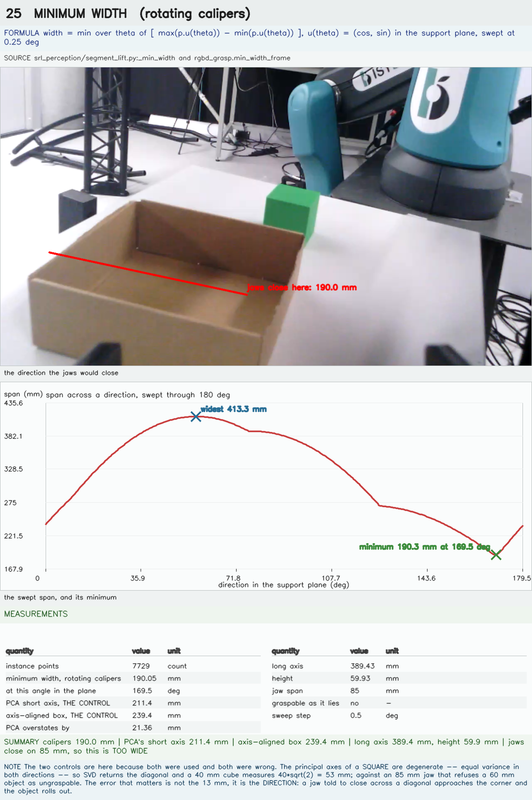

- **formula** `width = min over theta of [ max(p.u(theta)) - min(p.u(theta)) ],  u(theta) = (cos, sin) in the support plane, swept at 0.25 deg`
- **source** srl_perception/segment_lift.py:_min_width and rgbd_grasp.min_width_frame
- **summary** calipers 190.0 mm | PCA's short axis 211.4 mm | axis-aligned box 239.4 mm | long axis 389.4 mm, height 59.9 mm | jaws close on 85 mm, so this is TOO WIDE

| quantity | value | unit |
| --- | ---: | --- |
| instance points | 7729 | count |
| minimum width, rotating calipers | 190.05 | mm |
| at this angle in the plane | 169.5 | deg |
| PCA short axis, THE CONTROL | 211.4 | mm |
| axis-aligned box, THE CONTROL | 239.4 | mm |
| PCA overstates by | 21.36 | mm |
| long axis | 389.43 | mm |
| height | 59.93 | mm |
| jaw span | 85 | mm |
| graspable as it lies | no | - |
| sweep step | 0.5 | deg |

- **note** The two controls are here because both were used and both were wrong. The principal axes of a SQUARE are degenerate -- equal variance in both directions -- so SVD returns the diagonal and a 40 mm cube measures 40*sqrt(2) = 53 mm; against an 85 mm jaw that refuses a 60 mm object as ungraspable. The error that matters is not the 13 mm, it is the DIRECTION: a jaw told to close across a diagonal approaches the corner and the object rolls out.

### 26  Dropping masks that are unions of finer ones  [ok]

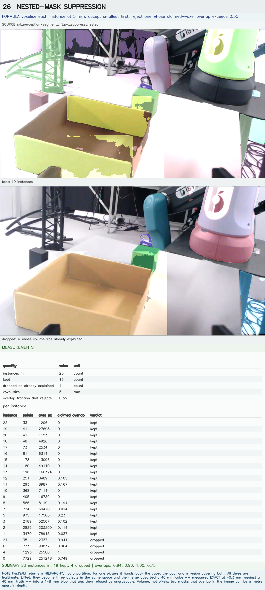

- **formula** `voxelise each instance at 5 mm; accept smallest first; reject one whose claimed-voxel overlap exceeds 0.55`
- **source** srl_perception/segment_lift.py:_suppress_nested
- **summary** 23 instances in, 19 kept, 4 dropped | overlaps: 0.94, 0.96, 1.00, 0.75

| quantity | value | unit |
| --- | ---: | --- |
| instances in | 23 | count |
| kept | 19 | count |
| dropped as already explained | 4 | count |
| voxel size | 5 | mm |
| overlap fraction that rejects | 0.55 | - |

*per instance* -- 23 rows, full data in `data/right_gripper/26_nested__per_instance.csv`

- **note** FastSAM returns a HIERARCHY, not a partition: for one picture it hands back the cube, the pad, and a region covering both. All three are legitimate. Lifted, they became three objects in the same space and the merge absorbed a 40 mm cube -- measured EXACT at 40.3 mm against a 40 mm truth -- into a 148 mm blob that was then refused as ungraspable. Volume, not pixels: two masks that overlap in the image can be a metre apart in depth.

### 27  The parallel-jaw grasp  [refused]

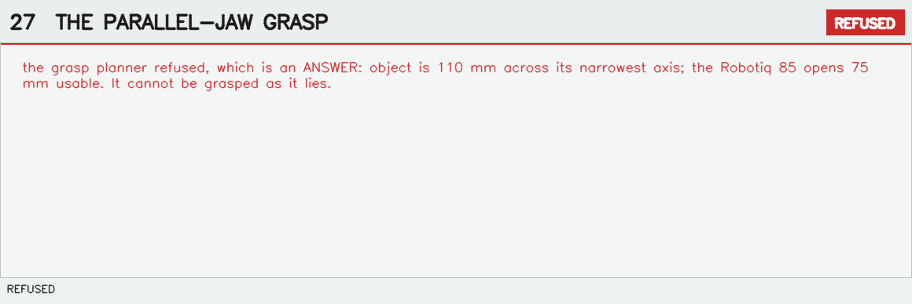

- **refused** the grasp planner refused, which is an ANSWER: object is 110 mm across its narrowest axis; the Robotiq 85 opens 75 mm usable. It cannot be grasped as it lies.

### 28  Fiducials: the primary detector  [refused]

- **refused** no AprilTag of family 36h11, 25h9 or 16h5 is in this frame. That is an answer, not a failure: a tag either decodes or it does not, which is exactly why this is the PRIMARY detector and colour is the capped fallback. Detector used: cv2.aruco.ArucoDetector (OpenCV 4.11.0).

### 29  The support surface, as an object  [ok]

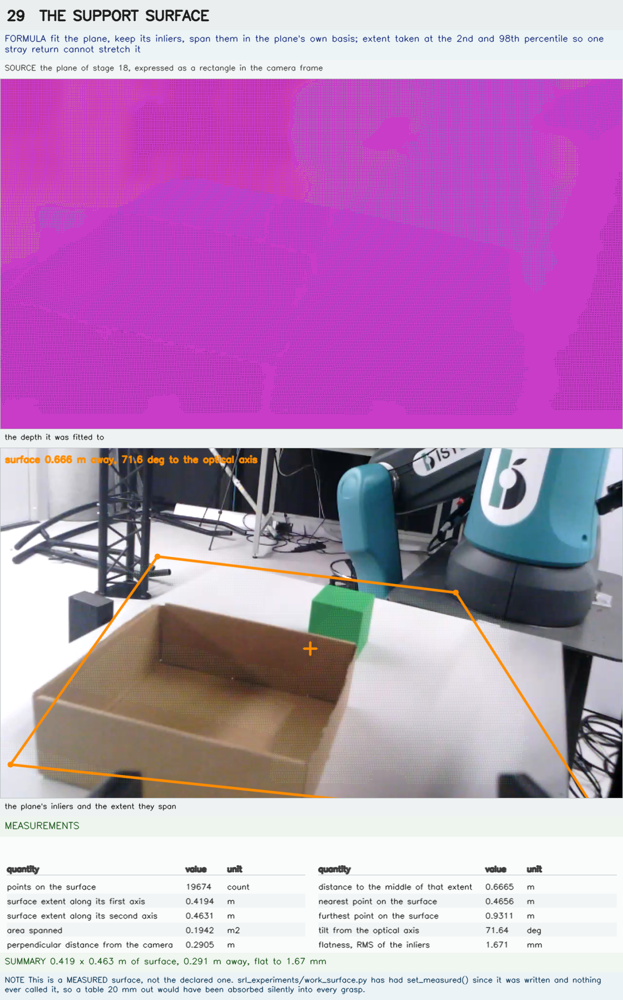

- **formula** `fit the plane, keep its inliers, span them in the plane's own basis; extent taken at the 2nd and 98th percentile so one stray return cannot stretch it`
- **source** the plane of stage 18, expressed as a rectangle in the camera frame
- **summary** 0.419 x 0.463 m of surface, 0.291 m away, flat to 1.67 mm

| quantity | value | unit |
| --- | ---: | --- |
| points on the surface | 19674 | count |
| surface extent along its first axis | 0.4194 | m |
| surface extent along its second axis | 0.4631 | m |
| area spanned | 0.1942 | m2 |
| perpendicular distance from the camera | 0.2905 | m |
| distance to the middle of that extent | 0.6665 | m |
| nearest point on the surface | 0.4656 | m |
| furthest point on the surface | 0.9311 | m |
| tilt from the optical axis | 71.64 | deg |
| flatness, RMS of the inliers | 1.671 | mm |

- **note** This is a MEASURED surface, not the declared one. srl_experiments/work_surface.py has had set_measured() since it was written and nothing ever called it, so a table 20 mm out would have been absorbed silently into every grasp.

### 30  Every object, as an oriented 3-D box  [ok]

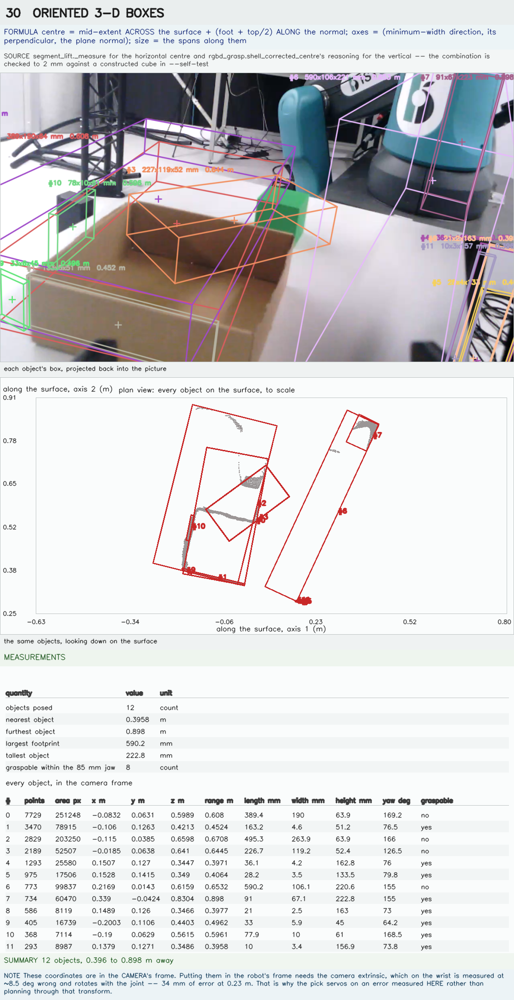

- **formula** `centre = mid-extent ACROSS the surface + (foot + top/2) ALONG the normal; axes = (minimum-width direction, its perpendicular, the plane normal); size = the spans along them`
- **source** segment_lift._measure for the horizontal centre and rgbd_grasp.shell_corrected_centre's reasoning for the vertical -- the combination is checked to 2 mm against a constructed cube in --self-test
- **summary** 12 objects, 0.396 to 0.898 m away

| quantity | value | unit |
| --- | ---: | --- |
| objects posed | 12 | count |
| nearest object | 0.3958 | m |
| furthest object | 0.898 | m |
| largest footprint | 590.2 | mm |
| tallest object | 222.8 | mm |
| graspable within the 85 mm jaw | 8 | count |

*every object, in the camera frame* -- 12 rows, full data in `data/right_gripper/30_boxes3d__every_object__in_the_camera_frame.csv`

- **note** These coordinates are in the CAMERA's frame. Putting them in the robot's frame needs the camera extrinsic, which on the wrist is measured at ~8.5 deg wrong and rotates with the joint -- 34 mm of error at 0.23 m. That is why the pick servos on an error measured HERE rather than planning through that transform.

### 31  How far apart everything is  [ok]

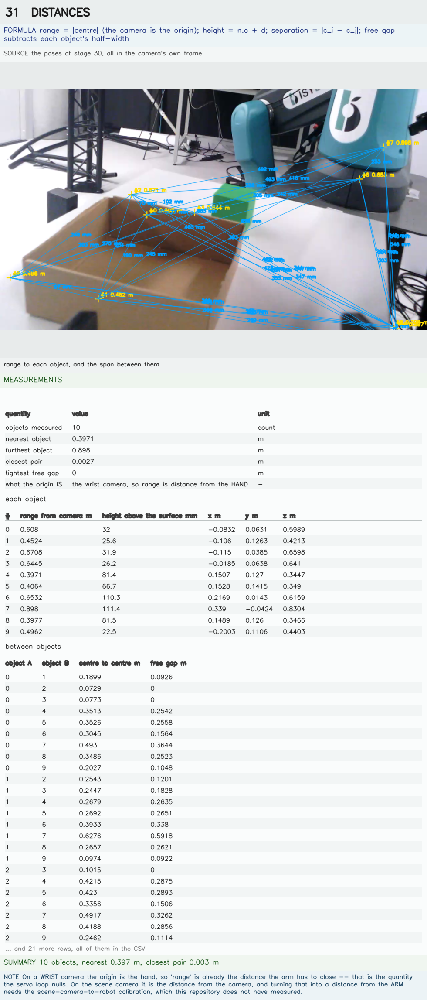

- **formula** `range = |centre| (the camera is the origin); height = n.c + d; separation = |c_i - c_j|; free gap subtracts each object's half-width`
- **source** the poses of stage 30, all in the camera's own frame
- **summary** 10 objects, nearest 0.397 m, closest pair 0.003 m

| quantity | value | unit |
| --- | ---: | --- |
| objects measured | 10 | count |
| nearest object | 0.3971 | m |
| furthest object | 0.898 | m |
| closest pair | 0.0027 | m |
| tightest free gap | 0 | m |
| what the origin IS | the wrist camera, so range is distance from the HAND | - |

*each object* -- 10 rows, full data in `data/right_gripper/31_distances__each_object.csv`

*between objects* -- 45 rows, full data in `data/right_gripper/31_distances__between_objects.csv`

- **note** On a WRIST camera the origin is the hand, so 'range' is already the distance the arm has to close -- that is the quantity the servo loop nulls. On the scene camera it is the distance from the camera, and turning that into a distance from the ARM needs the scene-camera-to-robot calibration, which this repository does not have measured.

### 32  People in the picture  [refused]

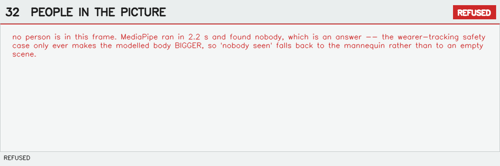

- **refused** no person is in this frame. MediaPipe ran in 2.2 s and found nobody, which is an answer -- the wearer-tracking safety case only ever makes the modelled body BIGGER, so 'nobody seen' falls back to the mannequin rather than to an empty scene.

### 33  The robot in the picture, and what is NOT detected  [ok]

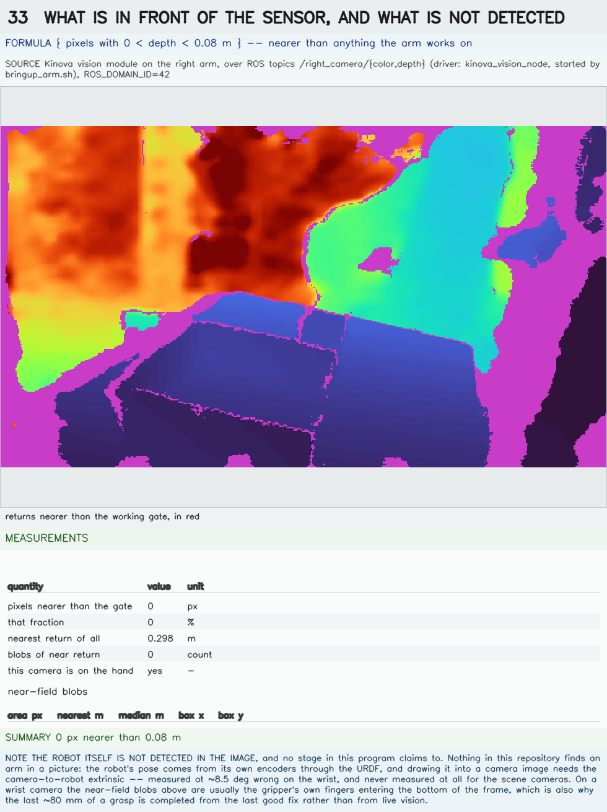

- **formula** `{ pixels with 0 < depth < 0.08 m } -- nearer than anything the arm works on`
- **source** Kinova vision module on the right arm, over ROS topics /right_camera/{color,depth} (driver: kinova_vision_node, started by bringup_arm.sh), ROS_DOMAIN_ID=42
- **summary** 0 px nearer than 0.08 m

| quantity | value | unit |
| --- | ---: | --- |
| pixels nearer than the gate | 0 | px |
| that fraction | 0 | % |
| nearest return of all | 0.298 | m |
| blobs of near return | 0 | count |
| this camera is on the hand | yes | - |

*near-field blobs* -- 0 rows, full data in `data/right_gripper/33_self_view__near_field_blobs.csv`

- **note** THE ROBOT ITSELF IS NOT DETECTED IN THE IMAGE, and no stage in this program claims to. Nothing in this repository finds an arm in a picture: the robot's pose comes from its own encoders through the URDF, and drawing it into a camera image needs the camera-to-robot extrinsic -- measured at ~8.5 deg wrong on the wrist, and never measured at all for the scene cameras. On a wrist camera the near-field blobs above are usually the gripper's own fingers entering the bottom of the frame, which is also why the last ~80 mm of a grasp is completed from the last good fix rather than from live vision.

## scene_rs

**No frame.** after attempting usbipd attach ran (rc 0) and /dev/video* did not change -- it still refuses: the RealSense would not start: RealSense would not start at 424x240 depth + 640x480 colour @15. If it enumerates but will not stream, check it negotiated USB3 (`cat /sys/bus/usb/devices/*/speed` should read 5000, not 480) and that this user can open /dev/video* and /dev/bus/usb/*/* : Couldn't resolve requests. Attach it first -- `python3 scripts/usb_cameras.py --fix` -- and check it negotiated USB3.

## scene_hd

HD USB webcam /dev/video0 (HD USB CAMERA: HD USB CAMERA 32e4:0317), MJPG 1280x720

- NO INTRINSICS: this camera has never been calibrated in this repository, so every stage that needs fx, fy, cx, cy refuses rather than assuming cx = w/2. Calibrate it with scripts/calibrate_scene_camera.py.

Contact sheet: `sheet_scene_hd.png`

### 01  The frame, as the camera delivered it  [ok]

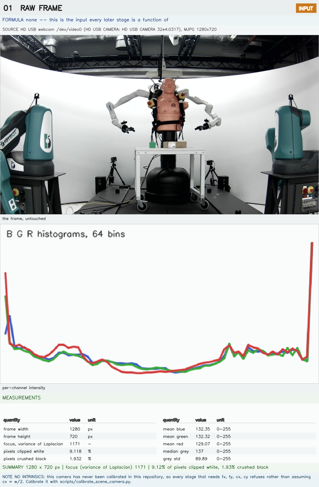

- **formula** `none -- this is the input every later stage is a function of`
- **source** HD USB webcam /dev/video0 (HD USB CAMERA: HD USB CAMERA 32e4:0317), MJPG 1280x720
- **summary** 1280 x 720 px | focus (variance of Laplacian) 1171 | 9.12% of pixels clipped white, 1.93% crushed black

| quantity | value | unit |
| --- | ---: | --- |
| frame width | 1280 | px |
| frame height | 720 | px |
| focus, variance of Laplacian | 1171 | - |
| pixels clipped white | 9.118 | % |
| pixels crushed black | 1.932 | % |
| mean blue | 132.35 | 0-255 |
| mean green | 132.32 | 0-255 |
| mean red | 129.07 | 0-255 |
| median grey | 137 | 0-255 |
| grey std | 89.89 | 0-255 |

- **note** NO INTRINSICS: this camera has never been calibrated in this repository, so every stage that needs fx, fy, cx, cy refuses rather than assuming cx = w/2. Calibrate it with scripts/calibrate_scene_camera.py.

### 02  Intrinsics and the ray each pixel stands for  [refused]

- **refused** this camera has no intrinsics in this repository, and this stage is arithmetic on fx, fy, cx, cy. Assuming cx = w/2 is exactly the error that throws a ray by 122 px on the Kinova module -- 94 mm at 1 m, three times the grasp tolerance. Calibrate it: scripts/calibrate_scene_camera.py

### 03  BGR to HSV, the space the colour tests live in  [ok]

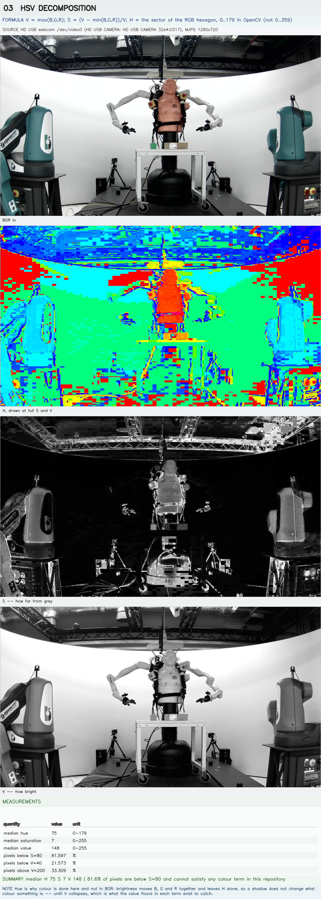

- **formula** `V = max(B,G,R);  S = (V - min(B,G,R))/V;  H = the sector of the RGB hexagon, 0..179 in OpenCV (not 0..359)`
- **source** HD USB webcam /dev/video0 (HD USB CAMERA: HD USB CAMERA 32e4:0317), MJPG 1280x720
- **summary** median H 75  S 7  V 148 | 81.6% of pixels are below S=80 and cannot satisfy any colour term in this repository

| quantity | value | unit |
| --- | ---: | --- |
| median hue | 75 | 0-179 |
| median saturation | 7 | 0-255 |
| median value | 148 | 0-255 |
| pixels below S=80 | 81.597 | % |
| pixels below V=40 | 21.573 | % |
| pixels above V=200 | 33.309 | % |

- **note** Hue is why colour is done here and not in BGR: brightness moves B, G and R together and leaves H alone, so a shadow does not change what colour something is -- until V collapses, which is what the value floors in each term exist to catch.

### 04  The pick path's own green threshold  [ok]

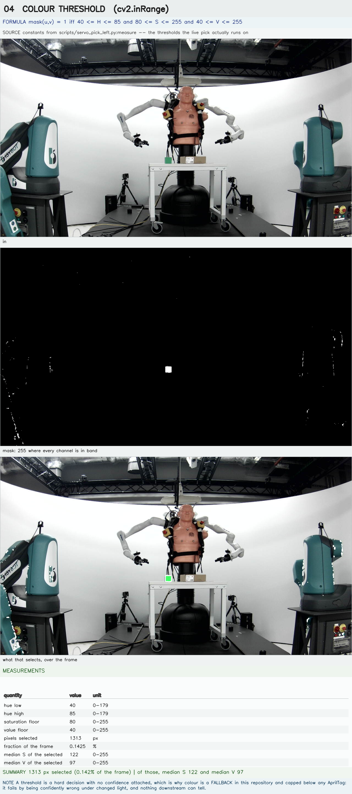

- **formula** `mask(u,v) = 1 iff  40 <= H <= 85  and  80 <= S <= 255  and  40 <= V <= 255`
- **source** constants from scripts/servo_pick_left.py:measure -- the thresholds the live pick actually runs on
- **summary** 1313 px selected (0.142% of the frame) | of those, median S 122 and median V 97

| quantity | value | unit |
| --- | ---: | --- |
| hue low | 40 | 0-179 |
| hue high | 85 | 0-179 |
| saturation floor | 80 | 0-255 |
| value floor | 40 | 0-255 |
| pixels selected | 1313 | px |
| fraction of the frame | 0.1425 | % |
| median S of the selected | 122 | 0-255 |
| median V of the selected | 97 | 0-255 |

- **note** A threshold is a hard decision with no confidence attached, which is why colour is a FALLBACK in this repository and capped below any AprilTag: it fails by being confidently wrong under changed light, and nothing downstream can tell.

### 05  What the 9x9 opening removes  [ok]

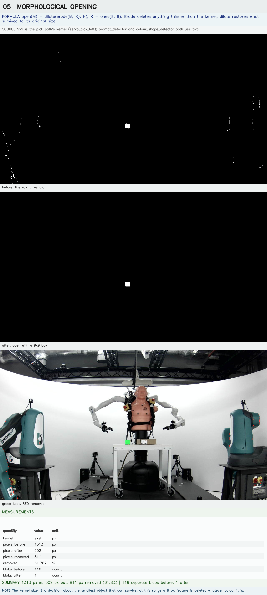

- **formula** `open(M) = dilate(erode(M, K), K),  K = ones(9, 9).  Erode deletes anything thinner than the kernel; dilate restores what survived to its original size.`
- **source** 9x9 is the pick path's kernel (servo_pick_left); prompt_detector and colour_shape_detector both use 5x5
- **summary** 1313 px in, 502 px out, 811 px removed (61.8%) | 116 separate blobs before, 1 after

| quantity | value | unit |
| --- | ---: | --- |
| kernel | 9x9 | px |
| pixels before | 1313 | px |
| pixels after | 502 | px |
| pixels removed | 811 | px |
| removed | 61.767 | % |
| blobs before | 116 | count |
| blobs after | 1 | count |

- **note** The kernel size IS a decision about the smallest object that can survive: at this range a 9 px feature is deleted whatever colour it is.

### 06  Connected components, and their statistics  [ok]

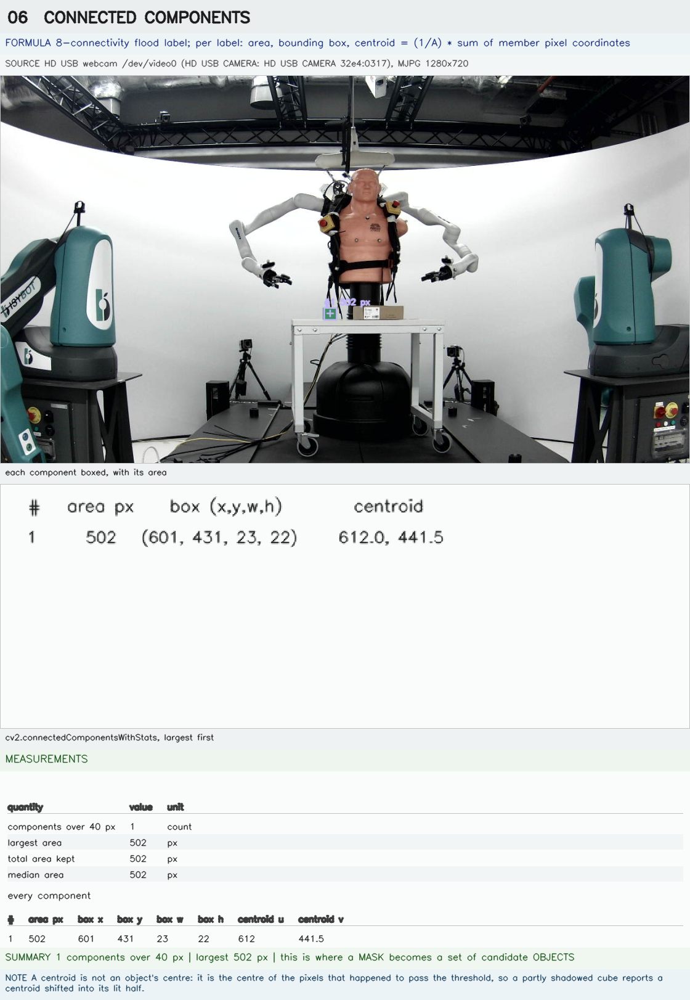

- **formula** `8-connectivity flood label; per label: area, bounding box, centroid = (1/A) * sum of member pixel coordinates`
- **source** HD USB webcam /dev/video0 (HD USB CAMERA: HD USB CAMERA 32e4:0317), MJPG 1280x720
- **summary** 1 components over 40 px | largest 502 px | this is where a MASK becomes a set of candidate OBJECTS

| quantity | value | unit |
| --- | ---: | --- |
| components over 40 px | 1 | count |
| largest area | 502 | px |
| total area kept | 502 | px |
| median area | 502 | px |

*every component* -- 1 rows, full data in `data/scene_hd/06_components__every_component.csv`

- **note** A centroid is not an object's centre: it is the centre of the pixels that happened to pass the threshold, so a partly shadowed cube reports a centroid shifted into its lit half.

### 07  The whole colour vocabulary, swept  [ok]

- **formula** `one inRange per band, OR-ed across bands (red needs two: it wraps the hue circle at 0/179), then a 5x5 opening`
- **source** srl_perception/prompt_detector.py:COLOUR_TERMS -- the colour backend's entire vocabulary, stated so its limit is visible rather than discovered
- **summary** white 299632 | black 192220 | cyan 45567 | red 9795 | green 507 | yellow 493

| quantity | value | unit |
| --- | ---: | --- |
| colour terms tested | 11 | count |
| terms with any pixels | 8 | count |
| largest term | white | - |
| its pixel count | 299632 | px |

*pixels per colour term* -- 11 rows, full data in `data/scene_hd/07_vocabulary__pixels_per_colour_term.csv`

*the three definitions of green* -- 3 rows, full data in `data/scene_hd/07_vocabulary__the_three_definitions_of_green.csv`

- **note** THE THREE GREENS ARE NOT THE SAME: servo_pick_left (the live pick) H40-85 S>=80 V>=40 open 9: 502 px; prompt_detector.COLOUR_TERMS H36-85 S>=80 V>=25 open 5: 507 px; colour_shape_detector.DEFAULT H40-85 S>=80 V>=60 open 5: 507 px. They differ in the value floor (25 / 40 / 60) and in the opening kernel, so the same cube in the same frame gives three different pixel counts depending on which module is asking.

### 08  The region-MEAN ratio test, and its near-black guard  [ok]

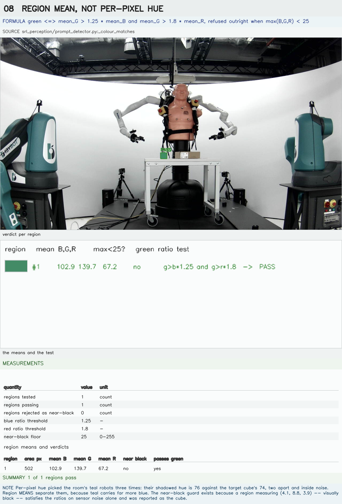

- **formula** `green  <=>  mean_G > 1.25 * mean_B  and  mean_G > 1.8 * mean_R,  refused outright when max(B,G,R) < 25`
- **source** srl_perception/prompt_detector.py:_colour_matches
- **summary** 1 of 1 regions pass

| quantity | value | unit |
| --- | ---: | --- |
| regions tested | 1 | count |
| regions passing | 1 | count |
| regions rejected as near-black | 0 | count |
| blue ratio threshold | 1.25 | - |
| red ratio threshold | 1.8 | - |
| near-black floor | 25 | 0-255 |

*region means and verdicts* -- 1 rows, full data in `data/scene_hd/08_region_mean__region_means_and_verdicts.csv`

- **note** Per-pixel hue picked the room's teal robots three times: their shadowed hue is 76 against the target cube's 74, two apart and inside noise. Region MEANS separate them, because teal carries far more blue. The near-black guard exists because a region measuring (4.1, 8.8, 3.9) -- visually black -- satisfies the ratios on sensor noise alone and was reported as the cube.

### 09  Rotated box, in-image yaw, and the degeneracy gate  [ok]

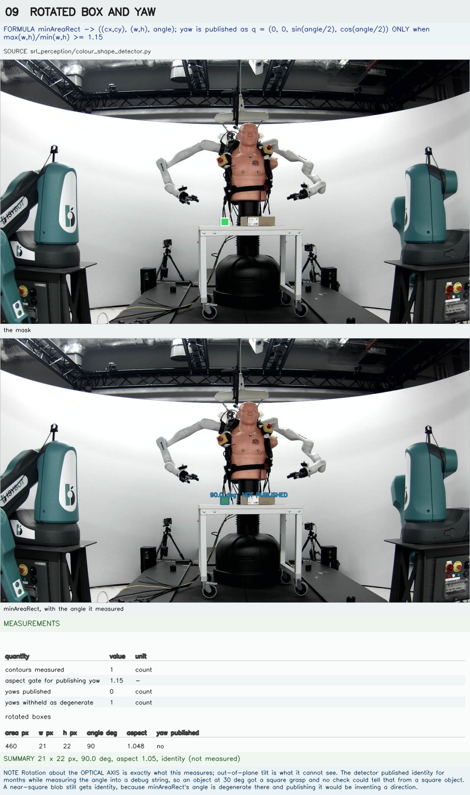

- **formula** `minAreaRect -> ((cx,cy), (w,h), angle);  yaw is published as q = (0, 0, sin(angle/2), cos(angle/2)) ONLY when max(w,h)/min(w,h) >= 1.15`
- **source** srl_perception/colour_shape_detector.py
- **summary** 21 x 22 px, 90.0 deg, aspect 1.05, identity (not measured)

| quantity | value | unit |
| --- | ---: | --- |
| contours measured | 1 | count |
| aspect gate for publishing yaw | 1.15 | - |
| yaws published | 0 | count |
| yaws withheld as degenerate | 1 | count |

*rotated boxes* -- 1 rows, full data in `data/scene_hd/09_minarearect__rotated_boxes.csv`

- **note** Rotation about the OPTICAL AXIS is exactly what this measures; out-of-plane tilt is what it cannot see. The detector published identity for months while measuring the angle into a debug string, so an object at 30 deg got a square grasp and no check could tell that from a square object. A near-square blob still gets identity, because minAreaRect's angle is degenerate there and publishing it would be inventing a direction.

### 10  The size-at-range gate  [refused]

- **refused** this camera has no intrinsics in this repository, and this stage is arithmetic on fx, fy, cx, cy. Assuming cx = w/2 is exactly the error that throws a ray by 122 px on the Kinova module -- 94 mm at 1 m, three times the grasp tolerance. Calibrate it: scripts/calibrate_scene_camera.py

### 11  FastSAM: every region in the picture, no prompt  [ok]

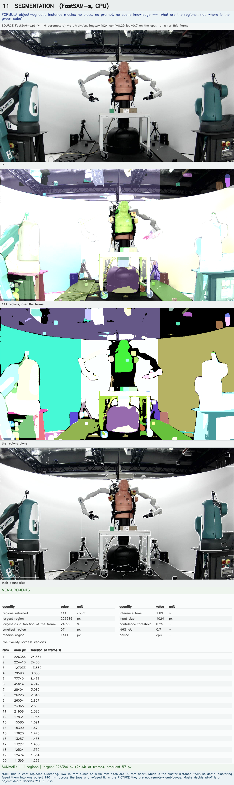

- **formula** `object-agnostic instance masks; no class, no prompt, no scene knowledge -- 'what are the regions', not 'where is the green cube'`
- **source** FastSAM-s.pt (~11M parameters) via ultralytics, imgsz=1024 conf=0.25 iou=0.7 on the cpu, 1.1 s for this frame
- **summary** 111 regions | largest 226386 px (24.6% of frame), smallest 57 px

| quantity | value | unit |
| --- | ---: | --- |
| regions returned | 111 | count |
| largest region | 226386 | px |
| largest as a fraction of the frame | 24.56 | % |
| smallest region | 57 | px |
| median region | 1411 | px |
| inference time | 1.09 | s |
| input size | 1024 | px |
| confidence threshold | 0.25 | - |
| NMS IoU | 0.7 | - |
| device | cpu | - |

*the twenty largest regions* -- 20 rows, full data in `data/scene_hd/11_fastsam__the_twenty_largest_regions.csv`

- **note** This is what replaced clustering. Two 40 mm cubes on a 60 mm pitch are 20 mm apart, which is the cluster distance itself, so depth-clustering fused them into one object 140 mm across the jaws and refused it. In the PICTURE they are not remotely ambiguous. Masks decide WHAT is an object; depth decides WHERE it is.

### 12  The area filter: noise below, the table above  [ok]

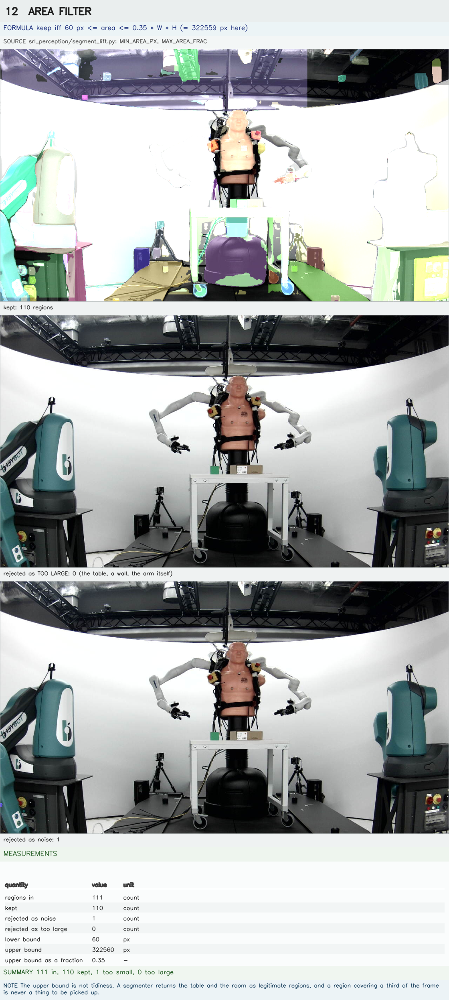

- **formula** `keep iff  60 px <= area <= 0.35 * W * H  (= 322559 px here)`
- **source** srl_perception/segment_lift.py: MIN_AREA_PX, MAX_AREA_FRAC
- **summary** 111 in, 110 kept, 1 too small, 0 too large

| quantity | value | unit |
| --- | ---: | --- |
| regions in | 111 | count |
| kept | 110 | count |
| rejected as noise | 1 | count |
| rejected as too large | 0 | count |
| lower bound | 60 | px |
| upper bound | 322560 | px |
| upper bound as a fraction | 0.35 | - |

- **note** The upper bound is not tidiness. A segmenter returns the table and the room as legitimate regions, and a region covering a third of the frame is never a thing to be picked up.

### 13  Segment everything, then pick the one that matches  [ok]

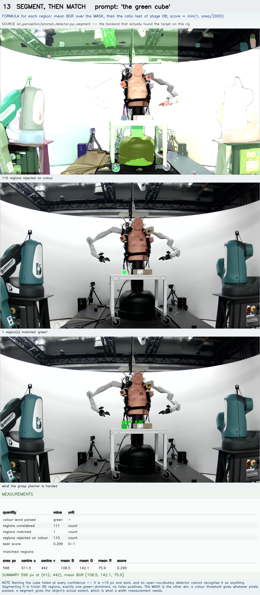

- **formula** `for each region: mean BGR over the MASK, then the ratio test of stage 08; score = min(1, area/2000)`
- **source** srl_perception/prompt_detector.py:_segment -- the backend that actually found the target on this rig
- **summary** 598 px at (612, 442), mean BGR [108.5, 142.1, 75.9]

| quantity | value | unit |
| --- | ---: | --- |
| colour word parsed | green | - |
| regions considered | 111 | count |
| regions matched | 1 | count |
| regions rejected on colour | 110 | count |
| best score | 0.299 | 0-1 |

*matched regions* -- 1 rows, full data in `data/scene_hd/13_segment_match__matched_regions.csv`

- **note** Naming the cube failed at every confidence -- it is ~19 px and dark, and an open-vocabulary detector cannot recognise it as anything. Segmenting it is trivial: 89 regions, exactly one green-dominant, no false positives. The MASK is the other win: a colour threshold gives whatever pixels passed, a segment gives the object's actual extent, which is what a width measurement needs.

### 14  YOLO-World: open-vocabulary naming  [refused]

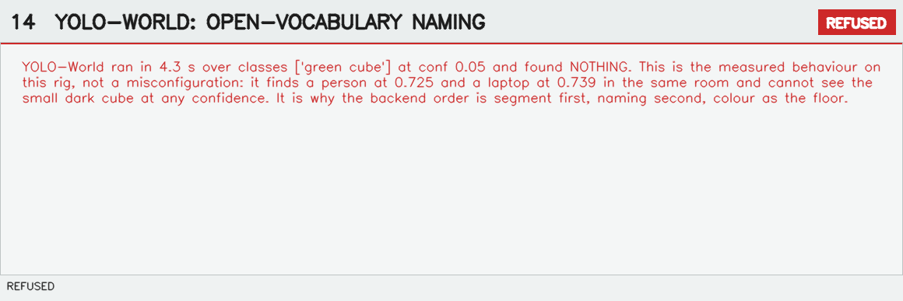

- **refused** YOLO-World ran in 4.3 s over classes ['green cube'] at conf 0.05 and found NOTHING. This is the measured behaviour on this rig, not a misconfiguration: it finds a person at 0.725 and a laptop at 0.739 in the same room and cannot see the small dark cube at any confidence. It is why the backend order is segment first, naming second, colour as the floor.

### 15  The depth frame, and where it has no answer  [by_design]

- **by_design** the HD USB webcam is a colour camera; it has no depth sensor. This is a by-design absence, not a fault -- the RealSense is the depth scene camera.

### 16  Depth put into the colour frame  [by_design]

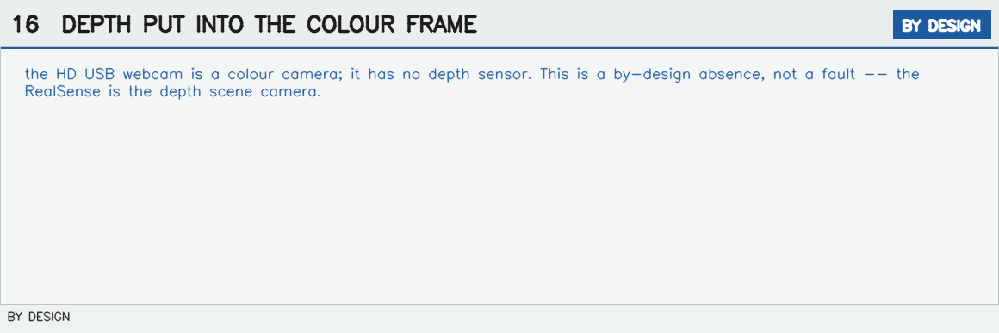

- **by_design** the HD USB webcam is a colour camera; it has no depth sensor. This is a by-design absence, not a fault -- the RealSense is the depth scene camera.

### 17  Pixels and depth become a cloud  [by_design]

- **by_design** the HD USB webcam is a colour camera; it has no depth sensor. This is a by-design absence, not a fault -- the RealSense is the depth scene camera.

### 18  RANSAC: the support plane  [by_design]

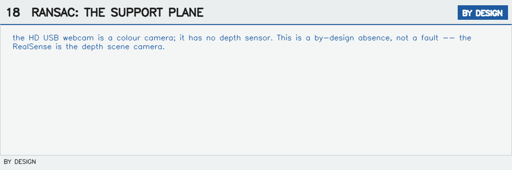

- **by_design** the HD USB webcam is a colour camera; it has no depth sensor. This is a by-design absence, not a fault -- the RealSense is the depth scene camera.

### 19  The PCA refinement, and the NaN it once produced  [by_design]

- **by_design** the HD USB webcam is a colour camera; it has no depth sensor. This is a by-design absence, not a fault -- the RealSense is the depth scene camera.

### 20  Height above the plane  [by_design]

- **by_design** the HD USB webcam is a colour camera; it has no depth sensor. This is a by-design absence, not a fault -- the RealSense is the depth scene camera.

### 21  The surface height as a MODE, not a mean  [by_design]

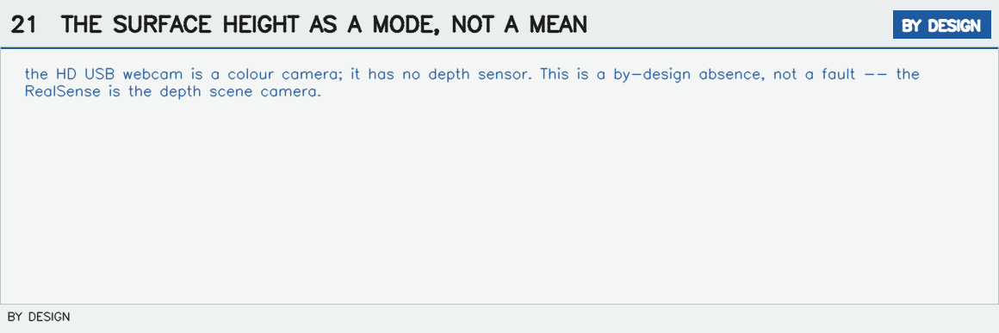

- **by_design** the HD USB webcam is a colour camera; it has no depth sensor. This is a by-design absence, not a fault -- the RealSense is the depth scene camera.

### 22  What is standing on the surface  [by_design]

- **by_design** the HD USB webcam is a colour camera; it has no depth sensor. This is a by-design absence, not a fault -- the RealSense is the depth scene camera.

### 23  The measurement the pick actually acts on  [refused]

- **refused** this camera has no intrinsics in this repository, and this stage is arithmetic on fx, fy, cx, cy. Assuming cx = w/2 is exactly the error that throws a ray by 122 px on the Kinova module -- 94 mm at 1 m, three times the grasp tolerance. Calibrate it: scripts/calibrate_scene_camera.py

### 24  Splitting a cube from the pad it stands on  [by_design]

- **by_design** the HD USB webcam is a colour camera; it has no depth sensor. This is a by-design absence, not a fault -- the RealSense is the depth scene camera.

### 25  Rotating calipers, against the two controls  [by_design]

- **by_design** the HD USB webcam is a colour camera; it has no depth sensor. This is a by-design absence, not a fault -- the RealSense is the depth scene camera.

### 26  Dropping masks that are unions of finer ones  [by_design]

- **by_design** the HD USB webcam is a colour camera; it has no depth sensor. This is a by-design absence, not a fault -- the RealSense is the depth scene camera.

### 27  The parallel-jaw grasp  [by_design]

- **by_design** the HD USB webcam is a colour camera; it has no depth sensor. This is a by-design absence, not a fault -- the RealSense is the depth scene camera.

### 28  Fiducials: the primary detector  [refused]

- **refused** no AprilTag of family 36h11, 25h9 or 16h5 is in this frame. That is an answer, not a failure: a tag either decodes or it does not, which is exactly why this is the PRIMARY detector and colour is the capped fallback. Detector used: cv2.aruco.ArucoDetector (OpenCV 4.11.0).

### 29  The support surface, as an object  [refused]

- **refused** this camera has no intrinsics in this repository, and this stage is arithmetic on fx, fy, cx, cy. Assuming cx = w/2 is exactly the error that throws a ray by 122 px on the Kinova module -- 94 mm at 1 m, three times the grasp tolerance. Calibrate it: scripts/calibrate_scene_camera.py

### 30  Every object, as an oriented 3-D box  [refused]

- **refused** this camera has no intrinsics in this repository, and this stage is arithmetic on fx, fy, cx, cy. Assuming cx = w/2 is exactly the error that throws a ray by 122 px on the Kinova module -- 94 mm at 1 m, three times the grasp tolerance. Calibrate it: scripts/calibrate_scene_camera.py

### 31  How far apart everything is  [refused]

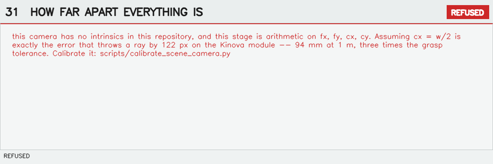

- **refused** this camera has no intrinsics in this repository, and this stage is arithmetic on fx, fy, cx, cy. Assuming cx = w/2 is exactly the error that throws a ray by 122 px on the Kinova module -- 94 mm at 1 m, three times the grasp tolerance. Calibrate it: scripts/calibrate_scene_camera.py

### 32  People in the picture  [ok]

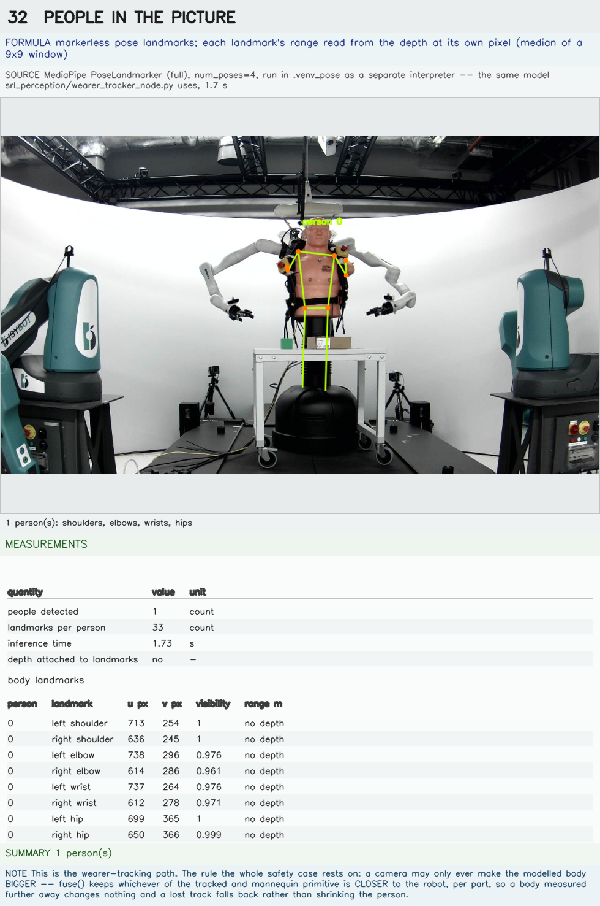

- **formula** `markerless pose landmarks; each landmark's range read from the depth at its own pixel (median of a 9x9 window)`
- **source** MediaPipe PoseLandmarker (full), num_poses=4, run in .venv_pose as a separate interpreter -- the same model srl_perception/wearer_tracker_node.py uses, 1.7 s
- **summary** 1 person(s)

| quantity | value | unit |
| --- | ---: | --- |
| people detected | 1 | count |
| landmarks per person | 33 | count |
| inference time | 1.73 | s |
| depth attached to landmarks | no | - |

*body landmarks* -- 8 rows, full data in `data/scene_hd/32_people__body_landmarks.csv`

- **note** This is the wearer-tracking path. The rule the whole safety case rests on: a camera may only ever make the modelled body BIGGER -- fuse() keeps whichever of the tracked and mannequin primitive is CLOSER to the robot, per part, so a body measured further away changes nothing and a lost track falls back rather than shrinking the person.

### 33  The robot in the picture, and what is NOT detected  [by_design]

- **by_design** the HD USB webcam is a colour camera; it has no depth sensor. This is a by-design absence, not a fault -- the RealSense is the depth scene camera.

