# 20260830_070529 -- left_gripper

Kinova vision module on the left arm, over ROS topics /left_camera/{color,depth} (driver: kinova_vision_node, started by bringup_arm.sh), ROS_DOMAIN_ID=42

27 of 33 stages produced a result. [Back to the index](GALLERY.md)

### 01  The frame, as the camera delivered it  [ok]

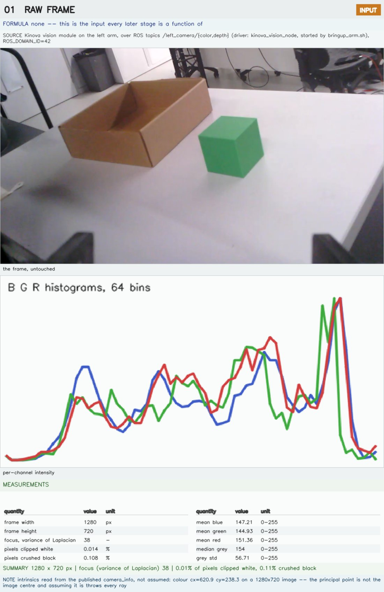

**Formula** `none -- this is the input every later stage is a function of`

**Measured** 1280 x 720 px | focus (variance of Laplacian) 38 | 0.01% of pixels clipped white, 0.11% crushed black

### 02  Intrinsics and the ray each pixel stands for  [ok]

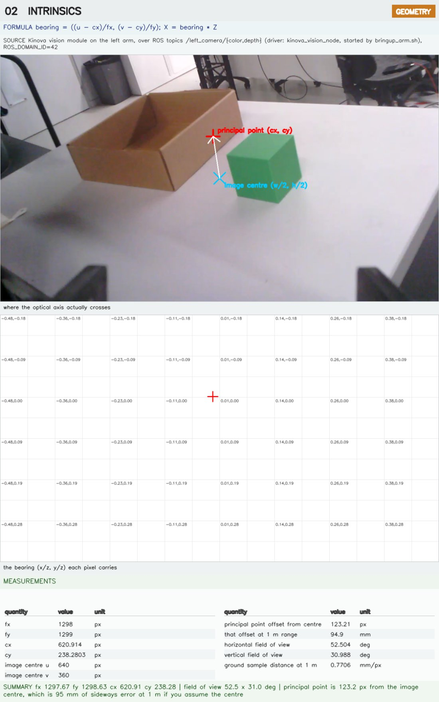

**Formula** `bearing = ((u - cx)/fx, (v - cy)/fy);  X = bearing * Z`

**Measured** fx 1297.67  fy 1298.63  cx 620.91  cy 238.28 | field of view 52.5 x 31.0 deg | principal point is 123.2 px from the image centre, which is 95 mm of sideways error at 1 m if you assume the centre

### 03  BGR to HSV, the space the colour tests live in  [ok]

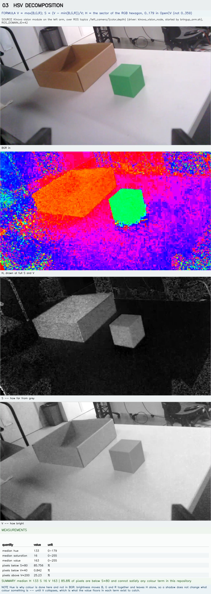

**Formula** `V = max(B,G,R);  S = (V - min(B,G,R))/V;  H = the sector of the RGB hexagon, 0..179 in OpenCV (not 0..359)`

**Measured** median H 133  S 16  V 163 | 85.8% of pixels are below S=80 and cannot satisfy any colour term in this repository

### 04  The pick path's own green threshold  [ok]

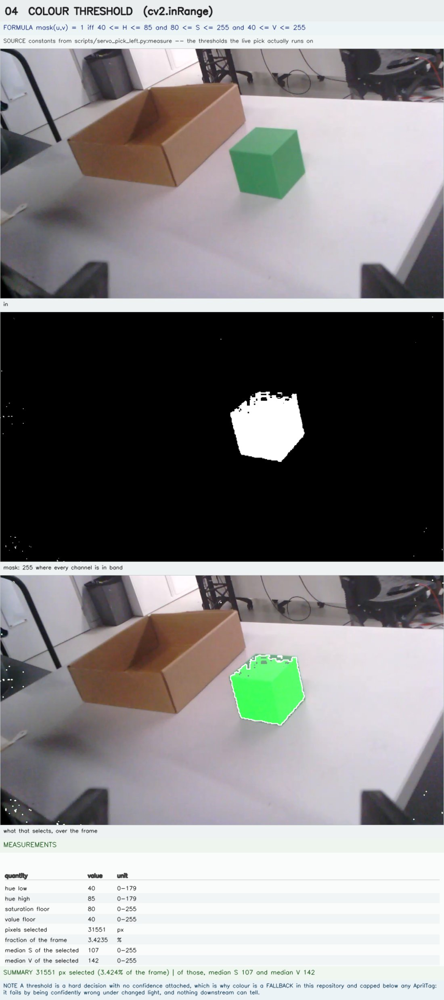

**Formula** `mask(u,v) = 1 iff  40 <= H <= 85  and  80 <= S <= 255  and  40 <= V <= 255`

**Measured** 31551 px selected (3.424% of the frame) | of those, median S 107 and median V 142

### 05  What the 9x9 opening removes  [ok]

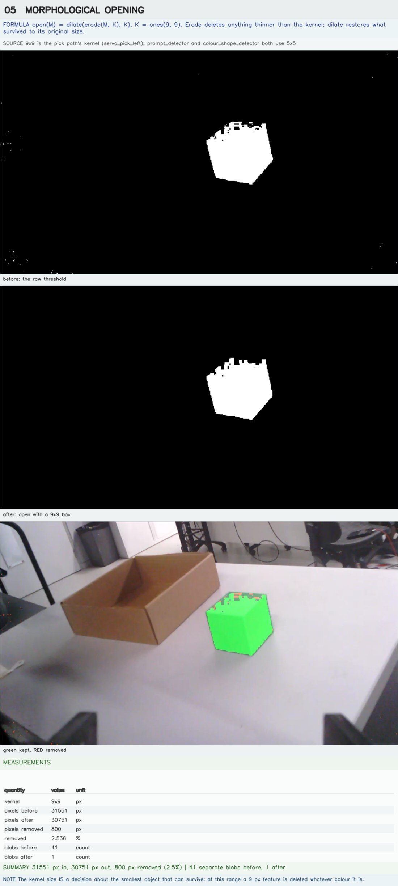

**Formula** `open(M) = dilate(erode(M, K), K),  K = ones(9, 9).  Erode deletes anything thinner than the kernel; dilate restores what survived to its original size.`

**Measured** 31551 px in, 30751 px out, 800 px removed (2.5%) | 41 separate blobs before, 1 after

### 06  Connected components, and their statistics  [ok]

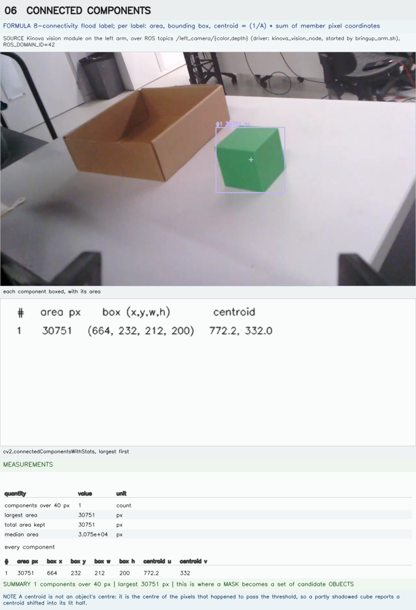

**Formula** `8-connectivity flood label; per label: area, bounding box, centroid = (1/A) * sum of member pixel coordinates`

**Measured** 1 components over 40 px | largest 30751 px | this is where a MASK becomes a set of candidate OBJECTS

### 07  The whole colour vocabulary, swept  [ok]

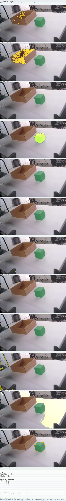

**Formula** `one inRange per band, OR-ed across bands (red needs two: it wraps the hue circle at 0/179), then a 5x5 opening`

**Measured** white 234039 | orange 46950 | green 31114 | black 11172 | red 6977 | blue 138

### 08  The region-MEAN ratio test, and its near-black guard  [ok]

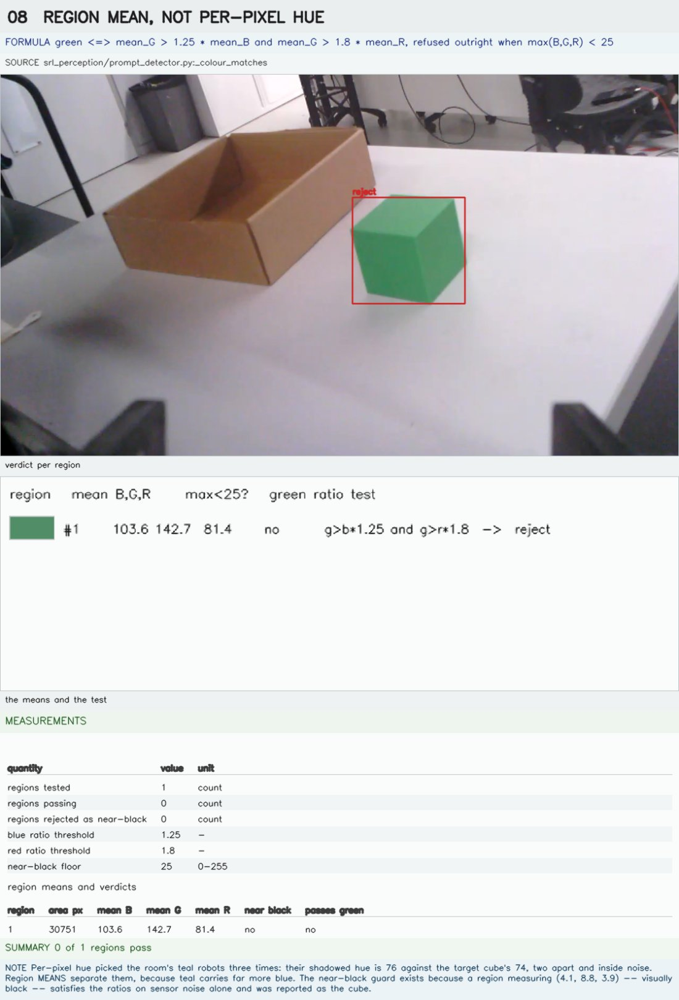

**Formula** `green  <=>  mean_G > 1.25 * mean_B  and  mean_G > 1.8 * mean_R,  refused outright when max(B,G,R) < 25`

**Measured** 0 of 1 regions pass

### 09  Rotated box, in-image yaw, and the degeneracy gate  [ok]

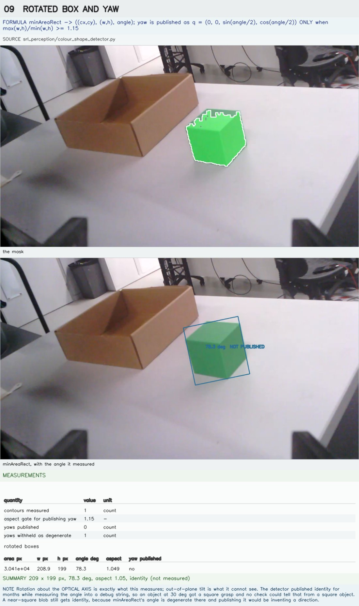

**Formula** `minAreaRect -> ((cx,cy), (w,h), angle);  yaw is published as q = (0, 0, sin(angle/2), cos(angle/2)) ONLY when max(w,h)/min(w,h) >= 1.15`

**Measured** 209 x 199 px, 78.3 deg, aspect 1.05, identity (not measured)

### 10  The size-at-range gate  [ok]

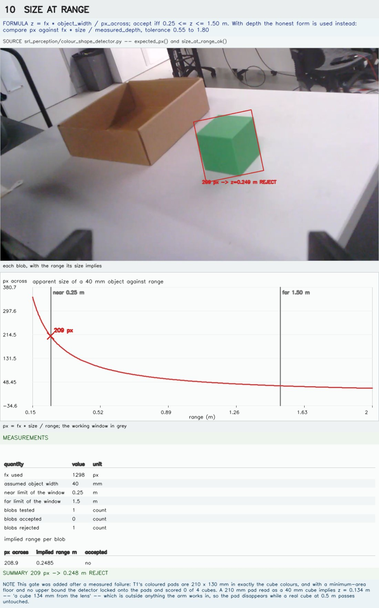

**Formula** `z = fx * object_width / px_across;  accept iff 0.25 <= z <= 1.50 m.  With depth the honest form is used instead: compare px against fx * size / measured_depth, tolerance 0.55 to 1.80`

**Measured** 209 px -> 0.248 m REJECT

### 11  FastSAM: every region in the picture, no prompt  [ok]

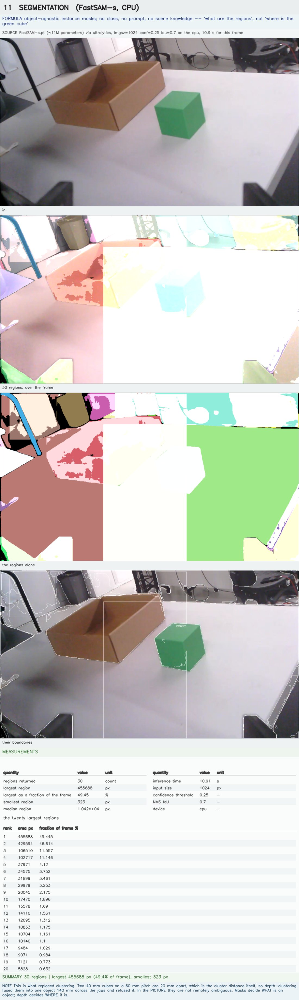

**Formula** `object-agnostic instance masks; no class, no prompt, no scene knowledge -- 'what are the regions', not 'where is the green cube'`

**Measured** 30 regions | largest 455688 px (49.4% of frame), smallest 323 px

### 12  The area filter: noise below, the table above  [ok]

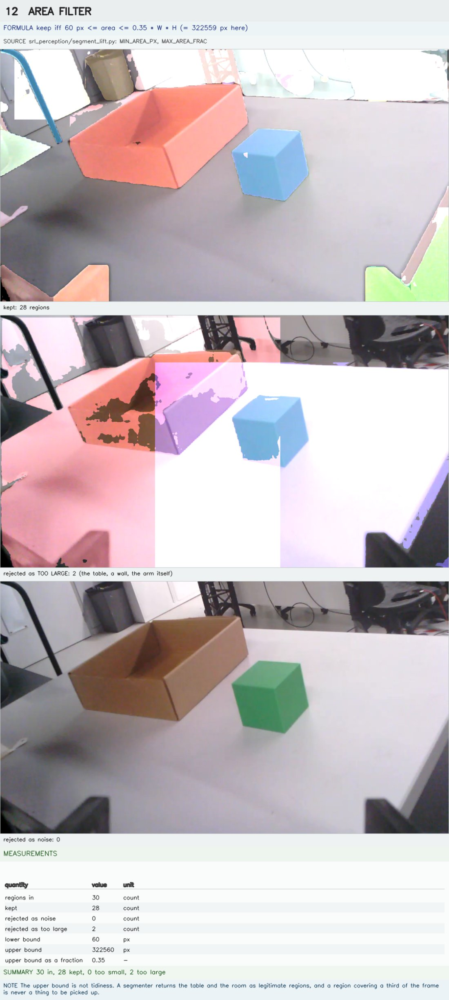

**Formula** `keep iff  60 px <= area <= 0.35 * W * H  (= 322559 px here)`

**Measured** 30 in, 28 kept, 0 too small, 2 too large

### 13  Segment everything, then pick the one that matches  [refused]

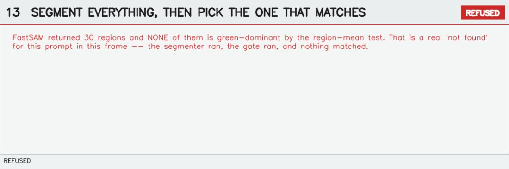

**refused** FastSAM returned 30 regions and NONE of them is green-dominant by the region-mean test. That is a real 'not found' for this prompt in this frame -- the segmenter ran, the gate ran, and nothing matched.

### 14  YOLO-World: open-vocabulary naming  [refused]

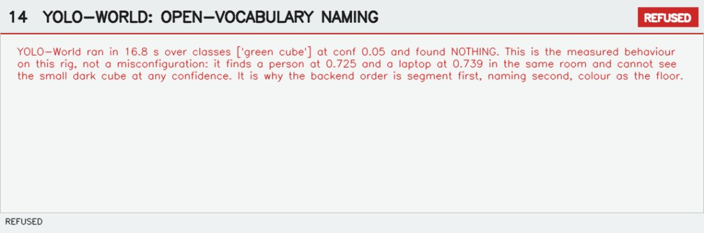

**refused** YOLO-World ran in 16.8 s over classes ['green cube'] at conf 0.05 and found NOTHING. This is the measured behaviour on this rig, not a misconfiguration: it finds a person at 0.725 and a laptop at 0.739 in the same room and cannot see the small dark cube at any confidence. It is why the backend order is segment first, naming second, colour as the floor.

### 15  The depth frame, and where it has no answer  [ok]

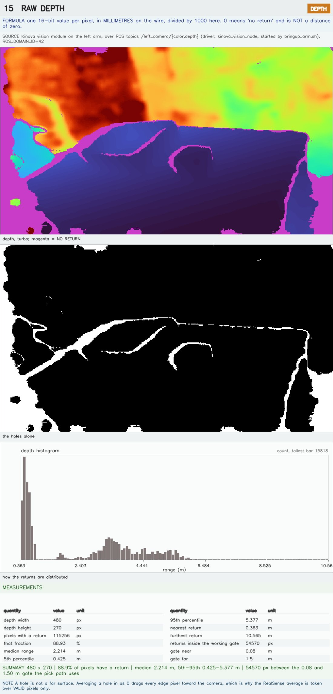

**Formula** `one 16-bit value per pixel, in MILLIMETRES on the wire, divided by 1000 here. 0 means 'no return' and is NOT a distance of zero.`

**Measured** 480 x 270 | 88.9% of pixels have a return | median 2.214 m, 5th-95th 0.425-5.377 m | 54570 px between the 0.08 and 1.50 m gate the pick path uses

### 16  Depth put into the colour frame  [ok]

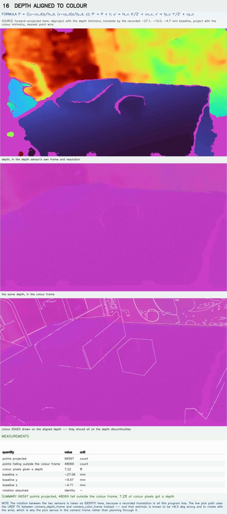

**Formula** `P = ((u-cx_d)z/fx_d, (v-cy_d)z/fy_d, z);  P' = P + t;  u' = fx_c X'/Z' + cx_c,  v' = fy_c Y'/Z' + cy_c`

**Measured** 66597 points projected, 48069 fell outside the colour frame, 7.2% of colour pixels got a depth

### 17  Pixels and depth become a cloud  [ok]

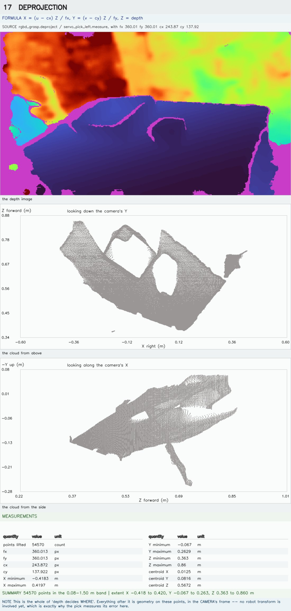

**Formula** `X = (u - cx) Z / fx,   Y = (v - cy) Z / fy,   Z = depth`

**Measured** 54570 points in the 0.08-1.50 m band | extent X -0.418 to 0.420, Y -0.067 to 0.263, Z 0.363 to 0.860 m

### 18  RANSAC: the support plane  [ok]

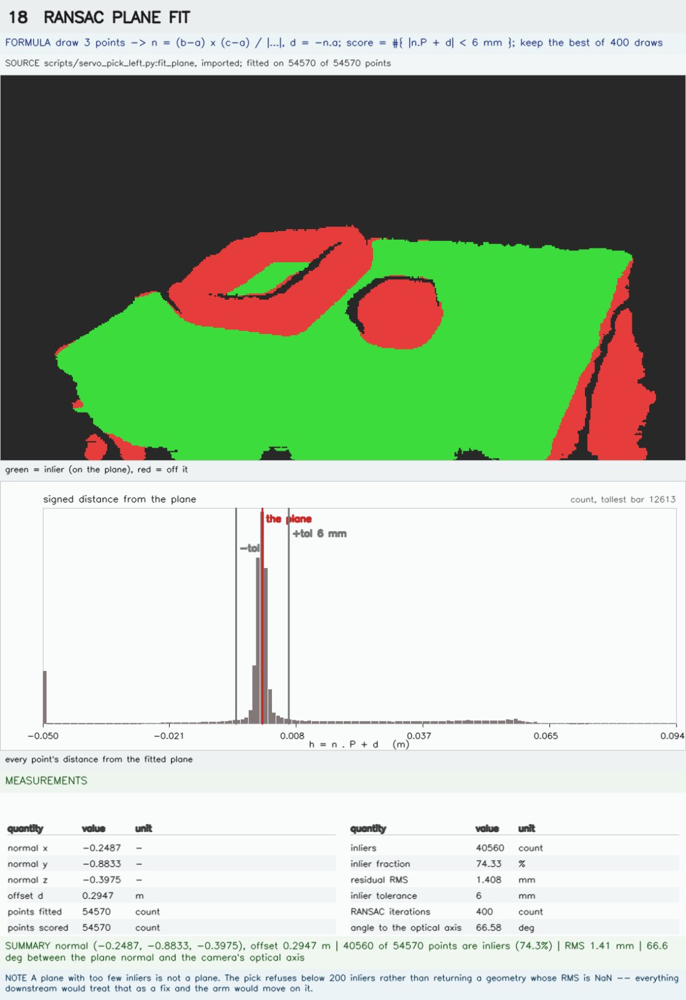

**Formula** `draw 3 points -> n = (b-a) x (c-a) / |...|,  d = -n.a;  score = #{ |n.P + d| < 6 mm };  keep the best of 400 draws`

**Measured** normal (-0.2487, -0.8833, -0.3975), offset 0.2947 m | 40560 of 54570 points are inliers (74.3%) | RMS 1.41 mm | 66.6 deg between the plane normal and the camera's optical axis

### 19  The PCA refinement, and the NaN it once produced  [ok]

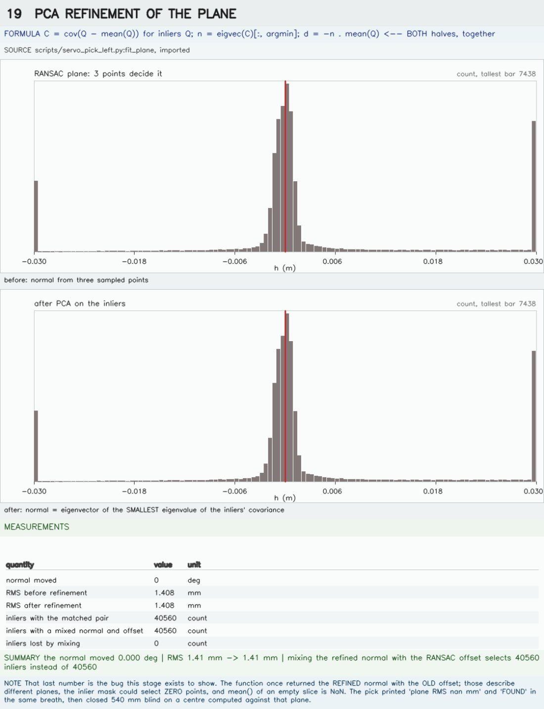

**Formula** `C = cov(Q - mean(Q)) for inliers Q;  n = eigvec(C)[:, argmin];  d = -n . mean(Q)   <-- BOTH halves, together`

**Measured** the normal moved 0.000 deg | RMS 1.41 mm -> 1.41 mm | mixing the refined normal with the RANSAC offset selects 40560 inliers instead of 40560

### 20  Height above the plane  [ok]

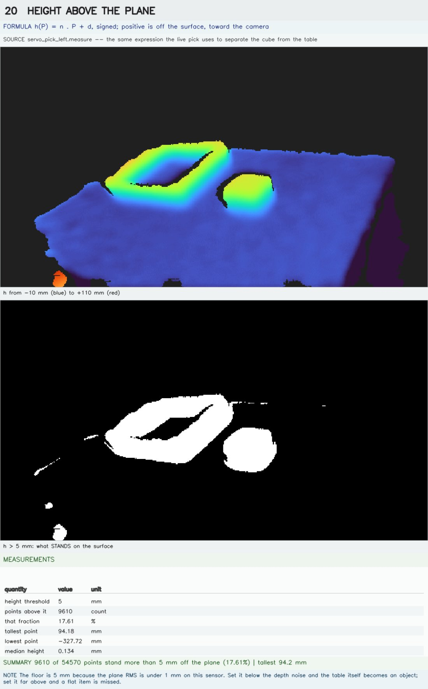

**Formula** `h(P) = n . P + d,  signed;  positive is off the surface, toward the camera`

**Measured** 9610 of 54570 points stand more than 5 mm off the plane (17.61%) | tallest 94.2 mm

### 21  The surface height as a MODE, not a mean  [ok]

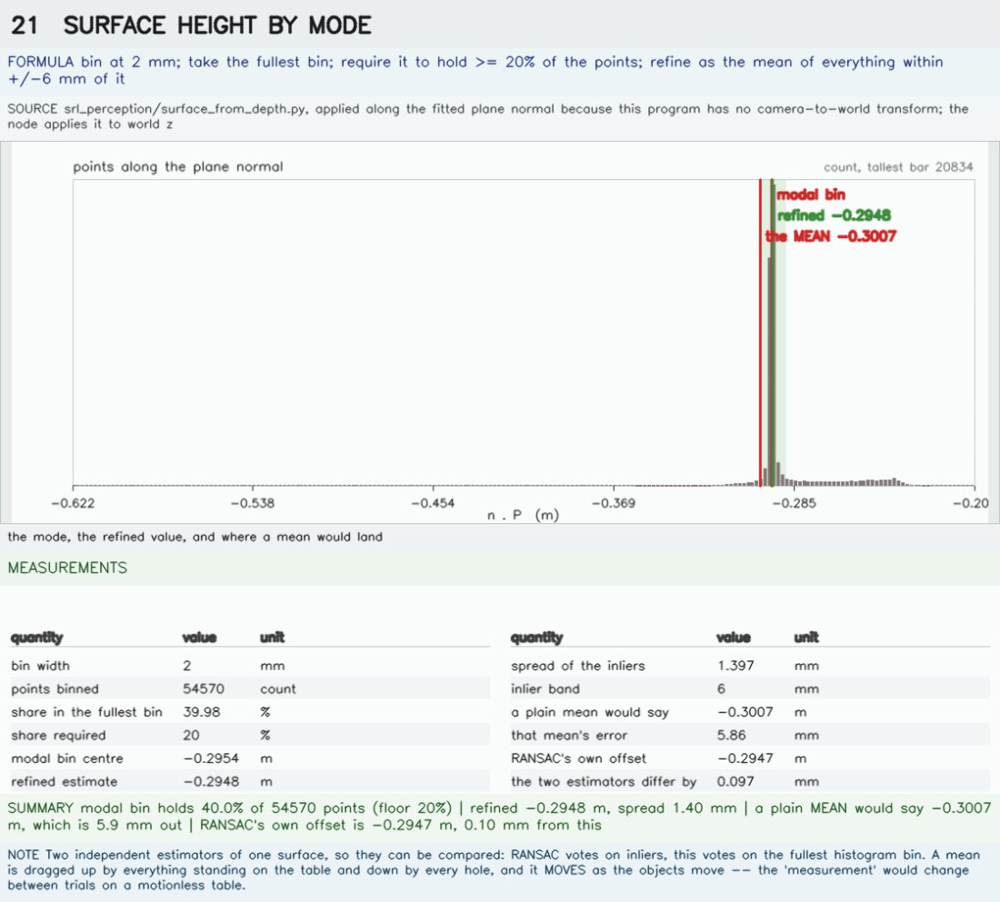

**Formula** `bin at 2 mm; take the fullest bin; require it to hold >= 20% of the points; refine as the mean of everything within +/-6 mm of it`

**Measured** modal bin holds 40.0% of 54570 points (floor 20%) | refined -0.2948 m, spread 1.40 mm | a plain MEAN would say -0.3007 m, which is 5.9 mm out | RANSAC's own offset is -0.2947 m, 0.10 mm from this

### 22  What is standing on the surface  [refused]

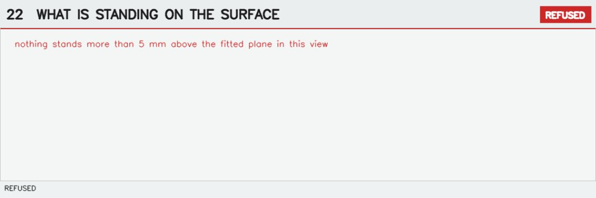

**refused** nothing stands more than 5 mm above the fitted plane in this view

### 23  The measurement the pick actually acts on  [ok]

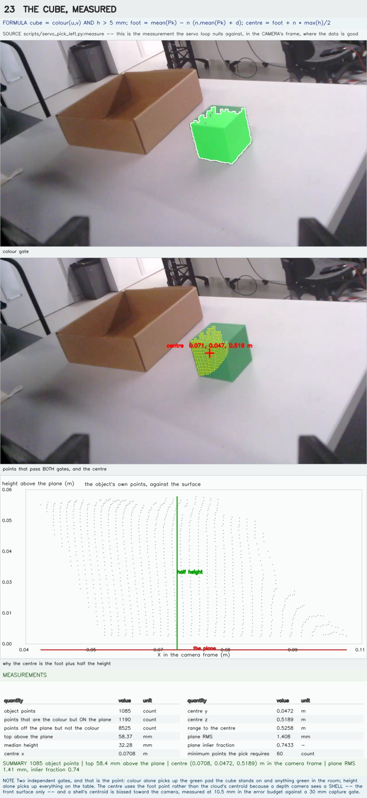

**Formula** `cube = colour(u,v) AND h > 5 mm;  foot = mean(Pk) - n (n.mean(Pk) + d);  centre = foot + n * max(h)/2`

**Measured** 1085 object points | top 58.4 mm above the plane | centre (0.0708, 0.0472, 0.5189) m in the camera frame | plane RMS 1.41 mm, inlier fraction 0.74

### 24  Splitting a cube from the pad it stands on  [ok]

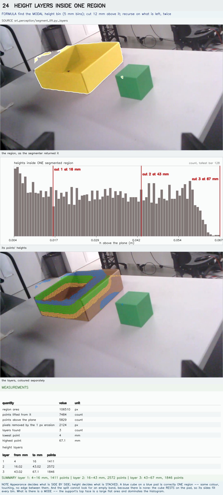

**Formula** `find the MODAL height bin (5 mm bins); cut 12 mm above it; recurse on what is left, twice`

**Measured** layer 1: 4-16 mm, 1411 points | layer 2: 16-43 mm, 2572 points | layer 3: 43-67 mm, 1846 points

### 25  Rotating calipers, against the two controls  [ok]

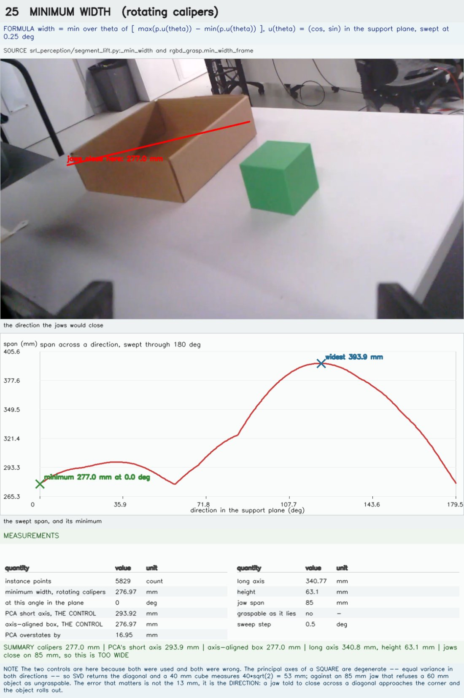

**Formula** `width = min over theta of [ max(p.u(theta)) - min(p.u(theta)) ],  u(theta) = (cos, sin) in the support plane, swept at 0.25 deg`

**Measured** calipers 277.0 mm | PCA's short axis 293.9 mm | axis-aligned box 277.0 mm | long axis 340.8 mm, height 63.1 mm | jaws close on 85 mm, so this is TOO WIDE

### 26  Dropping masks that are unions of finer ones  [ok]

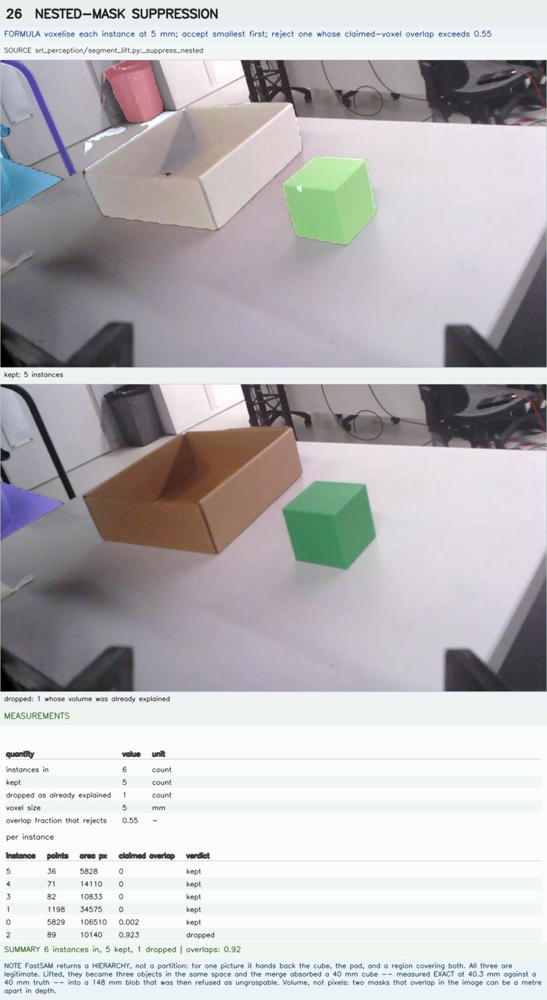

**Formula** `voxelise each instance at 5 mm; accept smallest first; reject one whose claimed-voxel overlap exceeds 0.55`

**Measured** 6 instances in, 5 kept, 1 dropped | overlaps: 0.92

### 27  The parallel-jaw grasp  [refused]

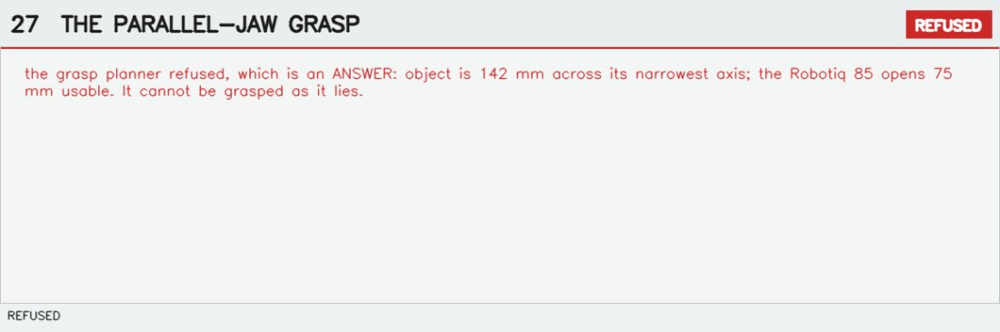

**refused** the grasp planner refused, which is an ANSWER: object is 142 mm across its narrowest axis; the Robotiq 85 opens 75 mm usable. It cannot be grasped as it lies.

### 28  Fiducials: the primary detector  [refused]

**refused** no AprilTag of family 36h11, 25h9 or 16h5 is in this frame. That is an answer, not a failure: a tag either decodes or it does not, which is exactly why this is the PRIMARY detector and colour is the capped fallback. Detector used: cv2.aruco.ArucoDetector (OpenCV 4.11.0).

### 29  The support surface, as an object  [ok]

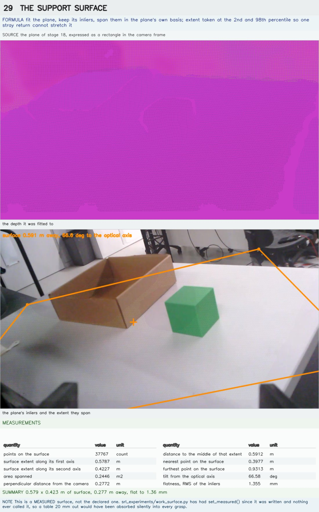

**Formula** `fit the plane, keep its inliers, span them in the plane's own basis; extent taken at the 2nd and 98th percentile so one stray return cannot stretch it`

**Measured** 0.579 x 0.423 m of surface, 0.277 m away, flat to 1.36 mm

### 30  Every object, as an oriented 3-D box  [ok]

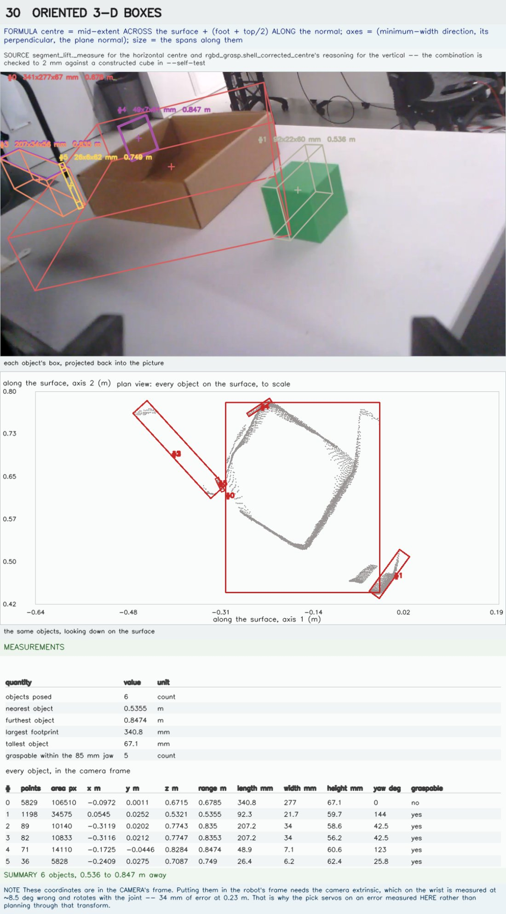

**Formula** `centre = mid-extent ACROSS the surface + (foot + top/2) ALONG the normal; axes = (minimum-width direction, its perpendicular, the plane normal); size = the spans along them`

**Measured** 6 objects, 0.536 to 0.847 m away

### 31  How far apart everything is  [ok]

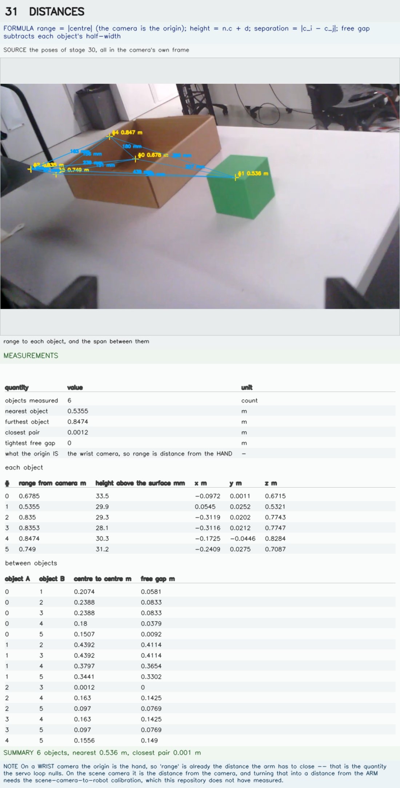

**Formula** `range = |centre| (the camera is the origin); height = n.c + d; separation = |c_i - c_j|; free gap subtracts each object's half-width`

**Measured** 6 objects, nearest 0.536 m, closest pair 0.001 m

### 32  People in the picture  [refused]

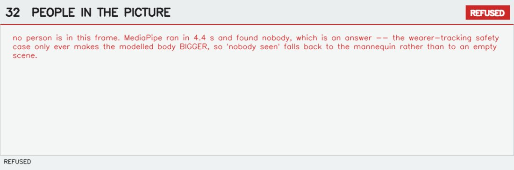

**refused** no person is in this frame. MediaPipe ran in 4.4 s and found nobody, which is an answer -- the wearer-tracking safety case only ever makes the modelled body BIGGER, so 'nobody seen' falls back to the mannequin rather than to an empty scene.

### 33  The robot in the picture, and what is NOT detected  [ok]

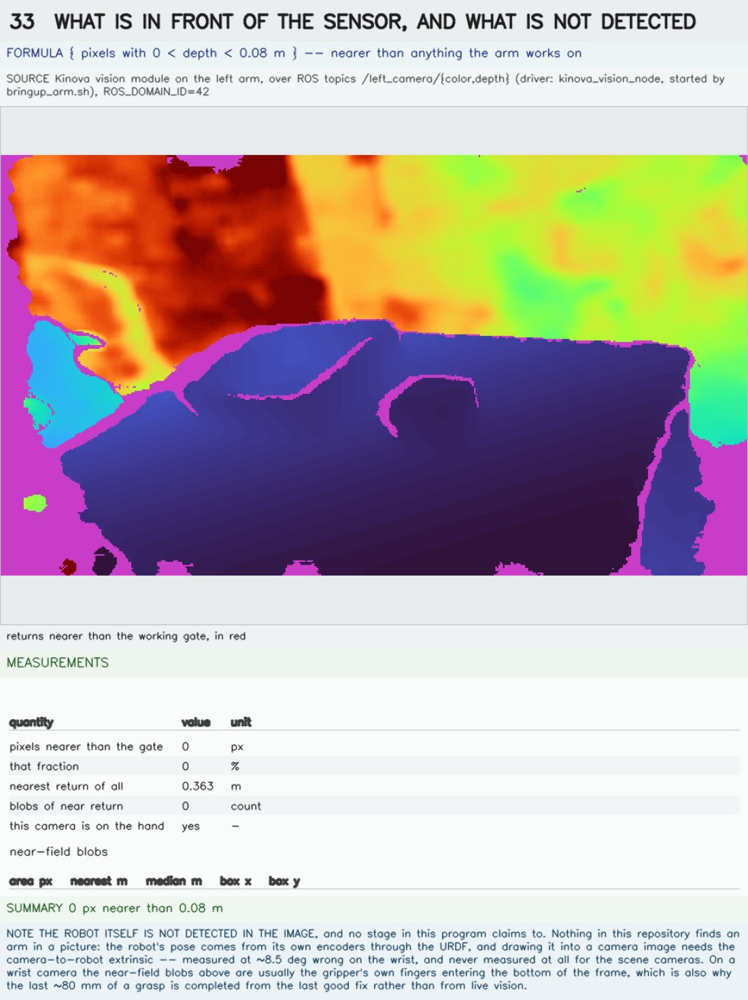

**Formula** `{ pixels with 0 < depth < 0.08 m } -- nearer than anything the arm works on`

**Measured** 0 px nearer than 0.08 m

