# 20260830_070529 -- scene_hd

HD USB webcam /dev/video6 (HD USB CAMERA: HD USB CAMERA 32e4:0317), MJPG 1280x720

12 of 33 stages produced a result. [Back to the index](GALLERY.md)

### 01  The frame, as the camera delivered it  [ok]

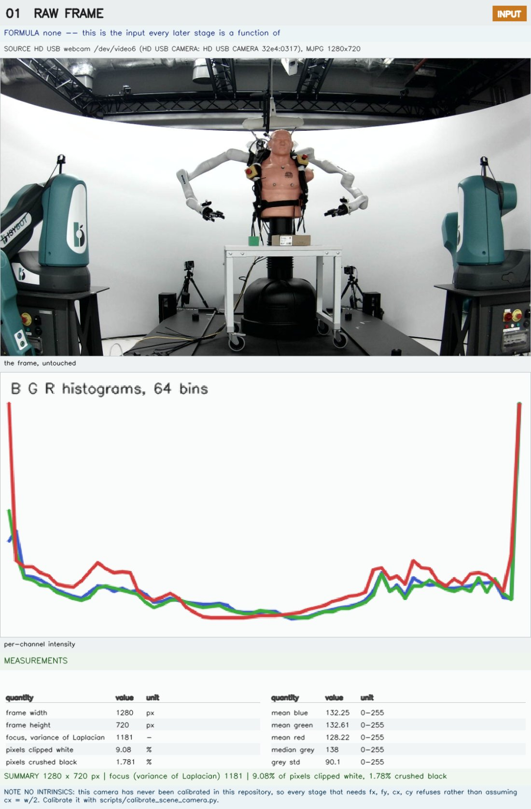

**Formula** `none -- this is the input every later stage is a function of`

**Measured** 1280 x 720 px | focus (variance of Laplacian) 1181 | 9.08% of pixels clipped white, 1.78% crushed black

### 02  Intrinsics and the ray each pixel stands for  [refused]

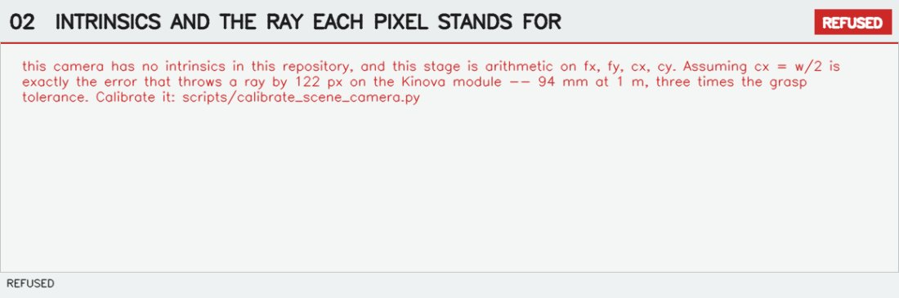

**refused** this camera has no intrinsics in this repository, and this stage is arithmetic on fx, fy, cx, cy. Assuming cx = w/2 is exactly the error that throws a ray by 122 px on the Kinova module -- 94 mm at 1 m, three times the grasp tolerance. Calibrate it: scripts/calibrate_scene_camera.py

### 03  BGR to HSV, the space the colour tests live in  [ok]

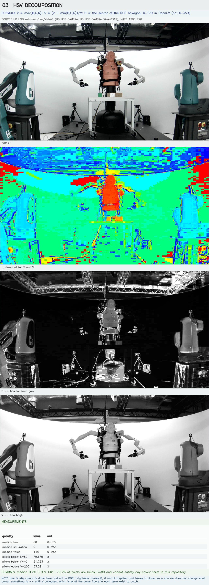

**Formula** `V = max(B,G,R);  S = (V - min(B,G,R))/V;  H = the sector of the RGB hexagon, 0..179 in OpenCV (not 0..359)`

**Measured** median H 80  S 9  V 148 | 79.7% of pixels are below S=80 and cannot satisfy any colour term in this repository

### 04  The pick path's own green threshold  [ok]

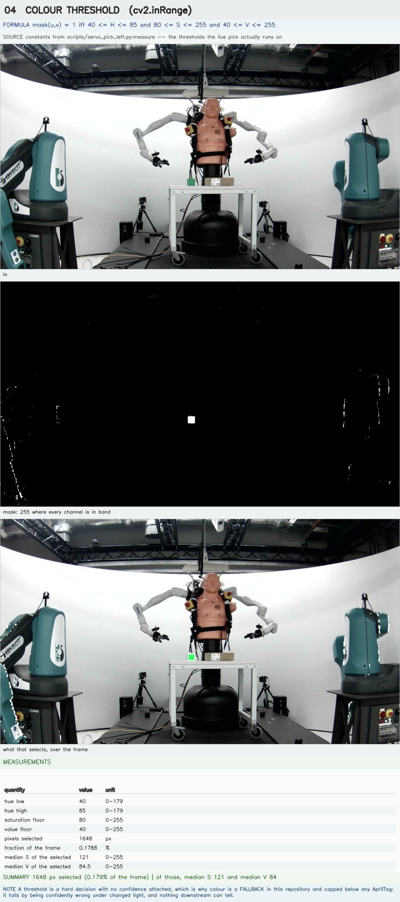

**Formula** `mask(u,v) = 1 iff  40 <= H <= 85  and  80 <= S <= 255  and  40 <= V <= 255`

**Measured** 1648 px selected (0.179% of the frame) | of those, median S 121 and median V 84

### 05  What the 9x9 opening removes  [ok]

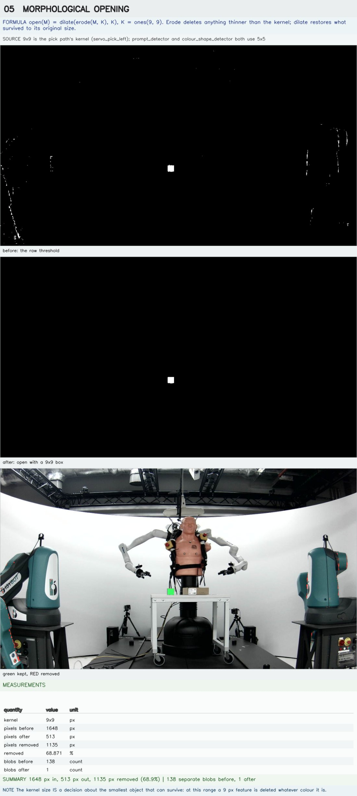

**Formula** `open(M) = dilate(erode(M, K), K),  K = ones(9, 9).  Erode deletes anything thinner than the kernel; dilate restores what survived to its original size.`

**Measured** 1648 px in, 513 px out, 1135 px removed (68.9%) | 138 separate blobs before, 1 after

### 06  Connected components, and their statistics  [ok]

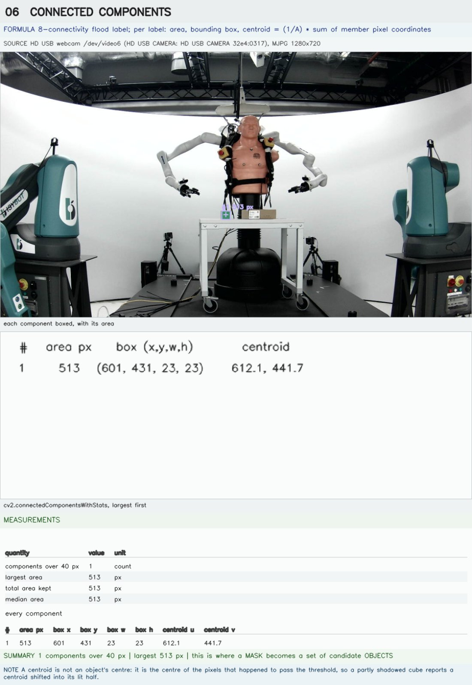

**Formula** `8-connectivity flood label; per label: area, bounding box, centroid = (1/A) * sum of member pixel coordinates`

**Measured** 1 components over 40 px | largest 513 px | this is where a MASK becomes a set of candidate OBJECTS

### 07  The whole colour vocabulary, swept  [ok]

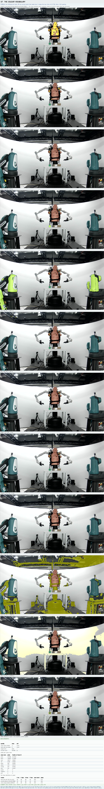

**Formula** `one inRange per band, OR-ed across bands (red needs two: it wraps the hue circle at 0/179), then a 5x5 opening`

**Measured** white 301606 | black 194407 | cyan 45917 | red 9148 | green 555 | yellow 475

### 08  The region-MEAN ratio test, and its near-black guard  [ok]

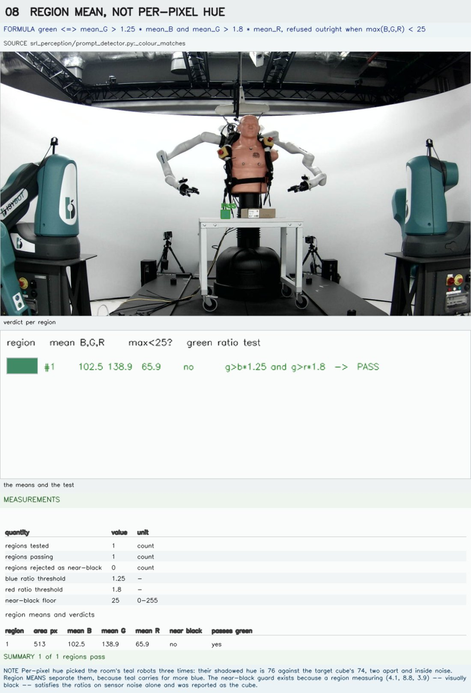

**Formula** `green  <=>  mean_G > 1.25 * mean_B  and  mean_G > 1.8 * mean_R,  refused outright when max(B,G,R) < 25`

**Measured** 1 of 1 regions pass

### 09  Rotated box, in-image yaw, and the degeneracy gate  [ok]

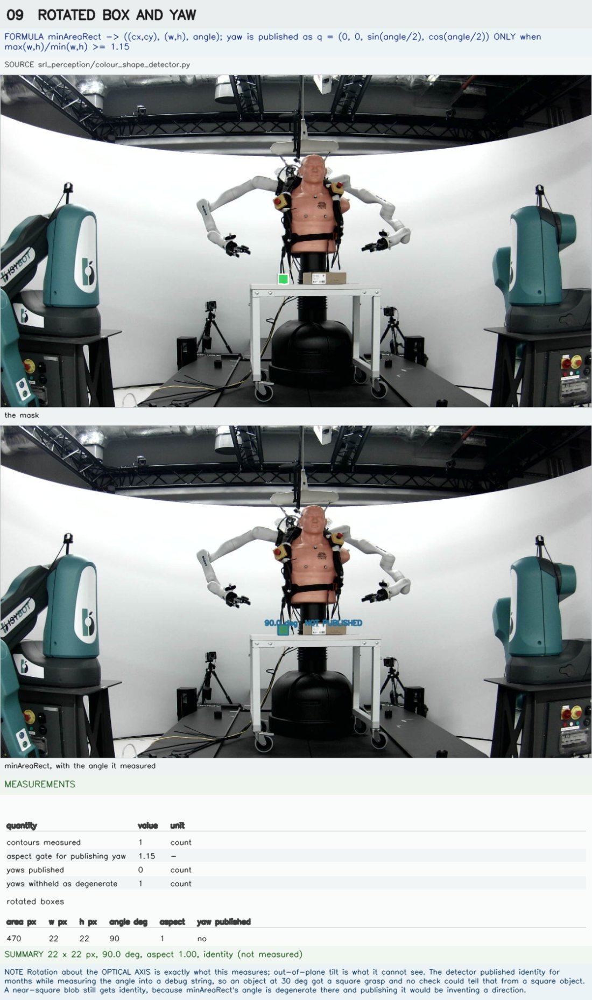

**Formula** `minAreaRect -> ((cx,cy), (w,h), angle);  yaw is published as q = (0, 0, sin(angle/2), cos(angle/2)) ONLY when max(w,h)/min(w,h) >= 1.15`

**Measured** 22 x 22 px, 90.0 deg, aspect 1.00, identity (not measured)

### 10  The size-at-range gate  [refused]

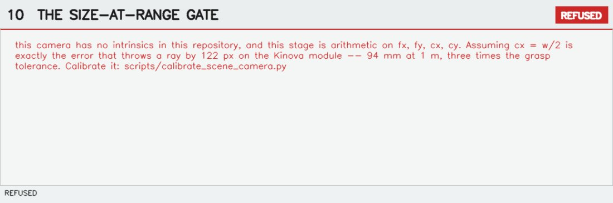

**refused** this camera has no intrinsics in this repository, and this stage is arithmetic on fx, fy, cx, cy. Assuming cx = w/2 is exactly the error that throws a ray by 122 px on the Kinova module -- 94 mm at 1 m, three times the grasp tolerance. Calibrate it: scripts/calibrate_scene_camera.py

### 11  FastSAM: every region in the picture, no prompt  [ok]

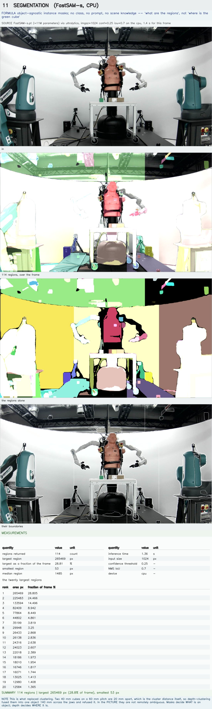

**Formula** `object-agnostic instance masks; no class, no prompt, no scene knowledge -- 'what are the regions', not 'where is the green cube'`

**Measured** 114 regions | largest 265469 px (28.8% of frame), smallest 53 px

### 12  The area filter: noise below, the table above  [ok]

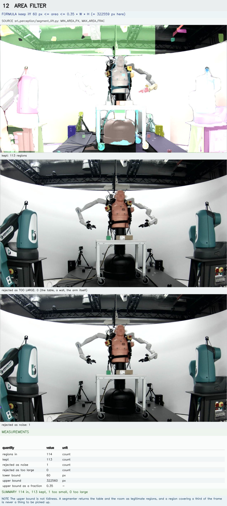

**Formula** `keep iff  60 px <= area <= 0.35 * W * H  (= 322559 px here)`

**Measured** 114 in, 113 kept, 1 too small, 0 too large

### 13  Segment everything, then pick the one that matches  [ok]

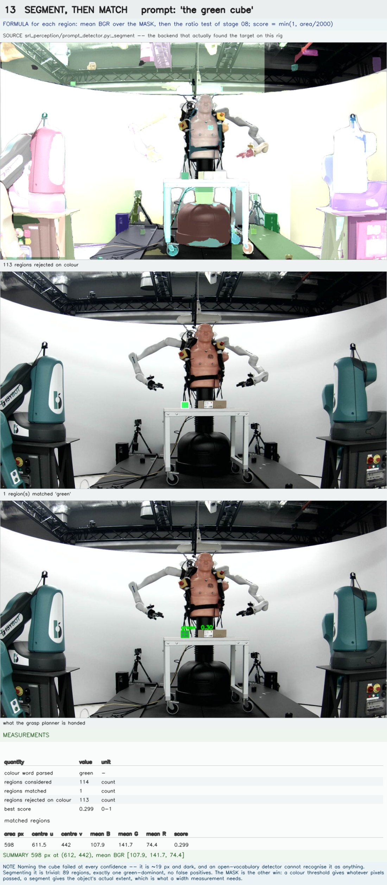

**Formula** `for each region: mean BGR over the MASK, then the ratio test of stage 08; score = min(1, area/2000)`

**Measured** 598 px at (612, 442), mean BGR [107.9, 141.7, 74.4]

### 14  YOLO-World: open-vocabulary naming  [refused]

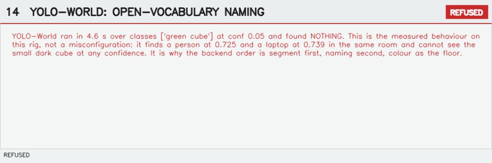

**refused** YOLO-World ran in 4.6 s over classes ['green cube'] at conf 0.05 and found NOTHING. This is the measured behaviour on this rig, not a misconfiguration: it finds a person at 0.725 and a laptop at 0.739 in the same room and cannot see the small dark cube at any confidence. It is why the backend order is segment first, naming second, colour as the floor.

### 15  The depth frame, and where it has no answer  [by_design]

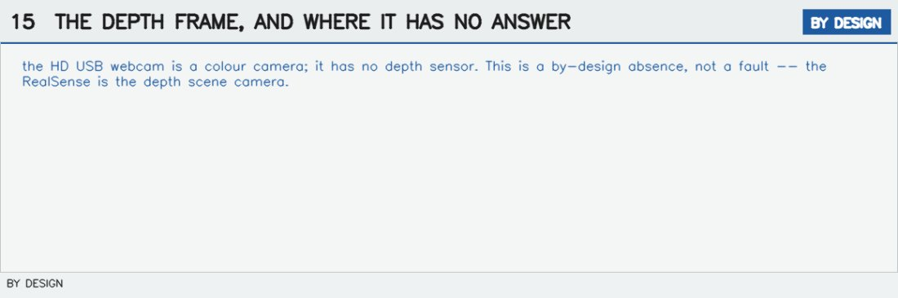

**by_design** the HD USB webcam is a colour camera; it has no depth sensor. This is a by-design absence, not a fault -- the RealSense is the depth scene camera.

### 16  Depth put into the colour frame  [by_design]

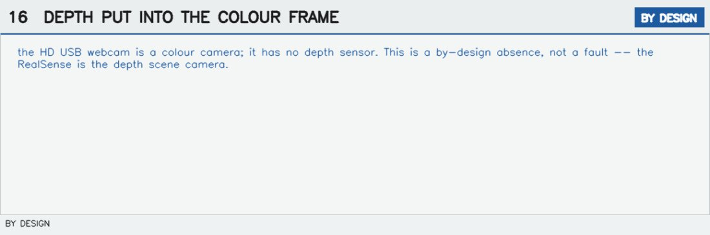

**by_design** the HD USB webcam is a colour camera; it has no depth sensor. This is a by-design absence, not a fault -- the RealSense is the depth scene camera.

### 17  Pixels and depth become a cloud  [by_design]

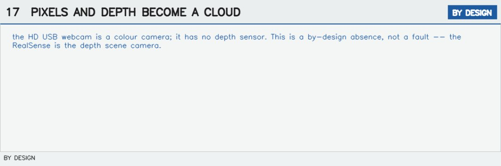

**by_design** the HD USB webcam is a colour camera; it has no depth sensor. This is a by-design absence, not a fault -- the RealSense is the depth scene camera.

### 18  RANSAC: the support plane  [by_design]

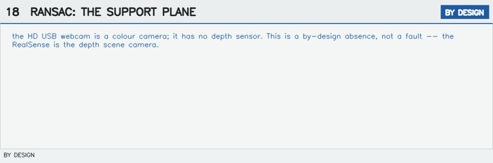

**by_design** the HD USB webcam is a colour camera; it has no depth sensor. This is a by-design absence, not a fault -- the RealSense is the depth scene camera.

### 19  The PCA refinement, and the NaN it once produced  [by_design]

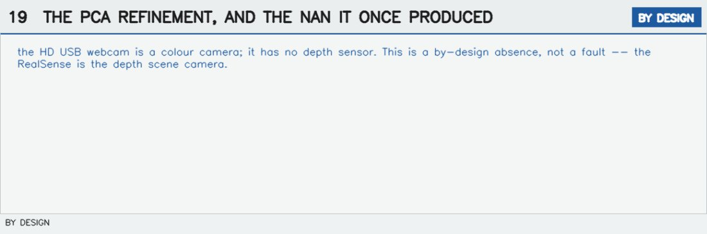

**by_design** the HD USB webcam is a colour camera; it has no depth sensor. This is a by-design absence, not a fault -- the RealSense is the depth scene camera.

### 20  Height above the plane  [by_design]

**by_design** the HD USB webcam is a colour camera; it has no depth sensor. This is a by-design absence, not a fault -- the RealSense is the depth scene camera.

### 21  The surface height as a MODE, not a mean  [by_design]

**by_design** the HD USB webcam is a colour camera; it has no depth sensor. This is a by-design absence, not a fault -- the RealSense is the depth scene camera.

### 22  What is standing on the surface  [by_design]

**by_design** the HD USB webcam is a colour camera; it has no depth sensor. This is a by-design absence, not a fault -- the RealSense is the depth scene camera.

### 23  The measurement the pick actually acts on  [refused]

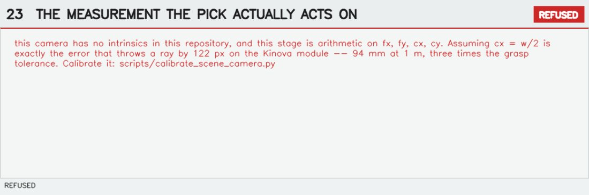

**refused** this camera has no intrinsics in this repository, and this stage is arithmetic on fx, fy, cx, cy. Assuming cx = w/2 is exactly the error that throws a ray by 122 px on the Kinova module -- 94 mm at 1 m, three times the grasp tolerance. Calibrate it: scripts/calibrate_scene_camera.py

### 24  Splitting a cube from the pad it stands on  [by_design]

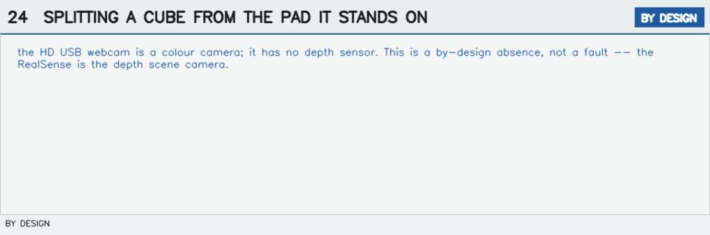

**by_design** the HD USB webcam is a colour camera; it has no depth sensor. This is a by-design absence, not a fault -- the RealSense is the depth scene camera.

### 25  Rotating calipers, against the two controls  [by_design]

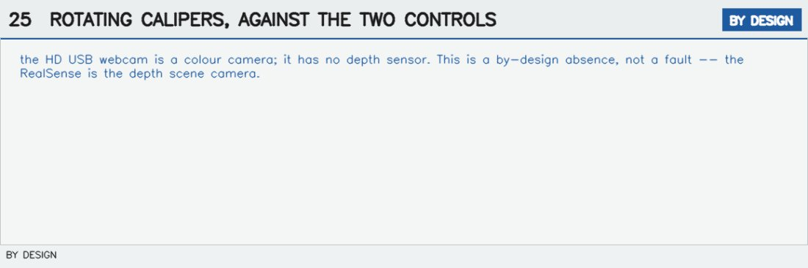

**by_design** the HD USB webcam is a colour camera; it has no depth sensor. This is a by-design absence, not a fault -- the RealSense is the depth scene camera.

### 26  Dropping masks that are unions of finer ones  [by_design]

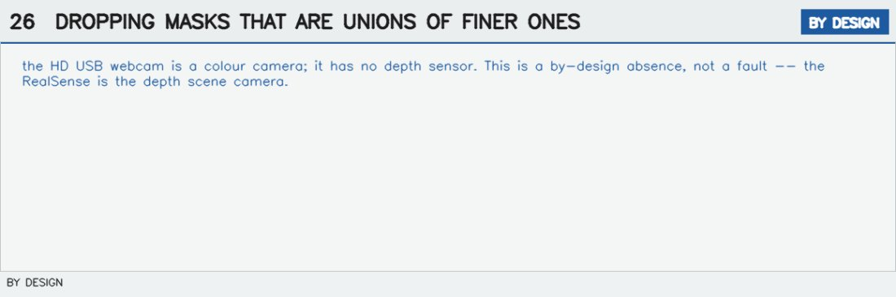

**by_design** the HD USB webcam is a colour camera; it has no depth sensor. This is a by-design absence, not a fault -- the RealSense is the depth scene camera.

### 27  The parallel-jaw grasp  [by_design]

**by_design** the HD USB webcam is a colour camera; it has no depth sensor. This is a by-design absence, not a fault -- the RealSense is the depth scene camera.

### 28  Fiducials: the primary detector  [refused]

**refused** no AprilTag of family 36h11, 25h9 or 16h5 is in this frame. That is an answer, not a failure: a tag either decodes or it does not, which is exactly why this is the PRIMARY detector and colour is the capped fallback. Detector used: cv2.aruco.ArucoDetector (OpenCV 4.11.0).

### 29  The support surface, as an object  [refused]

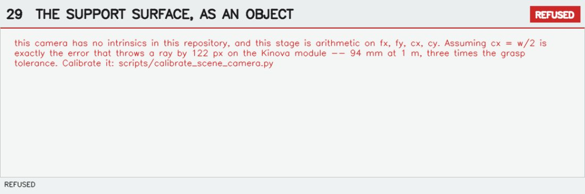

**refused** this camera has no intrinsics in this repository, and this stage is arithmetic on fx, fy, cx, cy. Assuming cx = w/2 is exactly the error that throws a ray by 122 px on the Kinova module -- 94 mm at 1 m, three times the grasp tolerance. Calibrate it: scripts/calibrate_scene_camera.py

### 30  Every object, as an oriented 3-D box  [refused]

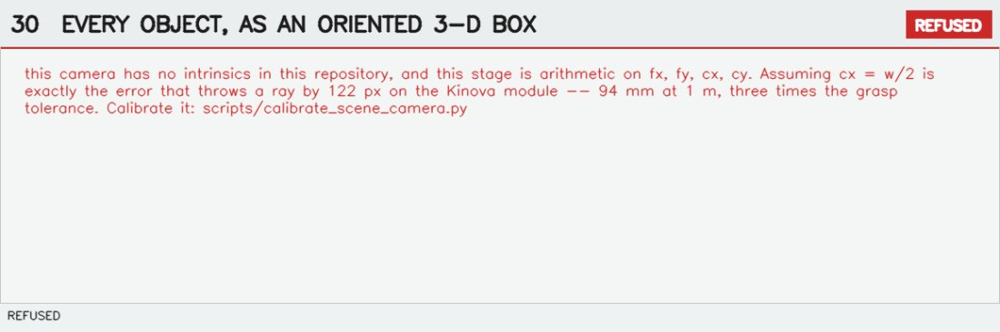

**refused** this camera has no intrinsics in this repository, and this stage is arithmetic on fx, fy, cx, cy. Assuming cx = w/2 is exactly the error that throws a ray by 122 px on the Kinova module -- 94 mm at 1 m, three times the grasp tolerance. Calibrate it: scripts/calibrate_scene_camera.py

### 31  How far apart everything is  [refused]

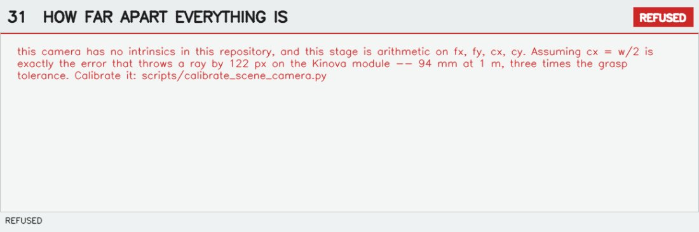

**refused** this camera has no intrinsics in this repository, and this stage is arithmetic on fx, fy, cx, cy. Assuming cx = w/2 is exactly the error that throws a ray by 122 px on the Kinova module -- 94 mm at 1 m, three times the grasp tolerance. Calibrate it: scripts/calibrate_scene_camera.py

### 32  People in the picture  [ok]

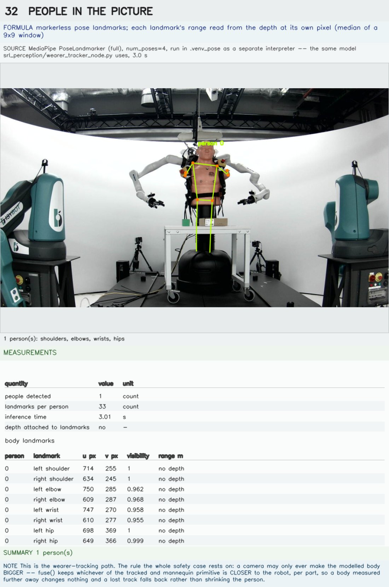

**Formula** `markerless pose landmarks; each landmark's range read from the depth at its own pixel (median of a 9x9 window)`

**Measured** 1 person(s)

### 33  The robot in the picture, and what is NOT detected  [by_design]

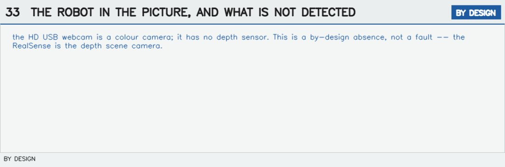

**by_design** the HD USB webcam is a colour camera; it has no depth sensor. This is a by-design absence, not a fault -- the RealSense is the depth scene camera.

