# 20260830_070529 -- scene_rs

RealSense D435i across the room, depth 480x270@15 + colour 640x480@15, USB 2.1, negotiated against what the device reports it has. Depth is aligned to colour by librealsense and averaged over 12 frames, valid pixels only.

17 of 33 stages produced a result. [Back to the index](GALLERY.md)

### 01  The frame, as the camera delivered it  [ok]

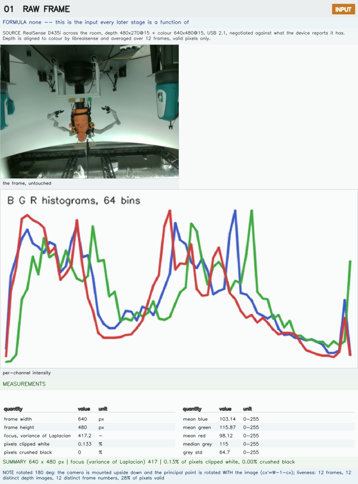

**Formula** `none -- this is the input every later stage is a function of`

**Measured** 640 x 480 px | focus (variance of Laplacian) 417 | 0.13% of pixels clipped white, 0.00% crushed black

### 02  Intrinsics and the ray each pixel stands for  [ok]

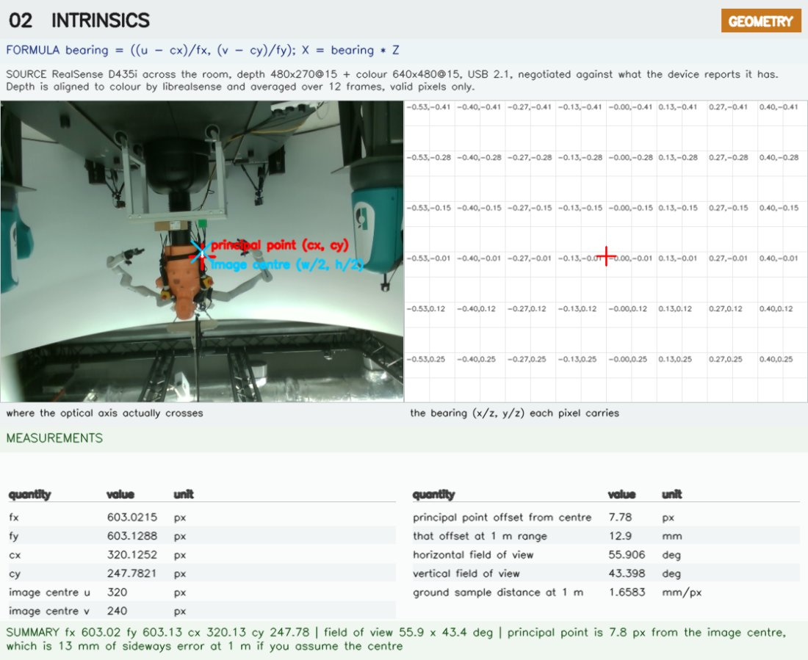

**Formula** `bearing = ((u - cx)/fx, (v - cy)/fy);  X = bearing * Z`

**Measured** fx 603.02  fy 603.13  cx 320.13  cy 247.78 | field of view 55.9 x 43.4 deg | principal point is 7.8 px from the image centre, which is 13 mm of sideways error at 1 m if you assume the centre

### 03  BGR to HSV, the space the colour tests live in  [ok]

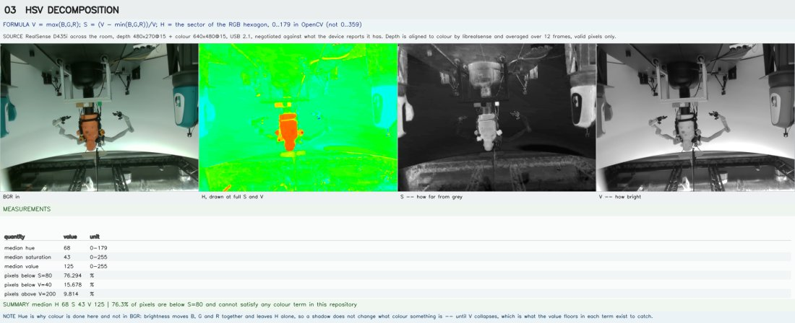

**Formula** `V = max(B,G,R);  S = (V - min(B,G,R))/V;  H = the sector of the RGB hexagon, 0..179 in OpenCV (not 0..359)`

**Measured** median H 68  S 43  V 125 | 76.3% of pixels are below S=80 and cannot satisfy any colour term in this repository

### 04  The pick path's own green threshold  [ok]

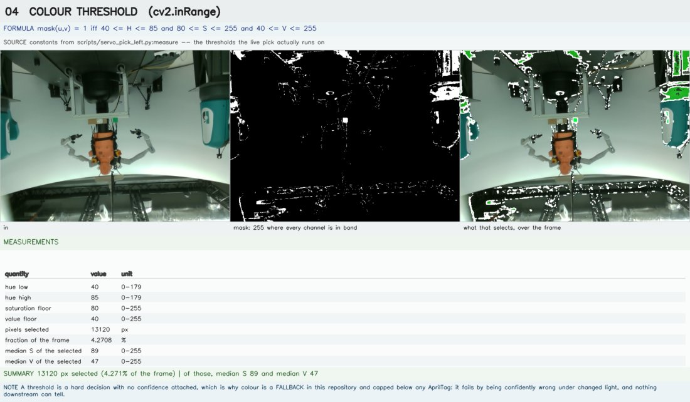

**Formula** `mask(u,v) = 1 iff  40 <= H <= 85  and  80 <= S <= 255  and  40 <= V <= 255`

**Measured** 13120 px selected (4.271% of the frame) | of those, median S 89 and median V 47

### 05  What the 9x9 opening removes  [ok]

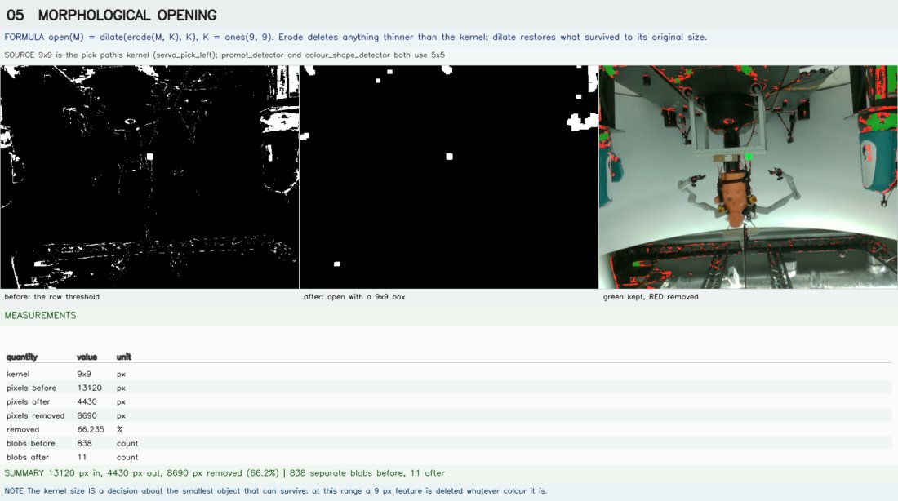

**Formula** `open(M) = dilate(erode(M, K), K),  K = ones(9, 9).  Erode deletes anything thinner than the kernel; dilate restores what survived to its original size.`

**Measured** 13120 px in, 4430 px out, 8690 px removed (66.2%) | 838 separate blobs before, 11 after

### 06  Connected components, and their statistics  [ok]

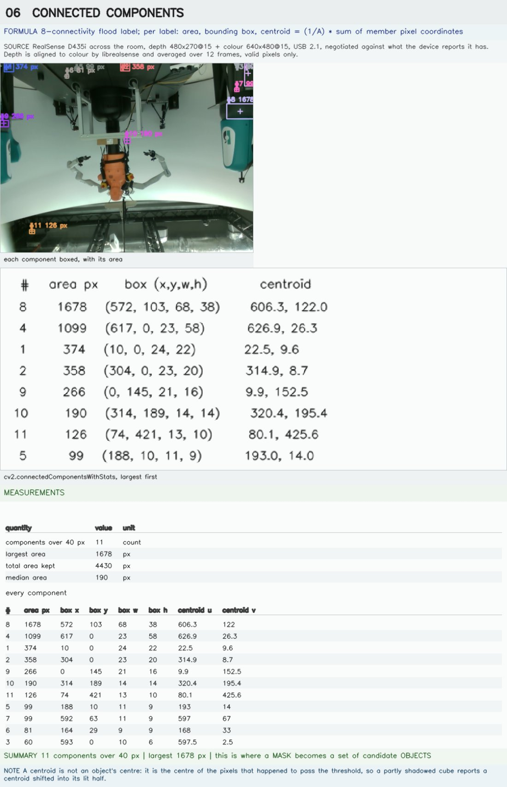

**Formula** `8-connectivity flood label; per label: area, bounding box, centroid = (1/A) * sum of member pixel coordinates`

**Measured** 11 components over 40 px | largest 1678 px | this is where a MASK becomes a set of candidate OBJECTS

### 07  The whole colour vocabulary, swept  [ok]

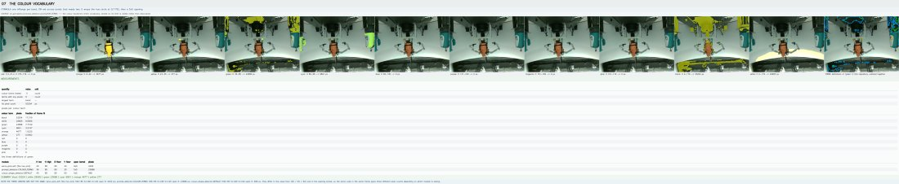

**Formula** `one inRange per band, OR-ed across bands (red needs two: it wraps the hue circle at 0/179), then a 5x5 opening`

**Measured** black 53204 | white 29665 | green 23688 | cyan 9891 | orange 4677 | yellow 277

### 08  The region-MEAN ratio test, and its near-black guard  [ok]

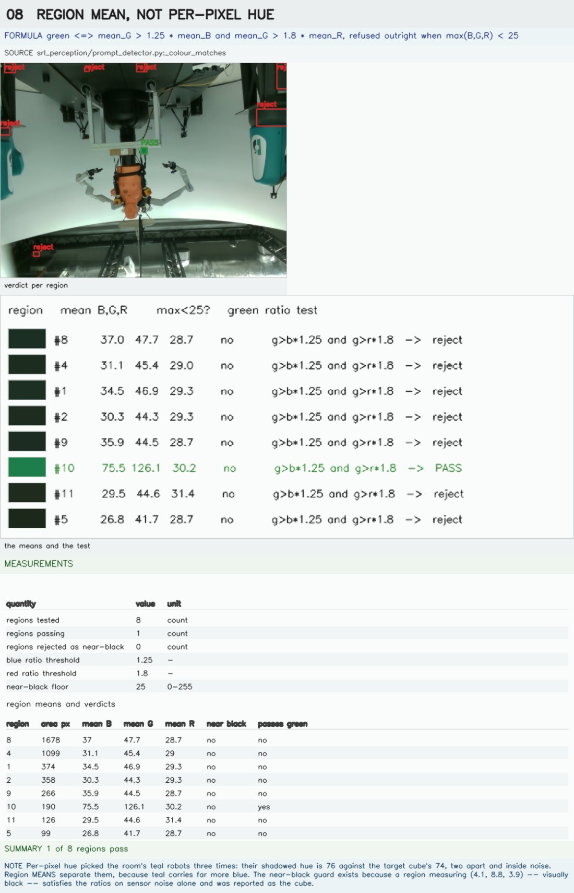

**Formula** `green  <=>  mean_G > 1.25 * mean_B  and  mean_G > 1.8 * mean_R,  refused outright when max(B,G,R) < 25`

**Measured** 1 of 8 regions pass

### 09  Rotated box, in-image yaw, and the degeneracy gate  [ok]

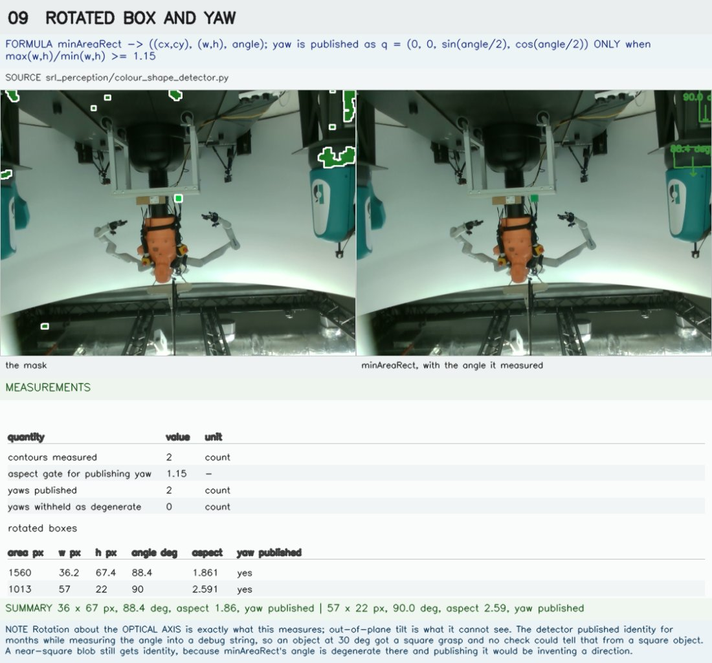

**Formula** `minAreaRect -> ((cx,cy), (w,h), angle);  yaw is published as q = (0, 0, sin(angle/2), cos(angle/2)) ONLY when max(w,h)/min(w,h) >= 1.15`

**Measured** 36 x 67 px, 88.4 deg, aspect 1.86, yaw published | 57 x 22 px, 90.0 deg, aspect 2.59, yaw published

### 10  The size-at-range gate  [ok]

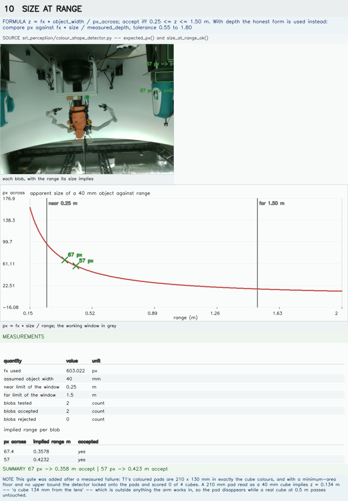

**Formula** `z = fx * object_width / px_across;  accept iff 0.25 <= z <= 1.50 m.  With depth the honest form is used instead: compare px against fx * size / measured_depth, tolerance 0.55 to 1.80`

**Measured** 67 px -> 0.358 m accept | 57 px -> 0.423 m accept

### 11  FastSAM: every region in the picture, no prompt  [ok]

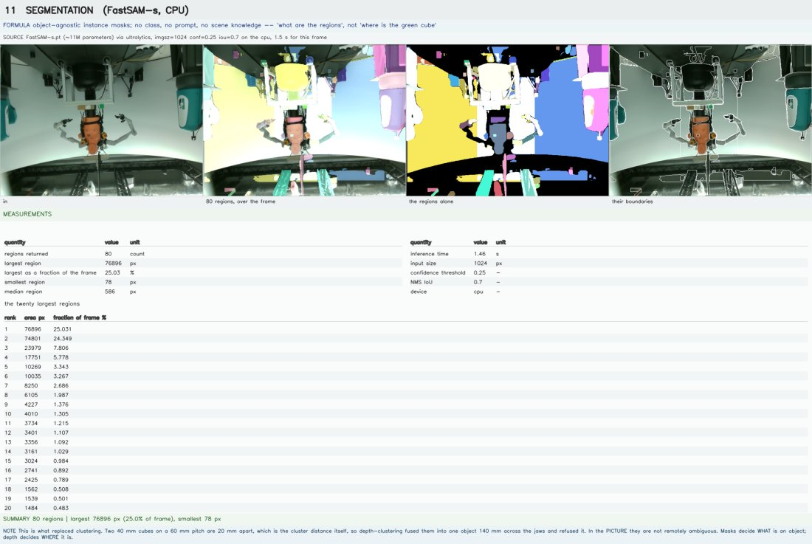

**Formula** `object-agnostic instance masks; no class, no prompt, no scene knowledge -- 'what are the regions', not 'where is the green cube'`

**Measured** 80 regions | largest 76896 px (25.0% of frame), smallest 78 px

### 12  The area filter: noise below, the table above  [ok]

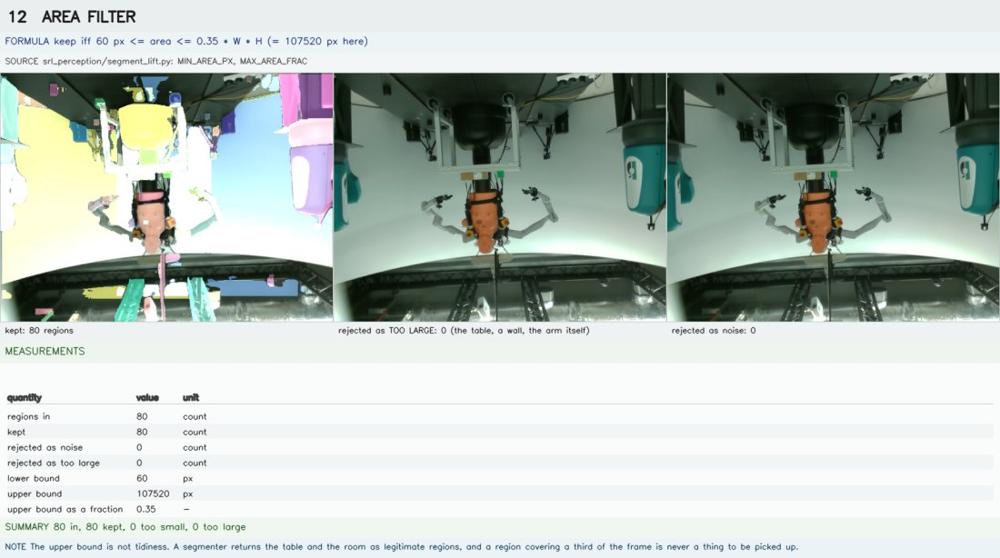

**Formula** `keep iff  60 px <= area <= 0.35 * W * H  (= 107520 px here)`

**Measured** 80 in, 80 kept, 0 too small, 0 too large

### 13  Segment everything, then pick the one that matches  [ok]

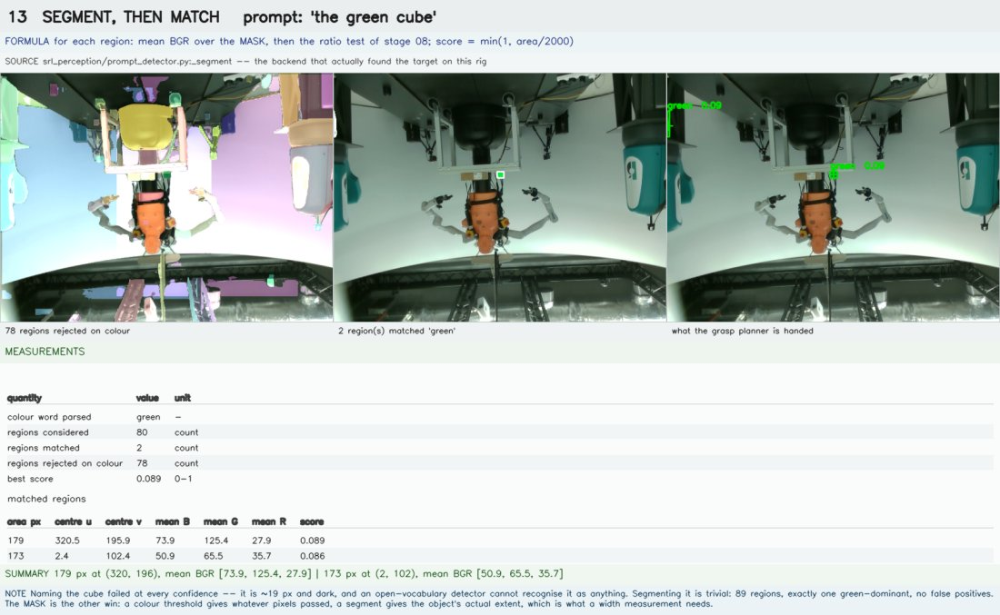

**Formula** `for each region: mean BGR over the MASK, then the ratio test of stage 08; score = min(1, area/2000)`

**Measured** 179 px at (320, 196), mean BGR [73.9, 125.4, 27.9] | 173 px at (2, 102), mean BGR [50.9, 65.5, 35.7]

### 14  YOLO-World: open-vocabulary naming  [refused]

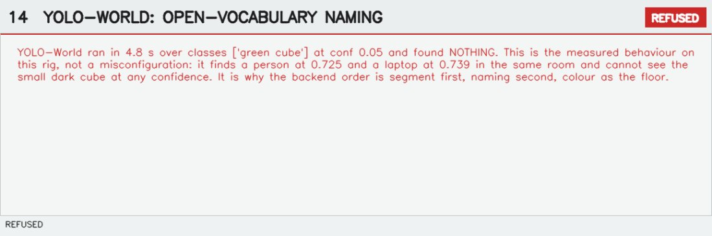

**refused** YOLO-World ran in 4.8 s over classes ['green cube'] at conf 0.05 and found NOTHING. This is the measured behaviour on this rig, not a misconfiguration: it finds a person at 0.725 and a laptop at 0.739 in the same room and cannot see the small dark cube at any confidence. It is why the backend order is segment first, naming second, colour as the floor.

### 15  The depth frame, and where it has no answer  [ok]

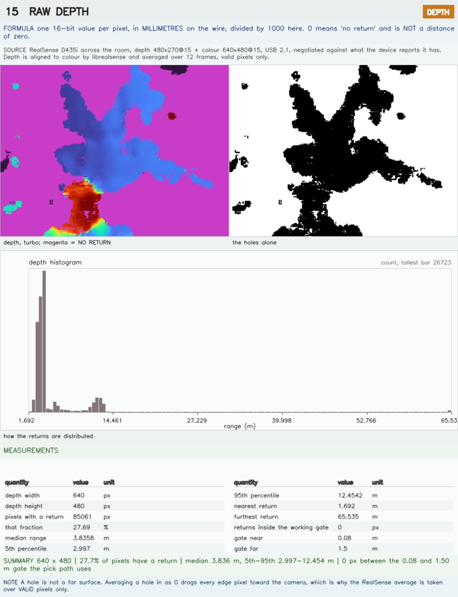

**Formula** `one 16-bit value per pixel, in MILLIMETRES on the wire, divided by 1000 here. 0 means 'no return' and is NOT a distance of zero.`

**Measured** 640 x 480 | 27.7% of pixels have a return | median 3.836 m, 5th-95th 2.997-12.454 m | 0 px between the 0.08 and 1.50 m gate the pick path uses

### 16  Depth put into the colour frame  [ok]

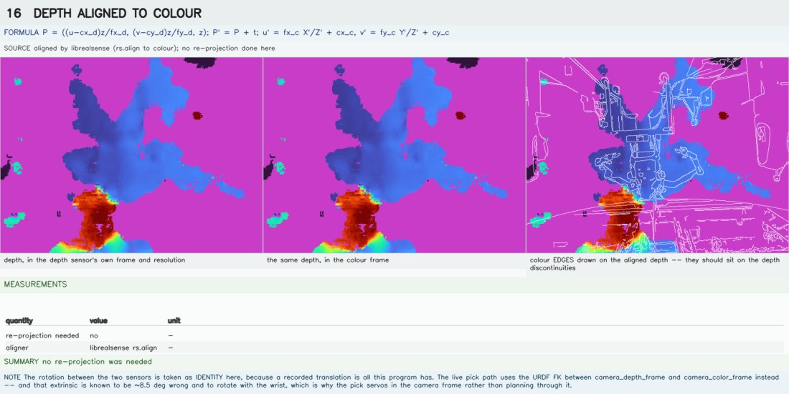

**Formula** `P = ((u-cx_d)z/fx_d, (v-cy_d)z/fy_d, z);  P' = P + t;  u' = fx_c X'/Z' + cx_c,  v' = fy_c Y'/Z' + cy_c`

**Measured** no re-projection was needed

### 17  Pixels and depth become a cloud  [refused]

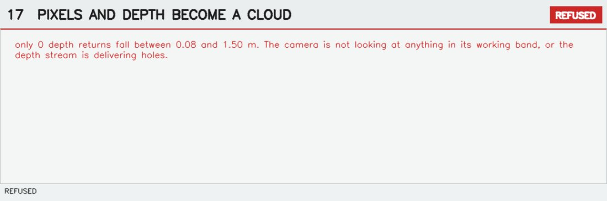

**refused** only 0 depth returns fall between 0.08 and 1.50 m. The camera is not looking at anything in its working band, or the depth stream is delivering holes.

### 18  RANSAC: the support plane  [refused]

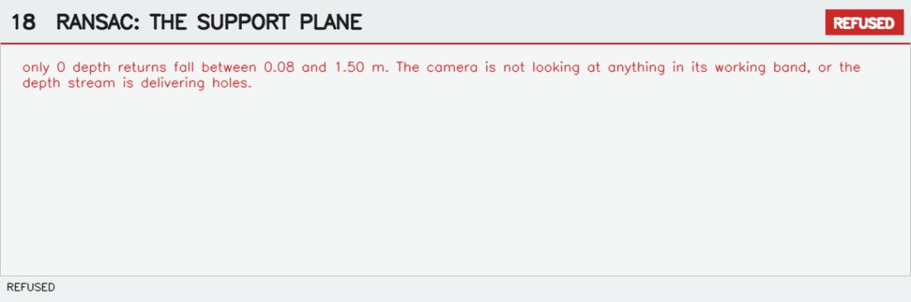

**refused** only 0 depth returns fall between 0.08 and 1.50 m. The camera is not looking at anything in its working band, or the depth stream is delivering holes.

### 19  The PCA refinement, and the NaN it once produced  [refused]

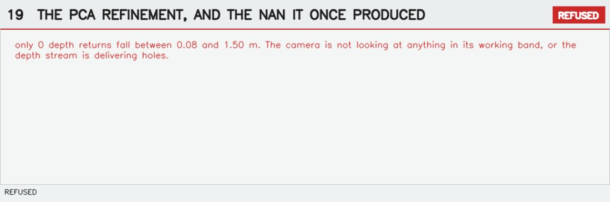

**refused** only 0 depth returns fall between 0.08 and 1.50 m. The camera is not looking at anything in its working band, or the depth stream is delivering holes.

### 20  Height above the plane  [refused]

**refused** only 0 depth returns fall between 0.08 and 1.50 m. The camera is not looking at anything in its working band, or the depth stream is delivering holes.

### 21  The surface height as a MODE, not a mean  [refused]

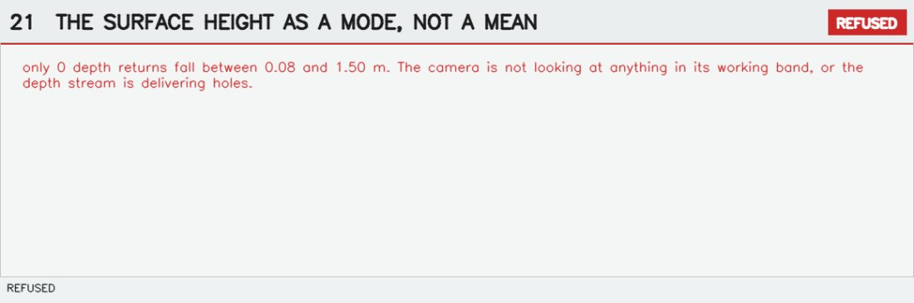

**refused** only 0 depth returns fall between 0.08 and 1.50 m. The camera is not looking at anything in its working band, or the depth stream is delivering holes.

### 22  What is standing on the surface  [refused]

**refused** only 0 aligned depth points; nothing to lift the masks through

### 23  The measurement the pick actually acts on  [refused]

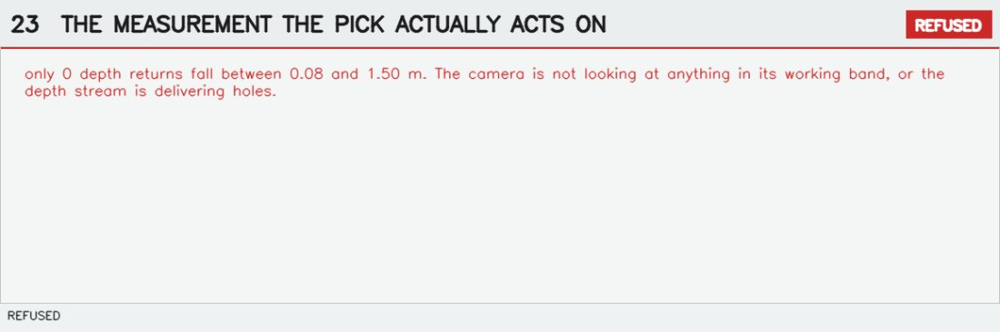

**refused** only 0 depth returns fall between 0.08 and 1.50 m. The camera is not looking at anything in its working band, or the depth stream is delivering holes.

### 24  Splitting a cube from the pad it stands on  [refused]

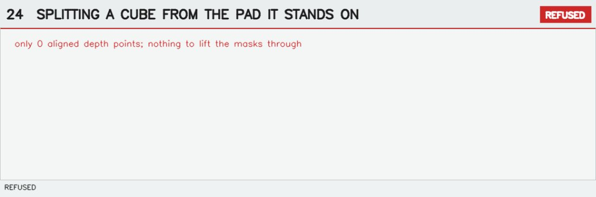

**refused** only 0 aligned depth points; nothing to lift the masks through

### 25  Rotating calipers, against the two controls  [refused]

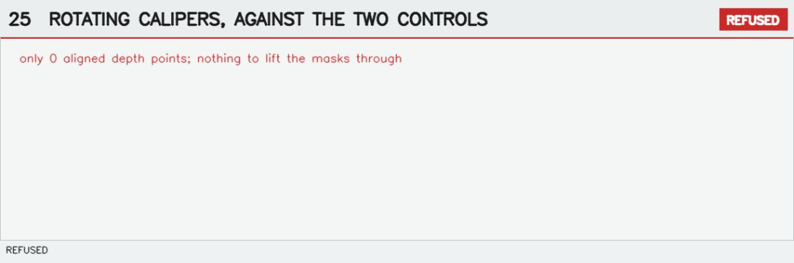

**refused** only 0 aligned depth points; nothing to lift the masks through

### 26  Dropping masks that are unions of finer ones  [refused]

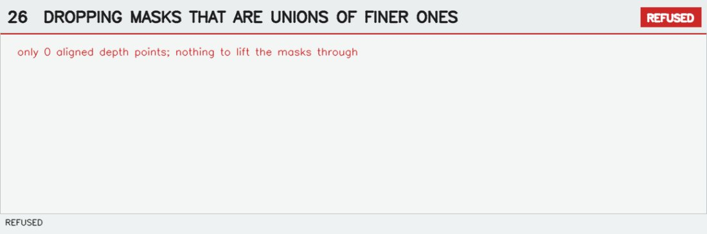

**refused** only 0 aligned depth points; nothing to lift the masks through

### 27  The parallel-jaw grasp  [refused]

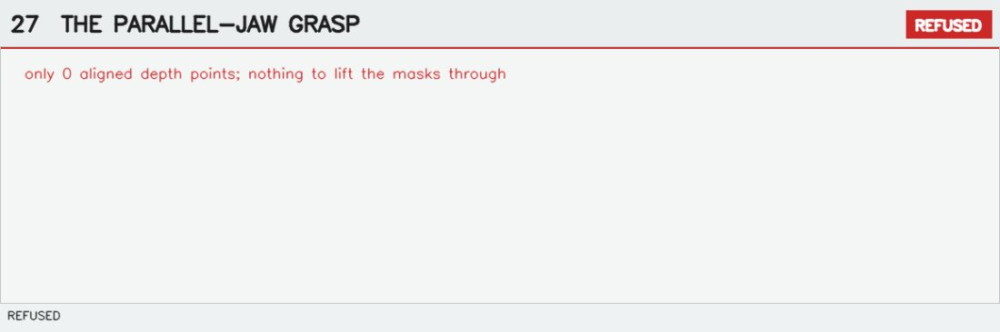

**refused** only 0 aligned depth points; nothing to lift the masks through

### 28  Fiducials: the primary detector  [refused]

**refused** no AprilTag of family 36h11, 25h9 or 16h5 is in this frame. That is an answer, not a failure: a tag either decodes or it does not, which is exactly why this is the PRIMARY detector and colour is the capped fallback. Detector used: cv2.aruco.ArucoDetector (OpenCV 4.11.0).

### 29  The support surface, as an object  [refused]

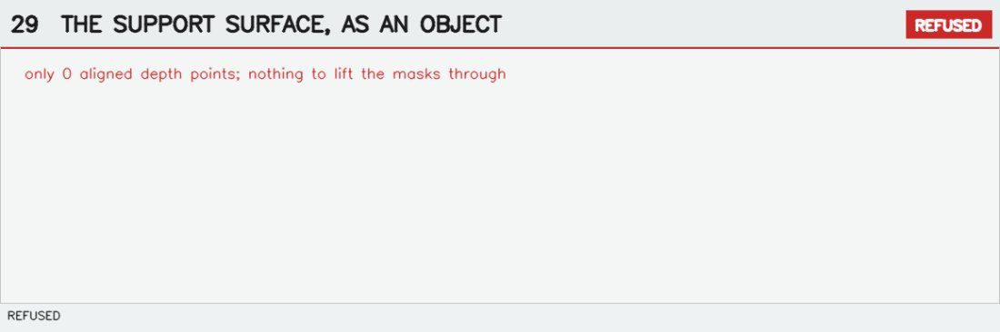

**refused** only 0 aligned depth points; nothing to lift the masks through

### 30  Every object, as an oriented 3-D box  [refused]

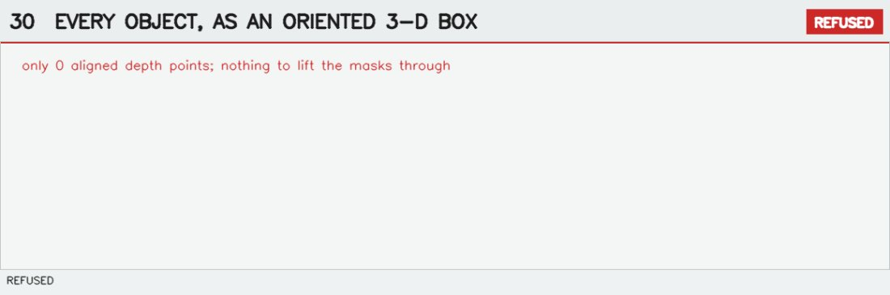

**refused** only 0 aligned depth points; nothing to lift the masks through

### 31  How far apart everything is  [refused]

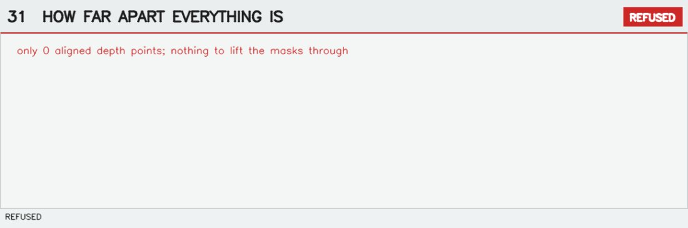

**refused** only 0 aligned depth points; nothing to lift the masks through

### 32  People in the picture  [ok]

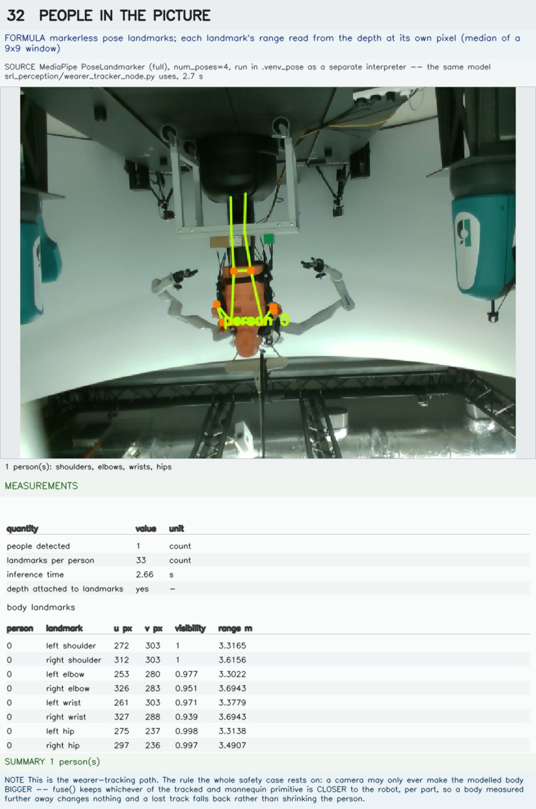

**Formula** `markerless pose landmarks; each landmark's range read from the depth at its own pixel (median of a 9x9 window)`

**Measured** 1 person(s)

### 33  The robot in the picture, and what is NOT detected  [ok]

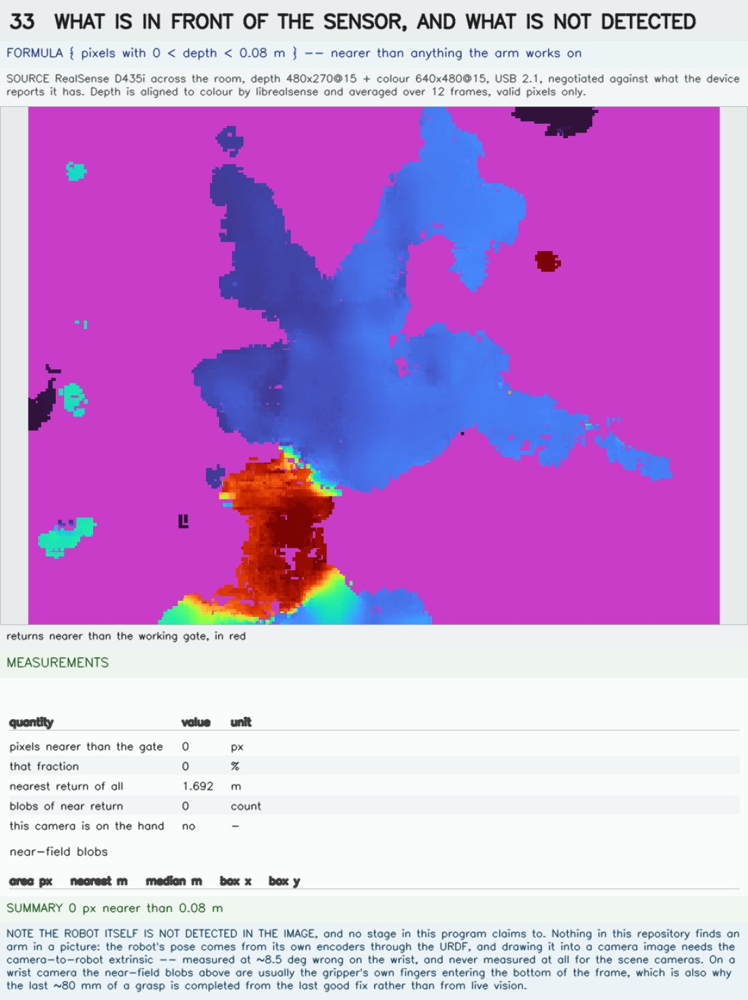

**Formula** `{ pixels with 0 < depth < 0.08 m } -- nearer than anything the arm works on`

**Measured** 0 px nearer than 0.08 m

