# 20260830_073141 -- scene_rs

RealSense D435i across the room, depth 640x480@15 + colour 640x480@15, USB 2.1, negotiated against what the device reports it has. Depth is aligned to colour by librealsense and averaged over 12 frames, valid pixels only.

27 of 33 stages produced a result. [Back to the index](GALLERY.md)

### 01  The frame, as the camera delivered it  [ok]

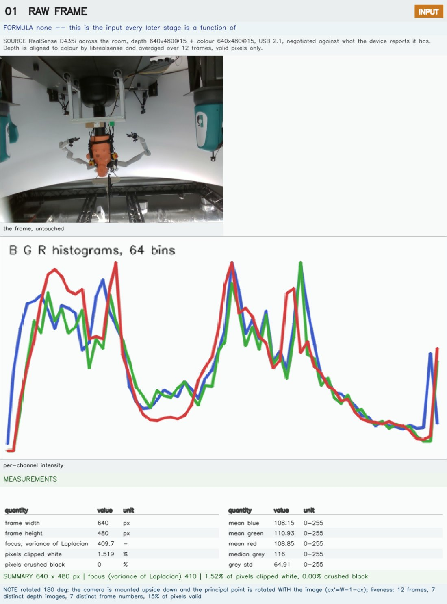

**Formula** `none -- this is the input every later stage is a function of`

**Measured** 640 x 480 px | focus (variance of Laplacian) 410 | 1.52% of pixels clipped white, 0.00% crushed black

### 02  Intrinsics and the ray each pixel stands for  [ok]

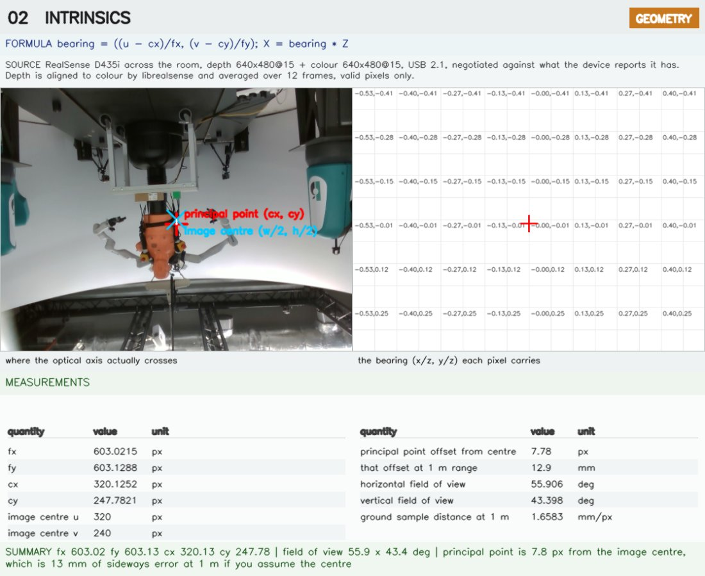

**Formula** `bearing = ((u - cx)/fx, (v - cy)/fy);  X = bearing * Z`

**Measured** fx 603.02  fy 603.13  cx 320.13  cy 247.78 | field of view 55.9 x 43.4 deg | principal point is 7.8 px from the image centre, which is 13 mm of sideways error at 1 m if you assume the centre

### 03  BGR to HSV, the space the colour tests live in  [ok]

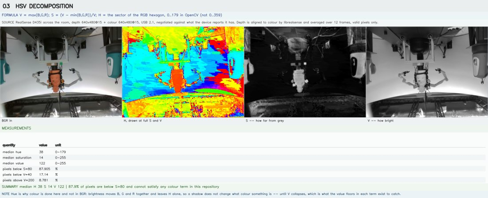

**Formula** `V = max(B,G,R);  S = (V - min(B,G,R))/V;  H = the sector of the RGB hexagon, 0..179 in OpenCV (not 0..359)`

**Measured** median H 38  S 14  V 122 | 87.9% of pixels are below S=80 and cannot satisfy any colour term in this repository

### 04  The pick path's own green threshold  [ok]

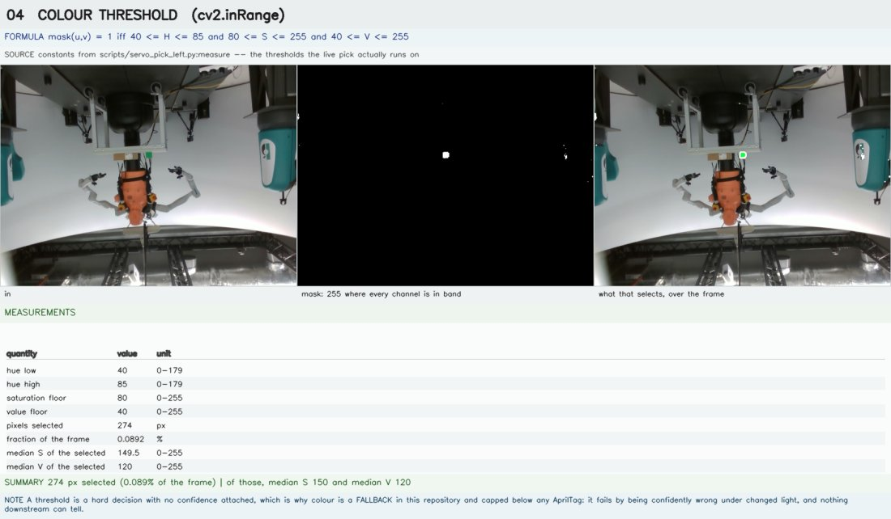

**Formula** `mask(u,v) = 1 iff  40 <= H <= 85  and  80 <= S <= 255  and  40 <= V <= 255`

**Measured** 274 px selected (0.089% of the frame) | of those, median S 150 and median V 120

### 05  What the 9x9 opening removes  [ok]

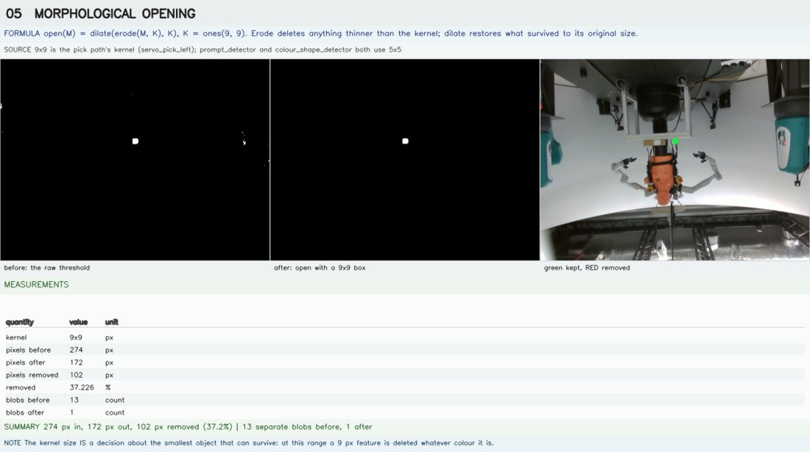

**Formula** `open(M) = dilate(erode(M, K), K),  K = ones(9, 9).  Erode deletes anything thinner than the kernel; dilate restores what survived to its original size.`

**Measured** 274 px in, 172 px out, 102 px removed (37.2%) | 13 separate blobs before, 1 after

### 06  Connected components, and their statistics  [ok]

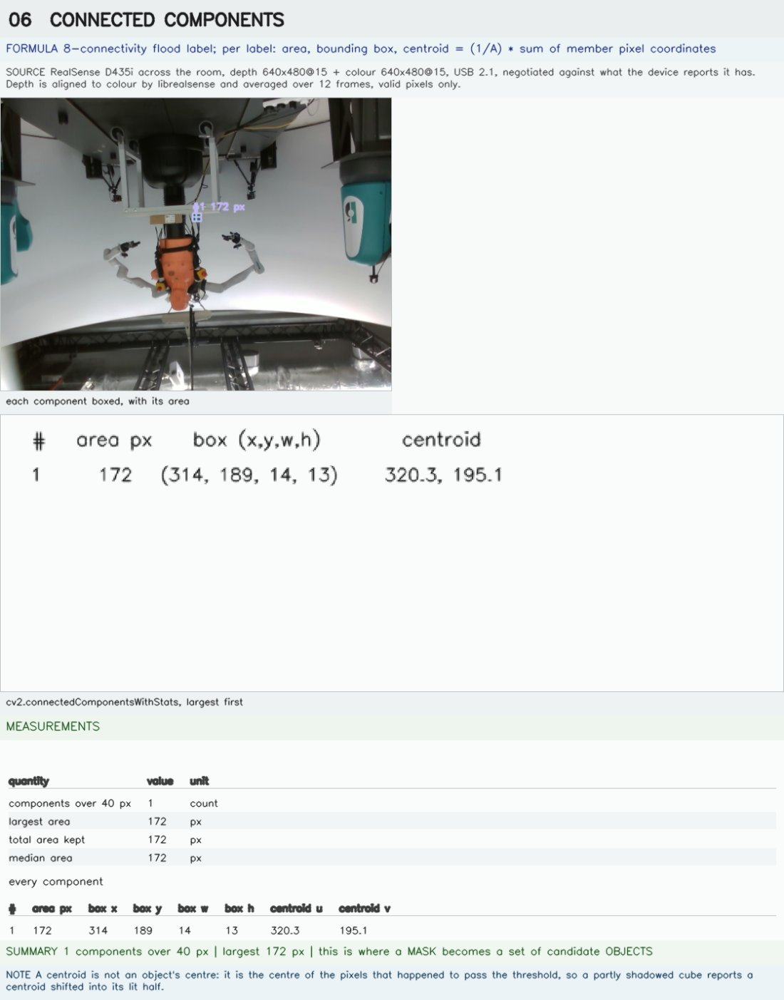

**Formula** `8-connectivity flood label; per label: area, bounding box, centroid = (1/A) * sum of member pixel coordinates`

**Measured** 1 components over 40 px | largest 172 px | this is where a MASK becomes a set of candidate OBJECTS

### 07  The whole colour vocabulary, swept  [ok]

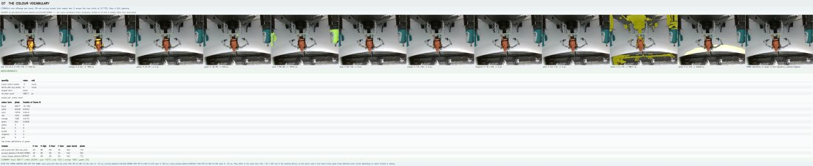

**Formula** `one inRange per band, OR-ed across bands (red needs two: it wraps the hue circle at 0/179), then a 5x5 opening`

**Measured** black 58817 | white 26248 | cyan 10572 | red 1932 | orange 1580 | green 202

### 08  The region-MEAN ratio test, and its near-black guard  [ok]

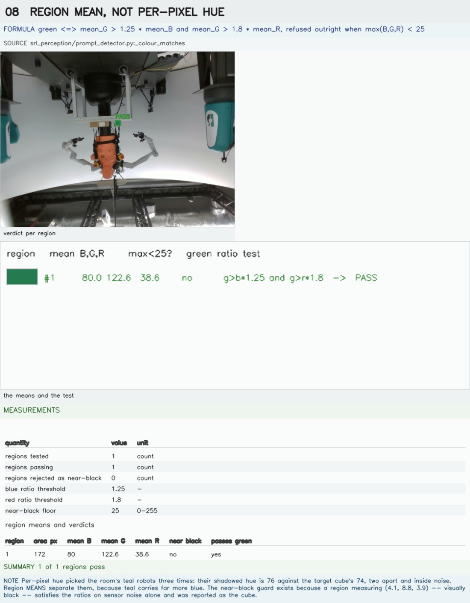

**Formula** `green  <=>  mean_G > 1.25 * mean_B  and  mean_G > 1.8 * mean_R,  refused outright when max(B,G,R) < 25`

**Measured** 1 of 1 regions pass

### 09  Rotated box, in-image yaw, and the degeneracy gate  [refused]

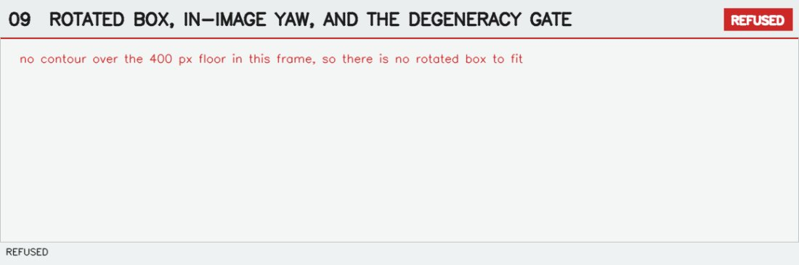

**refused** no contour over the 400 px floor in this frame, so there is no rotated box to fit

### 10  The size-at-range gate  [refused]

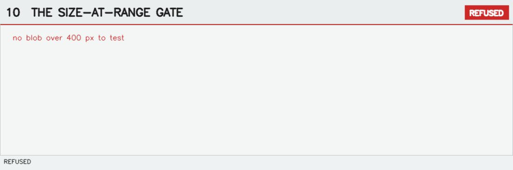

**refused** no blob over 400 px to test

### 11  FastSAM: every region in the picture, no prompt  [ok]

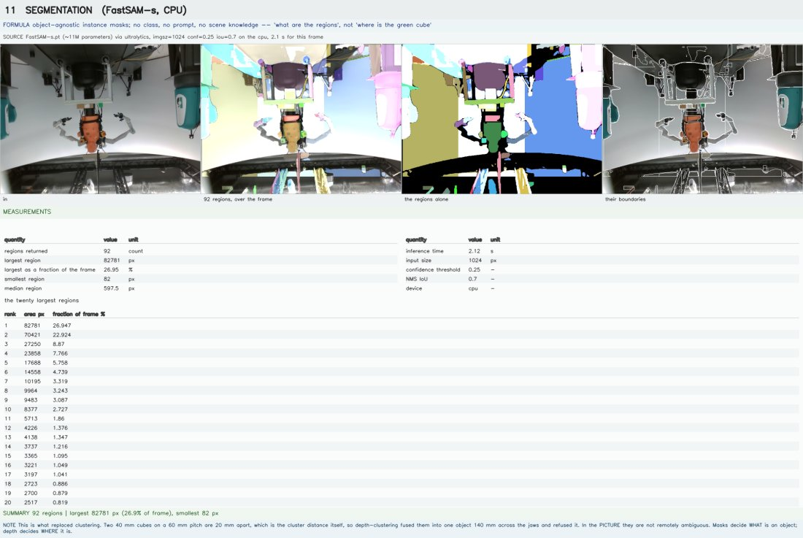

**Formula** `object-agnostic instance masks; no class, no prompt, no scene knowledge -- 'what are the regions', not 'where is the green cube'`

**Measured** 92 regions | largest 82781 px (26.9% of frame), smallest 82 px

### 12  The area filter: noise below, the table above  [ok]

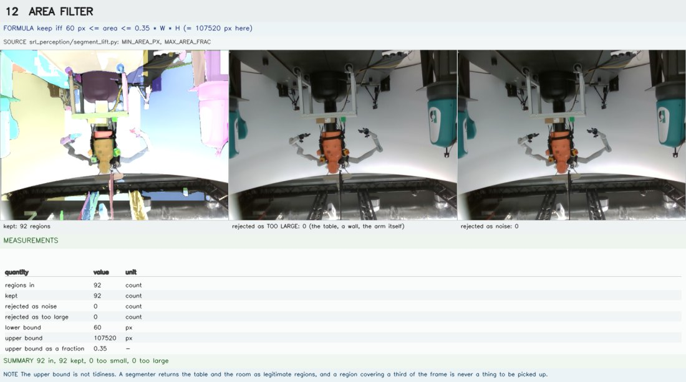

**Formula** `keep iff  60 px <= area <= 0.35 * W * H  (= 107520 px here)`

**Measured** 92 in, 92 kept, 0 too small, 0 too large

### 13  Segment everything, then pick the one that matches  [ok]

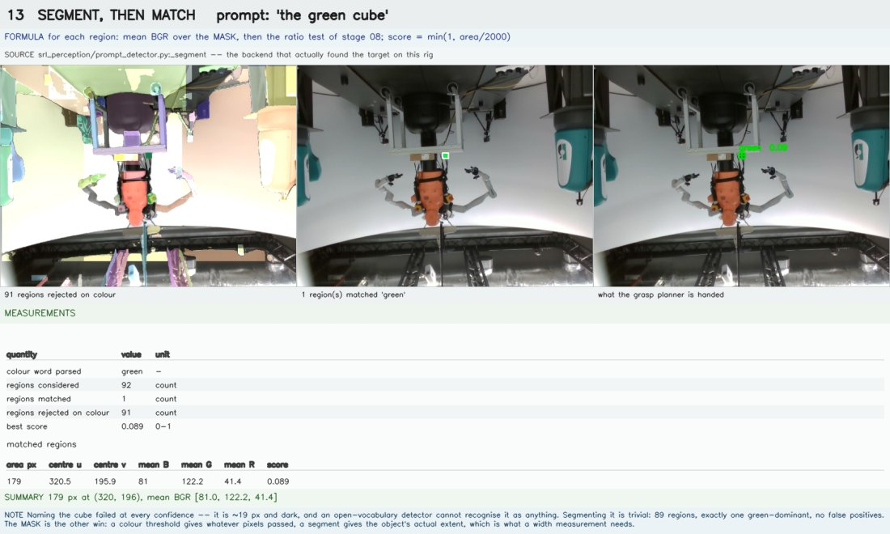

**Formula** `for each region: mean BGR over the MASK, then the ratio test of stage 08; score = min(1, area/2000)`

**Measured** 179 px at (320, 196), mean BGR [81.0, 122.2, 41.4]

### 14  YOLO-World: open-vocabulary naming  [refused]

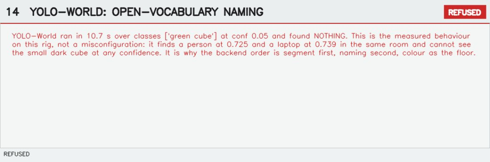

**refused** YOLO-World ran in 10.7 s over classes ['green cube'] at conf 0.05 and found NOTHING. This is the measured behaviour on this rig, not a misconfiguration: it finds a person at 0.725 and a laptop at 0.739 in the same room and cannot see the small dark cube at any confidence. It is why the backend order is segment first, naming second, colour as the floor.

### 15  The depth frame, and where it has no answer  [ok]

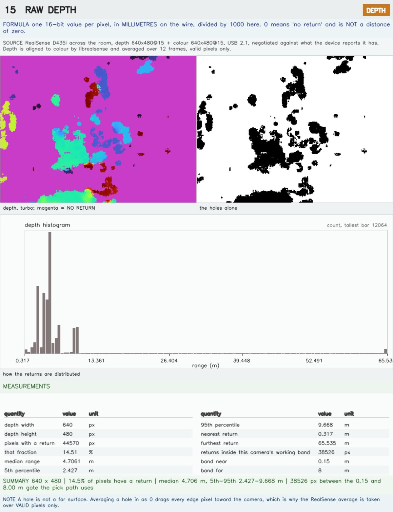

**Formula** `one 16-bit value per pixel, in MILLIMETRES on the wire, divided by 1000 here. 0 means 'no return' and is NOT a distance of zero.`

**Measured** 640 x 480 | 14.5% of pixels have a return | median 4.706 m, 5th-95th 2.427-9.668 m | 38526 px between the 0.15 and 8.00 m gate the pick path uses

### 16  Depth put into the colour frame  [ok]

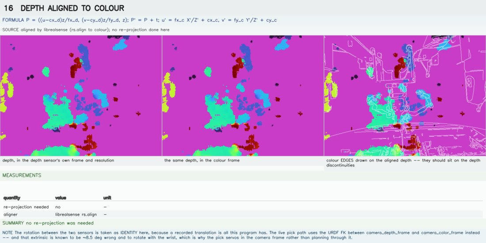

**Formula** `P = ((u-cx_d)z/fx_d, (v-cy_d)z/fy_d, z);  P' = P + t;  u' = fx_c X'/Z' + cx_c,  v' = fy_c Y'/Z' + cy_c`

**Measured** no re-projection was needed

### 17  Pixels and depth become a cloud  [ok]

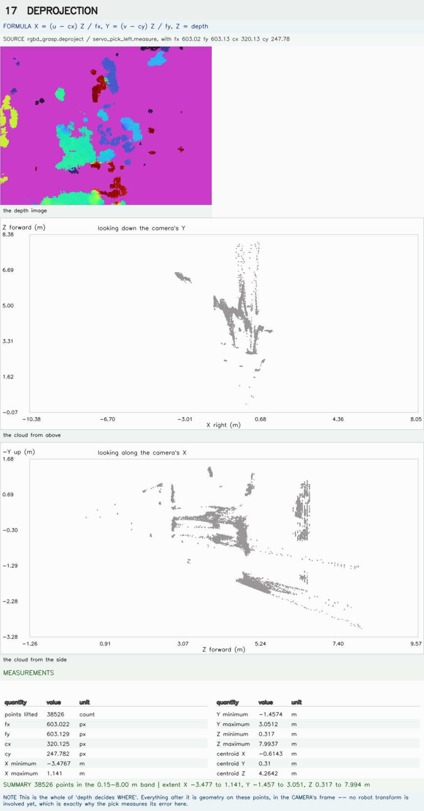

**Formula** `X = (u - cx) Z / fx,   Y = (v - cy) Z / fy,   Z = depth`

**Measured** 38526 points in the 0.15-8.00 m band | extent X -3.477 to 1.141, Y -1.457 to 3.051, Z 0.317 to 7.994 m

### 18  RANSAC: the support plane  [ok]

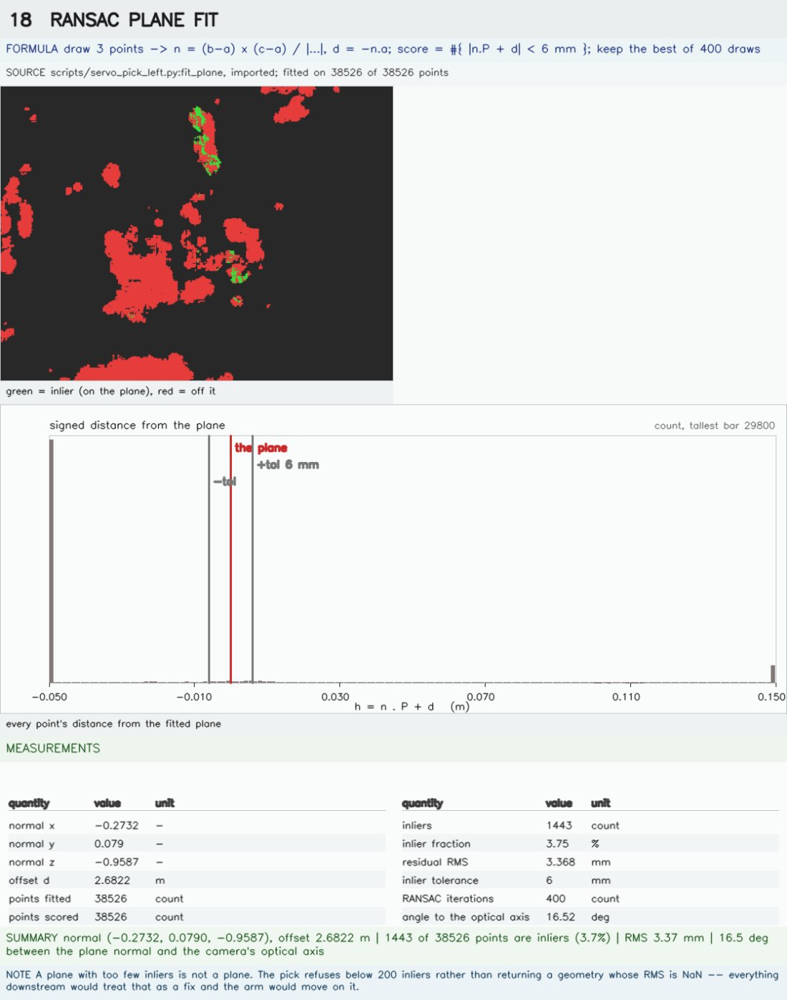

**Formula** `draw 3 points -> n = (b-a) x (c-a) / |...|,  d = -n.a;  score = #{ |n.P + d| < 6 mm };  keep the best of 400 draws`

**Measured** normal (-0.2732, 0.0790, -0.9587), offset 2.6822 m | 1443 of 38526 points are inliers (3.7%) | RMS 3.37 mm | 16.5 deg between the plane normal and the camera's optical axis

### 19  The PCA refinement, and the NaN it once produced  [ok]

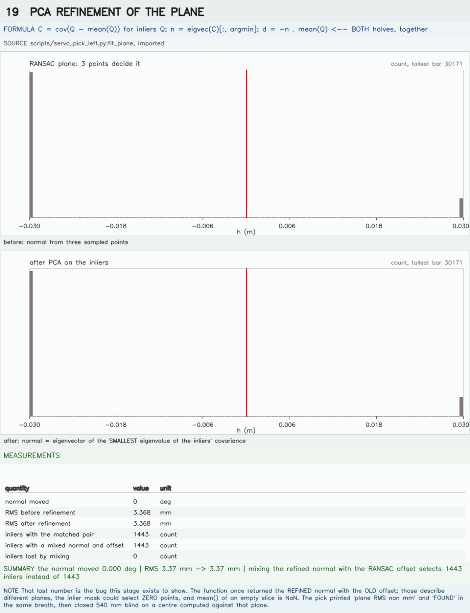

**Formula** `C = cov(Q - mean(Q)) for inliers Q;  n = eigvec(C)[:, argmin];  d = -n . mean(Q)   <-- BOTH halves, together`

**Measured** the normal moved 0.000 deg | RMS 3.37 mm -> 3.37 mm | mixing the refined normal with the RANSAC offset selects 1443 inliers instead of 1443

### 20  Height above the plane  [ok]

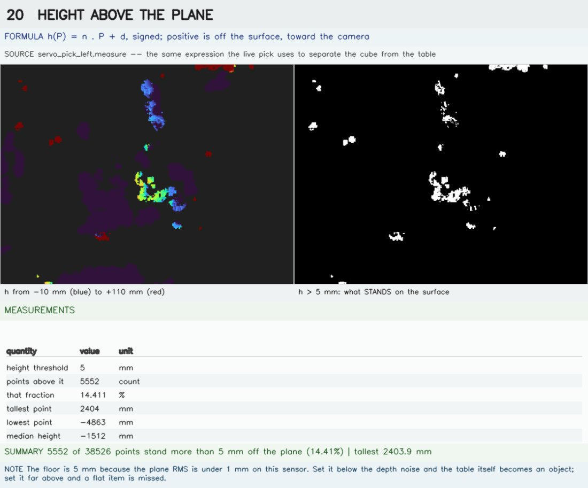

**Formula** `h(P) = n . P + d,  signed;  positive is off the surface, toward the camera`

**Measured** 5552 of 38526 points stand more than 5 mm off the plane (14.41%) | tallest 2403.9 mm

### 21  The surface height as a MODE, not a mean  [ok]

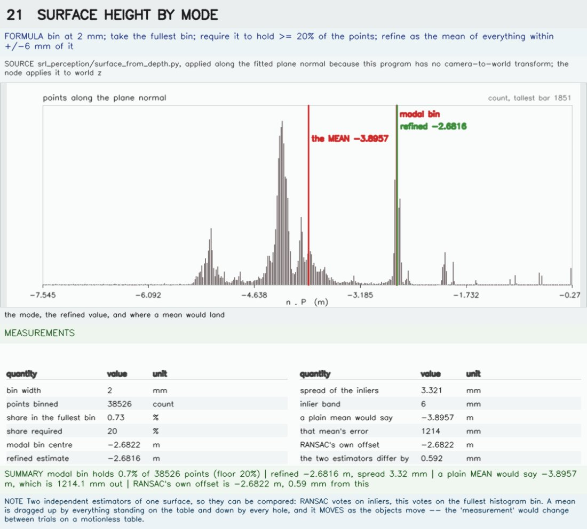

**Formula** `bin at 2 mm; take the fullest bin; require it to hold >= 20% of the points; refine as the mean of everything within +/-6 mm of it`

**Measured** modal bin holds 0.7% of 38526 points (floor 20%) | refined -2.6816 m, spread 3.32 mm | a plain MEAN would say -3.8957 m, which is 1214.1 mm out | RANSAC's own offset is -2.6822 m, 0.59 mm from this

### 22  What is standing on the surface  [ok]

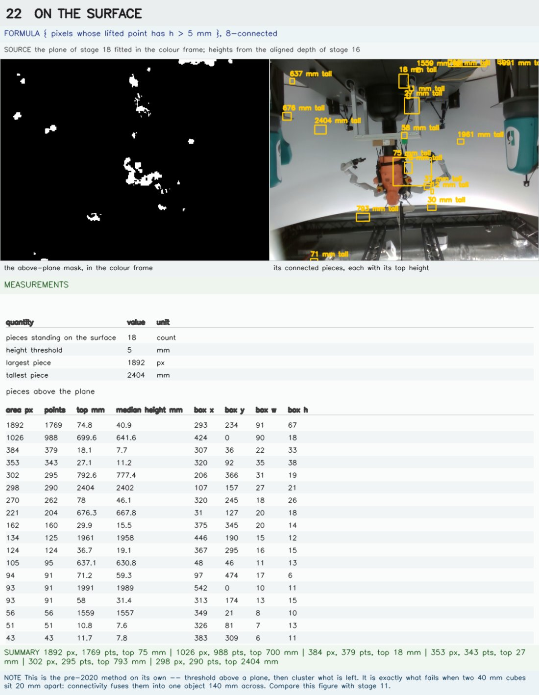

**Formula** `{ pixels whose lifted point has h > 5 mm }, 8-connected`

**Measured** 1892 px, 1769 pts, top 75 mm | 1026 px, 988 pts, top 700 mm | 384 px, 379 pts, top 18 mm | 353 px, 343 pts, top 27 mm | 302 px, 295 pts, top 793 mm | 298 px, 290 pts, top 2404 mm

### 23  The measurement the pick actually acts on  [refused]

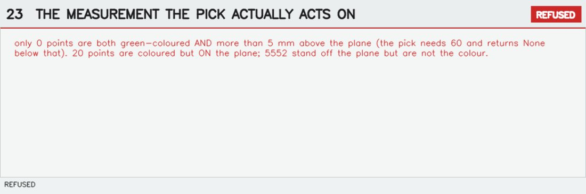

**refused** only 0 points are both green-coloured AND more than 5 mm above the plane (the pick needs 60 and returns None below that). 20 points are coloured but ON the plane; 5552 stand off the plane but are not the colour.

### 24  Splitting a cube from the pad it stands on  [ok]

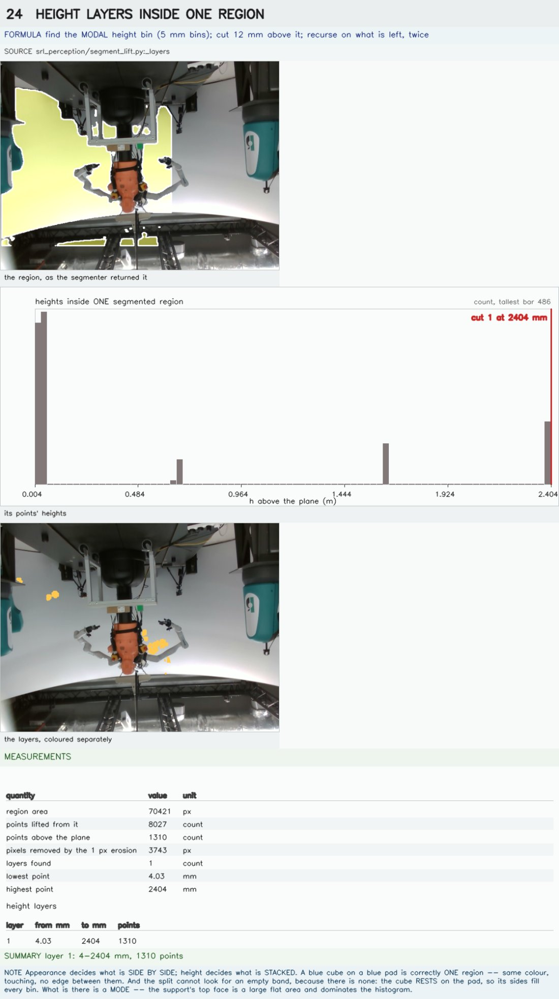

**Formula** `find the MODAL height bin (5 mm bins); cut 12 mm above it; recurse on what is left, twice`

**Measured** layer 1: 4-2404 mm, 1310 points

### 25  Rotating calipers, against the two controls  [ok]

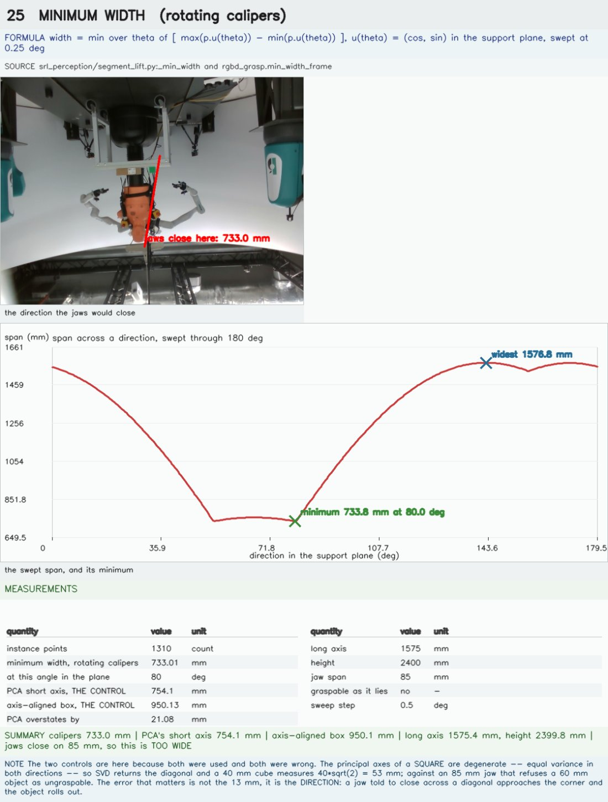

**Formula** `width = min over theta of [ max(p.u(theta)) - min(p.u(theta)) ],  u(theta) = (cos, sin) in the support plane, swept at 0.25 deg`

**Measured** calipers 733.0 mm | PCA's short axis 754.1 mm | axis-aligned box 950.1 mm | long axis 1575.4 mm, height 2399.8 mm | jaws close on 85 mm, so this is TOO WIDE

### 26  Dropping masks that are unions of finer ones  [ok]

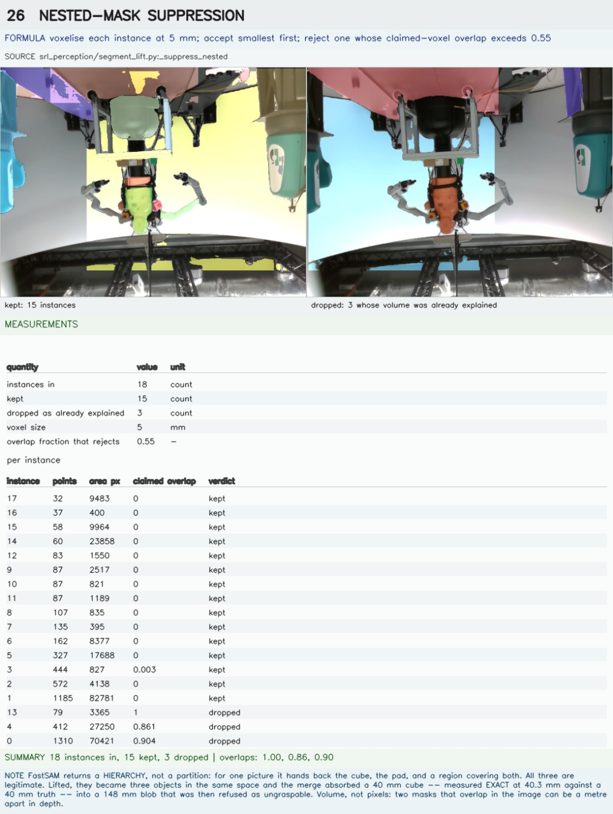

**Formula** `voxelise each instance at 5 mm; accept smallest first; reject one whose claimed-voxel overlap exceeds 0.55`

**Measured** 18 instances in, 15 kept, 3 dropped | overlaps: 1.00, 0.86, 0.90

### 27  The parallel-jaw grasp  [refused]

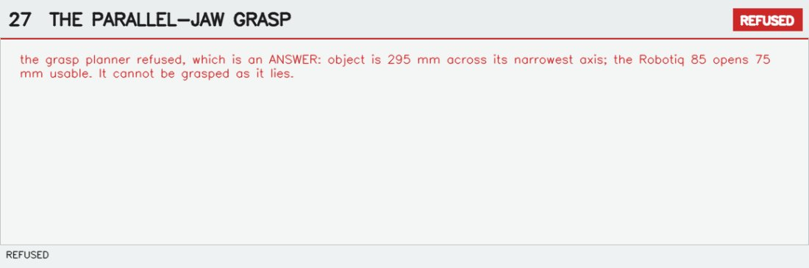

**refused** the grasp planner refused, which is an ANSWER: object is 295 mm across its narrowest axis; the Robotiq 85 opens 75 mm usable. It cannot be grasped as it lies.

### 28  Fiducials: the primary detector  [refused]

**refused** no AprilTag of family 36h11, 25h9 or 16h5 is in this frame. That is an answer, not a failure: a tag either decodes or it does not, which is exactly why this is the PRIMARY detector and colour is the capped fallback. Detector used: cv2.aruco.ArucoDetector (OpenCV 4.11.0).

### 29  The support surface, as an object  [ok]

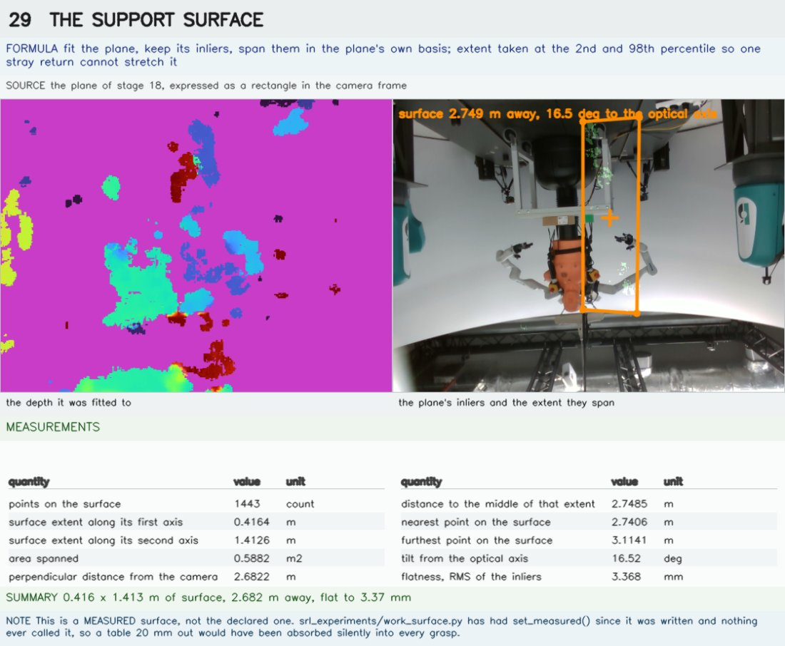

**Formula** `fit the plane, keep its inliers, span them in the plane's own basis; extent taken at the 2nd and 98th percentile so one stray return cannot stretch it`

**Measured** 0.416 x 1.413 m of surface, 2.682 m away, flat to 3.37 mm

### 30  Every object, as an oriented 3-D box  [ok]

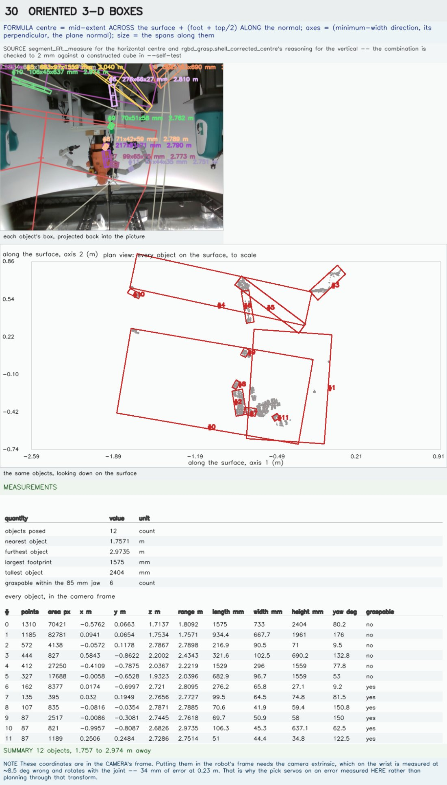

**Formula** `centre = mid-extent ACROSS the surface + (foot + top/2) ALONG the normal; axes = (minimum-width direction, its perpendicular, the plane normal); size = the spans along them`

**Measured** 12 objects, 1.757 to 2.974 m away

### 31  How far apart everything is  [ok]

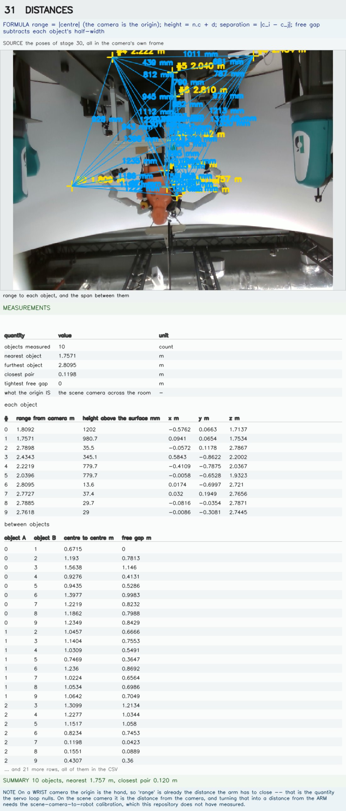

**Formula** `range = |centre| (the camera is the origin); height = n.c + d; separation = |c_i - c_j|; free gap subtracts each object's half-width`

**Measured** 10 objects, nearest 1.757 m, closest pair 0.120 m

### 32  People in the picture  [ok]

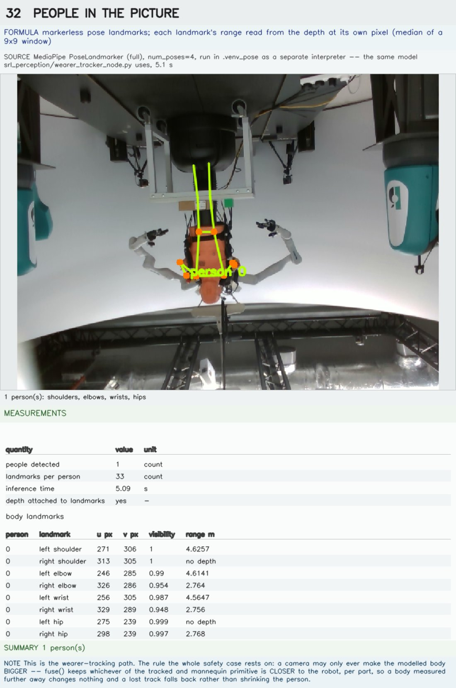

**Formula** `markerless pose landmarks; each landmark's range read from the depth at its own pixel (median of a 9x9 window)`

**Measured** 1 person(s)

### 33  The robot in the picture, and what is NOT detected  [ok]

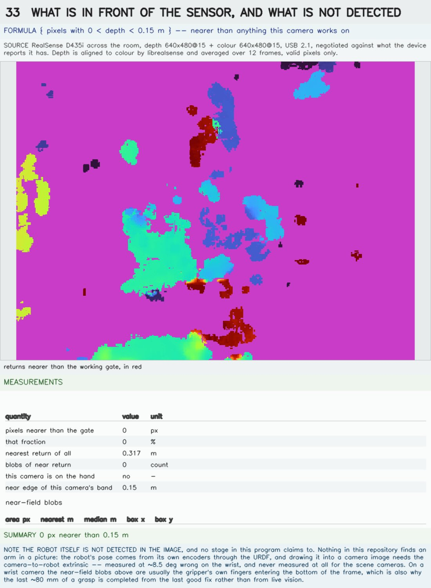

**Formula** `{ pixels with 0 < depth < 0.15 m } -- nearer than anything this camera works on`

**Measured** 0 px nearer than 0.15 m

